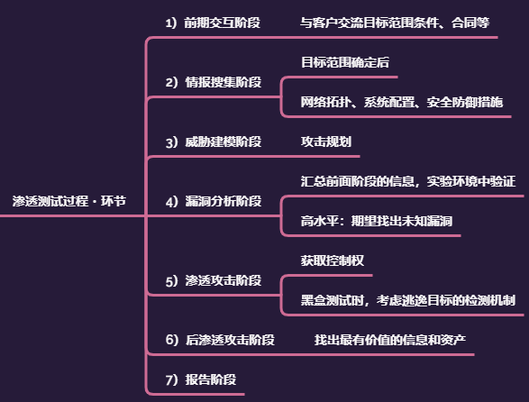

## 基本渗透流程・方法论

1. [信息收集阶段](../GatheringInformation/GatheringInformation.md)
    - 踩点
    - 扫描
    - 枚举

1. （攻击规划/漏洞分析阶段）

1. 攻击阶段
    - [初始访问](../GainingAccess/GainingAccess.md)
    - [提权](../EscalatingPrivilege/)

1. 后渗透
    - [权限维持](../PostExploitation/Persistence.md)
    - 内网探索
    - 痕迹清理
    - 获取数据/flag

## PTES（Penetration Testing Execution Standard，渗透测试执行标准）

> <www.pentest-standard.org>

