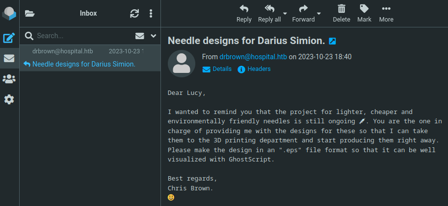
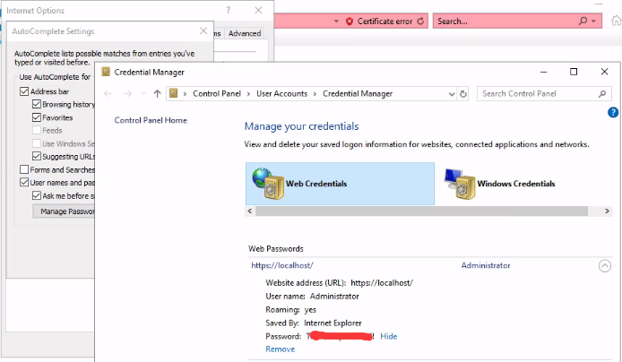

**Waiting for machine retire...**

---

## Summary

*`OS: Windows` `Difficulty: Medium`*

xxx

### Relevant Skills

- nmap
- 子域枚举
- sudo提权
- ……

### Attack Path Overview

{ width='450' }


## External Recon - nmap

自用扫描脚本：[工作流](https://github.com/TimeLess613/workflow-scan4HTB/blob/main/workflow-scan4HTB.sh)  
`curl -s https://raw.githubusercontent.com/TimeLess613/workflow-scan4HTB/main/workflow-scan4HTB.sh | sudo bash -s <HTB-IP>`

开放端口：
```
PORT     STATE SERVICE           VERSION
22/tcp   open  ssh               OpenSSH 9.0p1 Ubuntu 1ubuntu8.5 (Ubuntu Linux; protocol 2.0)
53/tcp   open  domain            Simple DNS Plus
88/tcp   open  kerberos-sec      Microsoft Windows Kerberos (server time: 2023-11-19 13:10:31Z)
135/tcp  open  msrpc             Microsoft Windows RPC
139/tcp  open  netbios-ssn       Microsoft Windows netbios-ssn
389/tcp  open  ldap              Microsoft Windows Active Directory LDAP (Domain: hospital.htb0., Site: Default-First-Site-Name)
443/tcp  open  ssl/http          Apache httpd 2.4.56 ((Win64) OpenSSL/1.1.1t PHP/8.0.28)
445/tcp  open  microsoft-ds?
464/tcp  open  kpasswd5?
593/tcp  open  ncacn_http        Microsoft Windows RPC over HTTP 1.0
636/tcp  open  ldapssl?
1801/tcp open  msmq?
2103/tcp open  msrpc             Microsoft Windows RPC
2105/tcp open  msrpc             Microsoft Windows RPC
2107/tcp open  msrpc             Microsoft Windows RPC
2179/tcp open  vmrdp?
3268/tcp open  ldap              Microsoft Windows Active Directory LDAP (Domain: hospital.htb0., Site: Default-First-Site-Name)
3269/tcp open  globalcatLDAPssl?
3389/tcp open  ms-wbt-server     Microsoft Terminal Services
5985/tcp open  http              Microsoft HTTPAPI httpd 2.0 (SSDP/UPnP)
6159/tcp open  msrpc             Microsoft Windows RPC
6404/tcp open  msrpc             Microsoft Windows RPC
6406/tcp open  ncacn_http        Microsoft Windows RPC over HTTP 1.0
6407/tcp open  msrpc             Microsoft Windows RPC
6409/tcp open  msrpc             Microsoft Windows RPC
6613/tcp open  msrpc             Microsoft Windows RPC
6633/tcp open  msrpc             Microsoft Windows RPC
8080/tcp open  http              Apache httpd 2.4.55 ((Ubuntu))
9389/tcp open  mc-nmf            .NET Message Framing
```


## 攻击路径规划·漏洞分析

常规Windows域控靶机。基本思路同[HTB-Authority](./HTB-Authority.md#_2)的。即SMB——>WEB (——>LDAP——>RPC)。


## SMB - 匿名

匿名无法列出共享。想着可能是端口问题于是顺便尝试了139端口，结果也不行：
```bash
└─$ smbclient -L //10.10.11.241 -N              
session setup failed: NT_STATUS_ACCESS_DENIED

└─$ smbclient -L //10.10.11.241 -N -p 139
do_connect: Connection to 10.10.11.241 failed (Error NT_STATUS_RESOURCE_NAME_NOT_FOUND)
```


## 443端口 - 无凭据

访问 `https://10.10.11.241/`，是一个“Hospital Webmail”的登录界面。

- robots.txt：无
- .git/config：无
- 网页信息：无特别发现
- 网页功能：登录界面
- 网页源码：无特别发现
- 子域枚举：无域名
- 目录枚举：尝试 `gobuster dir -u https://10.10.11.241 -w <wordlists> -k` 报错。


## 8080端口

注意到8080端口是个Apache HTTP服务，访问 `http://10.10.11.241:8080`，也是一个登录界面。

- robots.txt：无
- .git/config：无
- 网页信息：无特别发现
- 网页功能：登录界面。有个注册按钮
- 网页源码：无特别发现
- 子域枚举：无域名
- 目录枚举：有 `uploads` 等文件夹。直接访问响应403

443端口算作主站的话，这个8080端口的旁站估计是个突破口。

### 研究网页功能 - 文件上传

注册账号后可以登陆。显示一个上传界面。默认只能上传图片。估计可以绕过上传webshell？


开启Burp拦截，更改webshell文件的扩展名以.jpg结尾，然后拦截请求包删掉.jpg。


#### 关于空字节绕过

`\x00` 空字节绕过能显示上传成功，但是无法用URL访问。后来getshell进去之后看到了这个文件上传被保存为 `x00.jpg` 了。看了眼 `upload.php` 的代码也没能理解为什么文件名取了 `x00` 的部分……
```php
<?php
if ($_SERVER['REQUEST_METHOD'] === 'POST') {

    if (isset($_FILES['image'])) {
        $blockedExtensions = ['php', 'php1', 'php2', 'php3', 'php4', 'php5', 'php6', 'php7', 'php8', 'phtml', 'html', 'aspx', 'asp'];
        $uploadDirectory = 'uploads/';
        $uploadedFile = $uploadDirectory . basename($_FILES['image']['name']);
        $fileExtension = strtolower(pathinfo($uploadedFile, PATHINFO_EXTENSION));

        if (!in_array($fileExtension, $blockedExtensions)) {
            if (move_uploaded_file($_FILES['image']['tmp_name'], $uploadedFile)) {
                header("Location: /success.php");
                exit;
            } else {
                header("Location: /failed.php");
                exit;
            }
        } else {
            header("Location: /failed.php");
            exit;
        }
    }
}
?>
```


## Initial Access

```bash
www-data@webserver:/var/www/html/uploads$ id
uid=33(www-data) gid=33(www-data) groups=33(www-data)
```

可以发现进来不是靶机标的Windows，且网段不是靶机网段。估计是什么容器？  
有个本地3306端口以及mysql用户。

### MySQL凭据泄漏

发现mysql凭据，于是进数据库

### Linux容器 - OverlayFS提权

```bash
www-data@webserver:/var/www/html$ uname -a
Linux webserver 5.19.0-35-generic #36-Ubuntu SMP PREEMPT_DYNAMIC Fri Feb 3 18:36:56 UTC 2023 x86_64 x86_64 x86_64 GNU/Linux
```


```bash
root@webserver:/var/www/html/uploads# id
uid=0(root) gid=33(www-data) groups=33(www-data)
```

#### drwilliams用户凭据

提权后就收集 `passwd` 和 `shadow` 试试能否破解

几经辗转，最终又获得一个凭据：`drwilliams:`。那么重新出发。


## SMB - drwilliams用户

没什么特殊发现。


## 5985端口 - drwilliams用户

姑且试一下WinRM：`evil-winrm `。登录失败。


## 443端口 - drwilliams用户

用drwilliams用户凭据成功登陆。不过进去后老是有如下报错：

> Server Error: Empty startup greeting (hospital.htb:143)  
> Connection to storage server failed.

卡了一阵之后怀疑是靶机有问题，于是重启靶机。

### PoC (CVE-2023-36664)

再次登录，正常显示webmail界面了：



有一封邮件，联系人为 `drbrown@hospital.htb`。  
谷歌一下邮件关键字 `ghostscript eps exploit`


## flag: user

成功接受反弹shell：
```bash
└─$ nc -lvnp 4445
listening on [any] 4445 ...
connect to [10.10.14.10] from (UNKNOWN) [10.10.11.241] 18176

PS C:\Users\drbrown.HOSPITAL\Documents> whoami     
hospital\drbrown

PS C:\Users\drbrown.HOSPITAL\desktop> cat user.txt
4c19 (...) d221
```


## Windows主机探索

进去后发现一组凭据


## Privilege Escalation

想起来有RDP端口开放，Windows还是GUI好操作于是RDP连接，进入后发现有个selenium脚本在执行。以Administrator凭据登陆Webmail网页。  
静静地看他操作，登录的瞬间IE弹出提示问要不要保存凭据……当然要啊！我已经感觉得应该没几个人是按照我这个路线提权的了！


*后来试了下关掉powershell会自动重来，所以这种路线也是可以重现的。以及即使没有用浏览器保存凭据，也可以在selenium要输入密码的时候将鼠标点击到其他地方（如用户名输入框），也能看到输入的密码是什么。*


最后在凭据管理器中获得。




## flag: root

最后RDP登陆Administrator获得root flag：


---

## 总结·后记

2023/11/25

### 关于立足的Linux

最终提权后发现这个文件，所以最开始立足是进了个Linux的虚拟机：

```powershell title="vm_comp.ps1"
$vm_name = "LinuxServer"
get-vm -name $vm_name | stop-vm -force
Set-VMProcessor $vm_name -CompatibilityForMigrationEnabled $true
start-vm -name $vm_name 
```