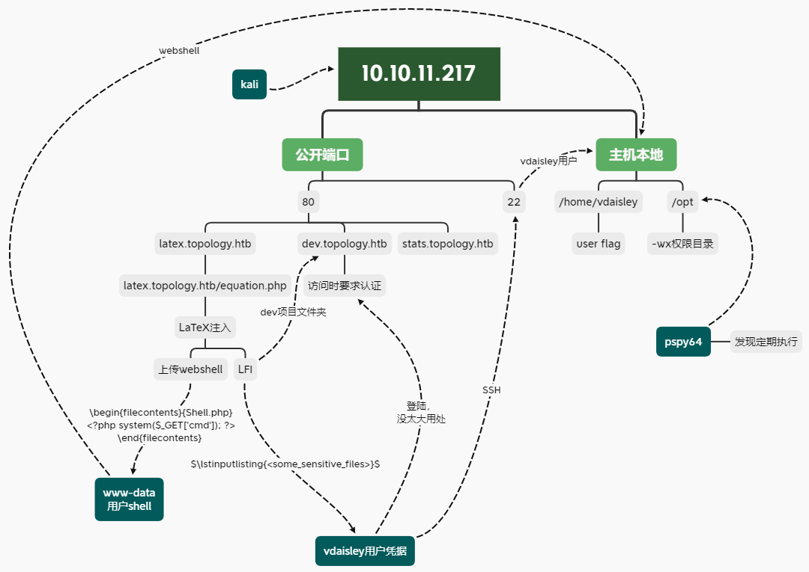

---
tags:
  - HTB/Linux
  - HTB/Easy
---

**Waiting for machine retire...**

---

## Summary

emmmm，太偏了，玩家评分也较低。结果还是围观大佬的方法打完。也不知道之后会不会写写详细版了……姑且传个攻击路径图吧。

### Attack Path Overview

{ width='450' }

---

## 总结·后记

2023/06/11

几个地方不是很懂。

- 为什么LFI的payload需要用“$”包围？
    - 后来看这位[师傅的WP](https://www.penglusoars.top/2023/06/18/%e9%9d%b6%e5%9c%ba%e7%ac%94%e8%ae%b0-htb-topology/)有说明&两个链接

        > 在 latex 命令的两端加上 $，可以用数学模式运行这个 latex 命令  
        > <https://www.kancloud.cn/thinkphp/latex/41806>  
        > <https://tex.stackexchange.com/questions/503/why-is-preferable-to>

- 如何发现上传以及上传文件夹，只能靠试出来吗？

反省：由于最开始是没有主域名的，而第一个子域（latex）是直接在网页源码发现的，所以就单纯地认为只有这一个子域。于是没有尝试子域枚举了，从而错过一个利用LFI的重要信息。但是其实即使发现了dev子域，知道有这个项目文件夹，也知道Apache的敏感文件位置。我想也会因为上述的不知道此处LFI的payload需要用“$”包围而错过突破口。

总的来说感觉是一个有点奇怪的靶机。有种CTF考偏僻知识点的感觉？