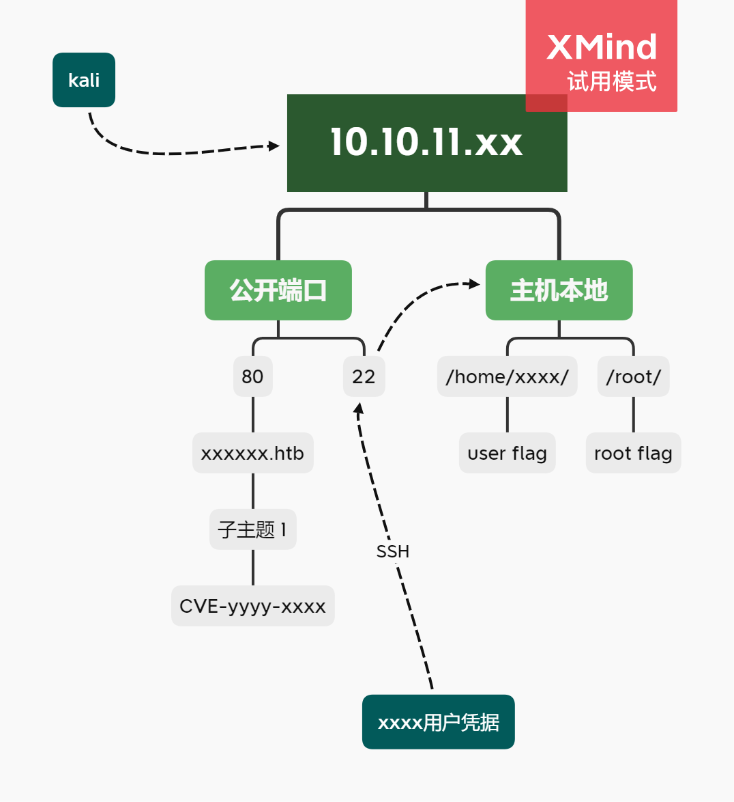

---
tags:
  - tag1
  - tag2
  - tag3
---

# Write Up 模板

（模板更新：2023/07/29）

- 基本上HTB的机器（可能只是Esay机器）都会使用这个WP模板。
- 可能我对WP这个词的理解有偏差，更应该说是我自己的打靶、学习笔记，所以会记录许多踩坑与思路等废话。
- [MetaTwo](../WriteUp/HTB-MetaTwo.md)之前WP模板并未成形，所以语言、格式上会略有不同。以后可能也会不断改善这个模板的不足之处。
- 对于仍在Active的机器，都会在WP开头写上 **Waiting for machine retire...**，表示这边暂时不会给出详细WP。不过会列一些提示，大致上是看官方Forum的话会有的程度。等机器退役后，会更新出详细WP。


下面是WP模板：
------------

**Waiting for machine retire...**

---

## Summary

*`OS: Linux/Windows` `Difficulty: Easy/Medium`*

xxx

### Relevant Skills

- nmap
- 子域枚举
- sudo提权
- ……

### Attack Path Overview

{ width='450' }


## External Recon - nmap

自用扫描脚本：[工作流](https://github.com/TimeLess613/workflow-scan4HTB/blob/main/workflow-scan4HTB.sh)  
`curl -s https://raw.githubusercontent.com/TimeLess613/workflow-scan4HTB/main/workflow-scan4HTB.sh | sudo bash -s <HTB-IP>`

开放端口：
```
PORT      STATE SERVICE VERSION
22/tcp    open  ssh     OpenSSH 8.2p1 Ubuntu 4ubuntu0.7 (Ubuntu Linux; protocol 2.0)
55555/tcp open  unknown
```

## 攻击路径规划·漏洞分析

常规简单靶机，22端口SSH的版本较新，优先度放低。先看80端口的Web。


## 80端口

- robots.txt：无
- .git/config：无
- 网页信息：无特别发现
- 网页源码：无特别发现
- 网页功能：xxxx
- 子域枚举：无域名/无特别发现
- 目录枚举：无特别发现

### 研究网页功能

### 子域：

## xx端口


## Initial Access

### PoC (CVE-yyyy-xxxx)


## flag: user


## Privilege Escalation

### Internal Recon

基础信息收集一把梭：

- 用户家目录的隐藏文件：无
- 有当前用户的凭据所以先看了眼 `sudo -l`：没有sudo可执行
- SUID：无特别发现
- cron：有个php引人注目，不过内容是清理会话。也无其他特别发现

### PoC (CVE-yyyy-xxxx)


## flag: root


---

## 总结·后记

YYYY/MM/DD

……