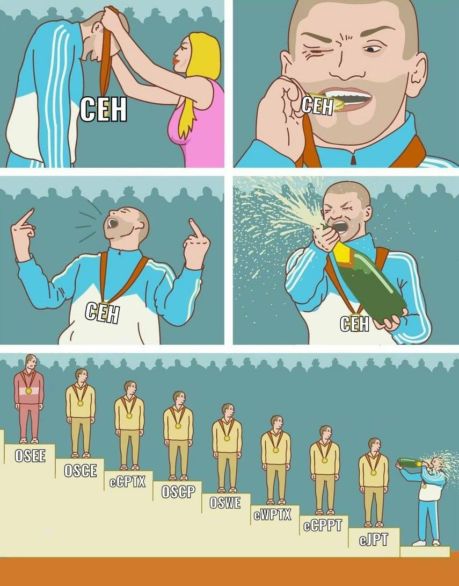

## 近况

- 2023年5月6日：CEHv11 合格（*Certification Number: ECC0935718624*）

    { width='450' }

## 靶机平台

 

## Credly

---

> 灵感来源：https://ctf-wiki.org/

*For full documentation visit [mkdocs.org](https://www.mkdocs.org),* *and [mkdocs-material](https://squidfunk.github.io/mkdocs-material/publishing-your-site/).*
